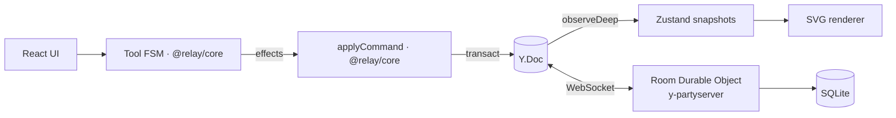

# Relay

Pizarra multijugador en vivo: cursores, formas y ediciones se sincronizan al instante entre todos los miembros de una sala.
Next.js · TypeScript · Yjs · Cloudflare Durable Objects (y-partyserver) · Zustand · Tailwind CSS.

> En desarrollo — ver la [spec de diseño](docs/superpowers/specs/2026-09-24-relay-design.md).

[Read in English](README.md)

## Estado

Fase F1 (MVP): rectángulos, notas adhesivas y formas de texto se sincronizan en vivo; cursores
con nombre, avatares de presencia, selección, arrastrar para mover, edición de texto colaborativa,
persistencia por sala en un Durable Object de Cloudflare, enlaces de capacidad (claves de
edición/vista).

## Arquitectura

## Inicio rápido

    npm install
    npm run dev        # web en http://localhost:3000, sync en http://localhost:8787
    npm test           # tests unitarios, de propiedades e integración
    npm run e2e        # tests de Playwright con dos navegadores

O con Docker: `docker compose up`.
