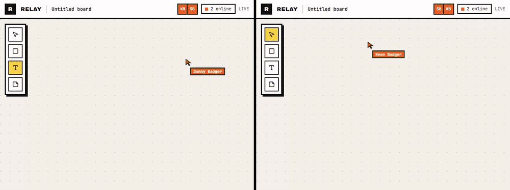

# Relay — live multiplayer whiteboard

[](https://github.com/jccarmenate/live-cooperating-dashboard/actions/workflows/ci.yml)
[](https://github.com/jccarmenate/live-cooperating-dashboard/actions/workflows/nightly.yml)


A shared canvas where cursors, shapes and edits sync instantly between everyone in a room.
No sign-up: open a link and you are in.

[Leer en español](README.es.md)



*Two independent browsers, two anonymous users, one board. Every frame of the GIF comes from
the real app, driven by [`scripts/capture.mjs`](scripts/capture.mjs).*

## What it does

- **Real-time collaboration.** All shapes (rectangles, ellipses, lines, text, sticky notes and
  code blocks) sync live. Edits merge character by character, so two people can type in the
  same sticky at once.
- **Presence.** Named, colored remote cursors, remote selections, presence avatars and an
  `N online` counter.
- **Editing.** Select, rectangle, ellipse, line, text, sticky note and code-block tools with shortcuts (`V R O L T S C`). Drag to move and resize from 8 handles (Shift keeps proportions); marquee selection; arrow keys nudge; `Ctrl+Z` / `Ctrl+Shift+Z` undo and redo your own changes only; double-click to edit text.
- **Persistence.** Every room lives in its own Cloudflare Durable Object, backed by SQLite.
  The browser also keeps a local copy in IndexedDB for instant loads.
- **Capability links.** No accounts. A room link carries an HMAC key that grants either edit
  or view access. The server enforces it: viewers can watch and show their cursor, but can't
  write.

## Engineering highlights

The central idea is that **the document is a CRDT and everything else is a pure function of
it**.

| Area | Decision | Why it matters |
|---|---|---|
| Data model | Shapes are a `Y.Map` of `Y.Map`s. z-order uses fractional-index strings. Text is `Y.Text`. | Concurrent edits to different shapes never conflict, and there is no shared order array to fight over. |
| Mutations | Every change is a typed command applied by `applyCommand` inside a Yjs transaction with a local origin. | One write path. It is testable without React and ready for per-user undo. |
| Read path | "Normalize on read": orphaned connectors, missing parents and z ties are resolved when reading. | Replicas can hold transiently odd states without anyone having to repair them. |
| UI state | A pure tool state machine, `(state, event) → (state, effects)`, lives in the core package. | Gestures are table-tested. React only renders snapshots and forwards pointer events. |
| Rendering | A hand-written SVG renderer. Only the shapes a transaction touched are rebuilt, and object identity is kept for the rest. | Each shape re-renders only when it actually changes. |
| Convergence | A property-based test (fast-check) runs three replicas with random concurrent commands and random delivery order, and asserts identical state. It runs 10,000 cases nightly in CI. | Convergence is tested, not assumed. |
| Security | Keys are HMAC-SHA-256 capabilities, compared in constant time. Invalid keys are rejected in the Worker before any Durable Object wakes up. The role is forwarded in a header the server overwrites, so clients can't spoof it. Messages have size caps, and each connection has a token bucket. | Everything stays inside the free tier, and a hostile client can't write without a key. |
| Text editing | A `<textarea>` overlay is diffed into `Y.Text`. The diff never splits UTF-16 surrogate pairs, and the caret is remapped on remote edits. | Emoji and simultaneous typing stay intact. |
| Local preview | Drags and resizes render from a local overlay every frame while commits to the CRDT stay throttled at 50 ms | Smooth 60 fps gestures without flooding peers or the free-tier request quota |
| Undo | Per-user `Y.UndoManager` tracking only this client's origins; one step per gesture or text-editing session; fuzzed in the convergence test | Undo never reverts someone else's work, and replicas still converge |

The full reasoning, including rejected alternatives (tldraw, Canvas 2D, y-websocket on a Node host), is in the
[design spec](docs/superpowers/specs/2026-09-24-relay-design.md). The build followed written
implementation plans for [F0/F1](docs/superpowers/plans/2026-09-24-relay-f0-f1-foundation-mvp.md)
and [F2a](docs/superpowers/plans/2026-09-26-relay-f2a-editing.md), with a spec and
code-quality review after every task.

## Architecture

```mermaid
flowchart LR
  subgraph Browser["Browser (Next.js, client-only board)"]
    UI[Toolbar · Header · Overlays] --> FSM[Tool FSM<br/>@relay/core]
    FSM -->|effects| CMD[applyCommand<br/>@relay/core]
    CMD -->|transact LOCAL| YD[(Y.Doc)]
    YD -->|observeDeep| Z[Zustand snapshots]
    Z --> R[SVG renderer]
    YD <--> IDB[(IndexedDB)]
  end
  subgraph Cloudflare["Cloudflare (free plan)"]
    W[Worker router<br/>HMAC key check] --> DO[Room Durable Object<br/>y-partyserver]
    DO --> SQL[(SQLite snapshot)]
  end
  YD <-->|WebSocket: Yjs sync + awareness| W
```

```
relay/
├─ packages/core       Platform-neutral TypeScript: schema, commands, geometry, tool FSM, presence
├─ apps/sync-server    Cloudflare Worker + one Durable Object per room (y-partyserver)
├─ apps/web            Next.js 16 App Router, Tailwind 4, Zustand
├─ e2e/                Playwright, two independent browser contexts
└─ scripts/            Demo bot + README media capture
```

## Tech stack

**Frontend:** Next.js 16, React 19, TypeScript 5.9, Tailwind CSS 4, Zustand 5 ·
**Realtime:** Yjs 13, y-partyserver, y-indexeddb ·
**Backend:** Cloudflare Workers + Durable Objects (SQLite), Wrangler 4 ·
**Quality:** Vitest 4, fast-check, Playwright, Biome, GitHub Actions.

Everything runs on free tiers with no credit card: Vercel Hobby for the web app and the
Cloudflare Workers free plan for sync.

## Running it locally

Requires Node ≥ 22. No Cloudflare account is needed; Wrangler runs the Worker locally.

```bash
npm install
npm run dev        # web → http://localhost:3000 · sync → http://localhost:8787
```

Open <http://localhost:3000>, click **New board**, and share the link with another browser or
a private window.

**Scripted collaborators.** Watch the board come alive with bots that use the real UI:

```bash
npm run demo:bot -- --role writer            # creates a room and writes a retro board
npm run demo:bot -- --role mover <board-url> # joins and moves / +1s shapes
```

Or run it in Docker: `docker compose up`.

## Tests

```bash
npm test         # unit, property and integration tests (≈140 tests)
npm run e2e      # Playwright: two users collaborating, double-click editing, invalid links,
                 # resize + undo/redo seen by a second user, marquee + delete, drawing ellipses/lines/code blocks
npm run lint && npm run typecheck
```

| Suite | What it proves |
|---|---|
| `packages/core` (Vitest + fast-check) | Geometry, the tool FSM transition tables, commands on a real `Y.Doc`, text diff (including emoji), resize geometry, marquee hit-testing, per-user undo, and three-replica convergence |
| `apps/sync-server` (Vitest + real `wrangler dev`) | Sync between editors, read-only viewers, 4401 on bad keys, a spoofed role header, message and awareness limits, the size cap, and persistence across a server restart |
| `apps/web` (Vitest) | The Yjs → Zustand bridge (only touched shapes are rebuilt), the board controller (throttled drag commits, local overlay, undo/redo), and the presence signature |
| `e2e/` (Playwright) | Two browsers see each other's edits and named cursors, state outlives all peers, double-click edits, invalid links are rejected, resize + undo/redo seen by a second user, marquee selection + delete, and drawing ellipses/lines/code blocks |

## Roadmap

Built in deployable phases; see the spec for details.

- [x] **F0 — Foundation:** monorepo, CI, design tokens, spike confirming WebSocket hibernation support
- [x] **F1 — MVP:** live shapes, sticky notes and text, cursors, presence, persistence, capability links
- [x] **F2a — Editing core:** per-user undo/redo, resize handles, marquee selection, ellipses, lines, code blocks, 60 fps drag preview
- [ ] **F2b — Structure:** anchored connectors, frames with columns
- [ ] **F3 — Navigation & session:** zoom to cursor, minimap, shared vote timer, "Typing…" ghost, comments
- [ ] **F4 — Ship:** share links UI, nightly-reset demo room, protocol hardening, deploy (Vercel + Workers), offline polish
- [ ] **F5 — AI:** "Cluster & summarize" for retro boards. Clustering is deterministic (embeddings plus agglomerative clustering) and runs on Workers AI; the LLM output is schema-validated and measured with Adjusted Rand Index.

**Known limitations (tracked for F2/F4):**
- The sync protocol still needs the F4 hardening pass (awareness frame validation, a refined document-size estimator) before the public demo room goes live.

## License

No license has been chosen yet. All rights reserved by the author until one is added.
