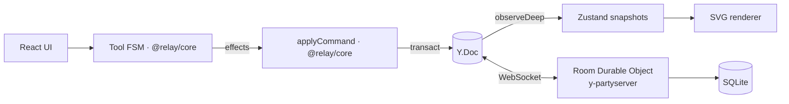

# Relay

A live multiplayer whiteboard: cursors, shapes and edits sync instantly between everyone in a room.
Next.js · TypeScript · Yjs · Cloudflare Durable Objects (y-partyserver) · Zustand · Tailwind CSS.

> Work in progress — see the [design spec](docs/superpowers/specs/2026-09-24-relay-design.md).

[Leer en español](README.es.md)

## Status

Phase F1 (MVP): rectangles, sticky notes and text shapes sync live; named cursors, presence
avatars, selection, drag-to-move, collaborative text editing, per-room persistence in a
Cloudflare Durable Object, capability links (edit/view keys).

## Architecture

## Quick start

    npm install
    npm run dev        # web on http://localhost:3000, sync on http://localhost:8787
    npm test           # unit, property and integration tests
    npm run e2e        # two-browser Playwright tests

Or with Docker: `docker compose up`.
