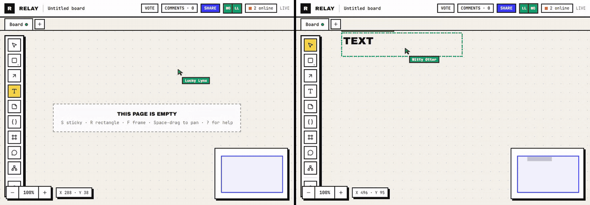
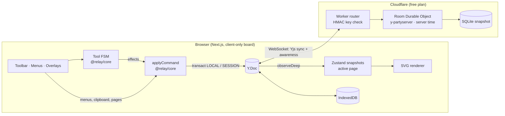

# Relay — live multiplayer whiteboard

[](https://github.com/jccarmenate/live-cooperating-dashboard/actions/workflows/ci.yml)
[](https://github.com/jccarmenate/live-cooperating-dashboard/actions/workflows/nightly.yml)


A shared canvas where cursors, shapes and edits sync instantly between everyone in a room.
No sign-up: open a link and you are in.

[Leer en español](README.es.md)



*Two independent browsers, two anonymous users (one in Madrid, one in Havana), one room. They
write a retro board with live cursors; add a sheet where one user's edit updates the other's
`=SUM`; generate a graph from an edge list and highlight a shortest path (visible only to
whoever ran it); then drag a weekly 09:00 standup onto a calendar, which Havana sees at 03:00
and answers "Going" live. Every frame comes from the real app, driven by
[`scripts/capture.mjs`](scripts/capture.mjs).*

## What it does

- **Real-time collaboration.** Everything syncs live: shapes, connectors, frames, text, votes,
  comments, pages, spreadsheet cells and calendar events. Text merges character by character, so two people can
  type in the same sticky note at once.
- **Board tools.** The board has:
  - Shapes: rectangles, ellipses, lines, text, sticky notes and code blocks. Rectangle, ellipse
    and line share one **Shapes** toolbar button with a flyout (`R`, `O` and `L` still work).
  - **Connectors** that stay anchored to the shapes they join (straight or elbow). A connector
    can carry a label of up to 40 characters, drawn at its middle; double-click it to edit.
  - **Frames with columns** for retrospectives. They adopt the shapes dropped into them and count them per column.
  - Resize from 8 handles, marquee selection, nudging with the arrow keys, and double-click to edit text.
- **Context menus and clipboard.** Right-clicking anything gives:
  - cut, copy, paste and duplicate;
  - bring to front and send to back;
  - fill colours, lock and comment.

  Copy and paste go through the system clipboard, so you can move shapes between boards, and text
  from other apps pastes as a sticky note. A floating properties bar edits fill, stroke, font and
  text size. Locked shapes cannot be moved, resized, deleted or edited by anyone.
- **Navigation.** You can zoom around the cursor (10–400%), pan with Space-drag or the wheel, and zoom to fit. The minimap is interactive and shows where everyone is looking. Each page remembers its own camera.
- **Session tools.** A dot-voting timer runs on the server clock. It has a per-user vote cap and live tallies. Comment threads are pinned to shapes or to points on the canvas, with replies and resolve.
- **Pages.** One room holds several pages, shown as tabs you can rename, reorder and delete. Every page has its own content, camera and presence.
- **Spreadsheet pages.** A page can be a shared spreadsheet instead of a board:
  - rows and columns have stable ids, so they survive concurrent inserts, deletes and moves;
  - a hand-written formula engine covers `SUM`, `AVERAGE`, `MIN`, `MAX`, `COUNT`, `ROUND`, `ABS`
    and `IF`, with operators, ranges, error values and cycle detection;
  - copy and paste use tab-separated text, compatible with Excel and Google Sheets;
  - there is a fill handle and `Ctrl+D`, plus bold, alignment and number formats;
  - you see each peer's selected range live.
- **Graphs.** The **Graph** button (or `G`) opens a menu:
  - **New graph…** generates a complete, cycle, path, star, wheel, complete bipartite, grid,
    k-ary tree or random G(n, p) graph, optionally directed or weighted. It can also build one
    from a pasted edge list (`A-B`, `A->B`, `A-B:5`) and reports errors line by line. Each
    family gets its own layout, and edge lists get a deterministic force-directed one. A graph
    has up to 100 nodes and 500 edges, and one undo step removes all of it.
  - **Algorithms…** runs BFS, DFS, shortest path (Dijkstra), minimum spanning tree (Kruskal) and
    connected components on the selection, or on the whole page when nothing is selected. A numeric connector label is
    the edge weight. Results appear as a local overlay (visit order, path, tree, component
    colours) that is never synced; Escape or **Clear** removes it. Viewers can run algorithms too.
- **Calendar pages.** A page can also be a shared calendar (**+** → **Calendar**) with month and week views:
  - click a day, press **New event** or `N`, or drag in the week grid to create an event; drag an
    event to move or resize it, snapped to 15 minutes. The mouse wheel scrolls week by week (the
    month grid rolls a row at a time); Shift+wheel scrolls the week view's hours;
  - events repeat daily, weekly (on chosen weekdays), monthly or yearly, with an interval and an
    end (never, on a date or after N times). Acting on one occurrence asks **Only this event** or
    **All events**, and "All events" applies only what you changed;
  - every viewer sees times in their own time zone, while a timed event keeps its creator's wall
    time across DST changes. All-day events are dates, the same for everyone;
  - RSVP (Going / Maybe / Not going) updates live, and coloured dots show which peers have an event open;
  - `.ics` export works for everyone. Import (editors) reads a bounded subset of the format, warns
    with line numbers about what it skips, and never duplicates an event whose UID is already on the page;
  - **Add to calendar…** in a sticky's context menu creates a linked event, and **Open on board**
    jumps back to the sticky. Viewers can read and export, but not edit or RSVP.
- **Presence.** You see named, coloured remote cursors and selections. A "typing…" tag shows who is editing a shape. Dots on each page tab show who is on that page.
- **Sharing.** There are no accounts. A room link carries an HMAC key that grants either edit or view access, and the server enforces it. The Share dialog gives both links.
- **Help.** `?` lists the board shortcuts. An empty page shows a starter hint.

## Engineering highlights

The central idea is that **the document is a CRDT and everything else is a pure function of
it**.

| Area | Decision | Why it matters |
|---|---|---|
| Data model | Shapes, connectors, comments and pages are `Y.Map`s keyed by id. z-order uses fractional-index strings. Text is `Y.Text`. | Concurrent edits to different items never conflict, and there is no shared order array to fight over. |
| Mutations | Every change is a typed command applied by `applyCommand` inside a Yjs transaction, tagged with an origin (`LOCAL`, or the untracked `SESSION` for votes, comments and pages). | One write path. It is testable without React, and it decides exactly what undo can reach. |
| Read path | Orphaned connectors, missing parents, deleted pages and z ties are resolved when the document is read ("normalize on read"). | Replicas can hold transiently odd states without anyone having to repair them. |
| Deletes that stick | A deleted page is recorded in a flat, write-once tombstone map, and never as a flag on the page's map. | A concurrent rename or move can never resurrect a deleted page. |
| UI state | A pure tool state machine, `(state, event) → (state, effects)`, lives in the core package, and locks are enforced there as well as in the commands. | Gestures are table-tested. React only renders snapshots and forwards pointer events. |
| Rendering | A hand-written SVG renderer. Only the shapes a transaction touched are rebuilt, and the rest keep their object identity. | Each shape re-renders only when it actually changes. |
| Convergence | Property-based tests (fast-check) run three replicas through random concurrent commands (shapes, votes, comments, pages, z-order, style, lock and calendar events) in random delivery order, and assert identical state. The nightly CI run executes 10,000 cases. | Convergence is tested, not assumed. |
| Time | Vote deadlines are absolute server timestamps. Clients apply a clock offset from the server's `hello`/`time` messages, and "open" is derived rather than stored. | No client clock can extend a vote, and nobody has to write when the timer ends. |
| Undo | A per-user `Y.UndoManager` tracks only this client's origins. Each gesture, paste or text-editing session is one step, and switching pages clears the stack. | Undo never reverts someone else's work or changes a page you are not looking at. |
| Security | Keys are HMAC-SHA-256 capabilities, compared in constant time and checked before any Durable Object wakes up. The server overwrites the role header, and messages have size caps. Each connection has a token bucket, and pastes are refused above 192 KiB. | Everything stays inside the free tier, and a hostile client can't write without a key. |
| Text editing | A `<textarea>` overlay is diffed into `Y.Text`. The diff never splits UTF-16 surrogate pairs, and the caret is remapped on remote edits. | Emoji and simultaneous typing stay intact. |
| Sheet model | Rows and columns are nested maps with a fractional order, and cells sit in one flat map keyed by row and column id. Formulas store references by id, and evaluation is a pure, deterministic row-major pass with a depth cap. | Inserting or moving a row never rewrites a formula, and a concurrent move and delete cannot resurrect a row. |
| Graphs | A graph is made of ordinary ellipses and connectors, and the algorithms are pure functions in the core package. | Collaboration, undo, clipboard and styling work on graphs for free, and every algorithm is tested without a browser. |
| Calendar time | Timed events store wall time plus an IANA zone. Conversion uses `Intl` only (no date library, with a cached offset per zone), with explicit rules for DST gaps and overlaps. Recurrence expansion is pure and bounded, and jumps straight to the visible window. | A weekly 09:00 meeting stays at 09:00 through DST changes, every viewer sees their own local time, and the engine is pure and property-tested (fast-check). |
| Local preview | Drags and resizes render from a local overlay every frame, while commits to the CRDT are throttled to 50 ms. | Smooth 60 fps gestures without flooding peers or the free-tier request quota. |

The full reasoning, including rejected alternatives (tldraw, Canvas 2D, y-websocket on a Node
host), is in the [design spec](docs/superpowers/specs/2026-09-24-relay-design.md). Each phase
followed a written implementation plan, with a spec and code-quality review after every task:
[F0/F1](docs/superpowers/plans/2026-09-24-relay-f0-f1-foundation-mvp.md) ·
[F2a](docs/superpowers/plans/2026-09-26-relay-f2a-editing.md) ·
[F2b](docs/superpowers/plans/2026-09-26-relay-f2b-structure.md) ·
[F3a](docs/superpowers/plans/2026-09-27-relay-f3a-navigation.md) ·
[F3b](docs/superpowers/plans/2026-09-27-relay-f3b-session.md) ·
[F4 P1](docs/superpowers/plans/2026-09-27-relay-p1-pages.md) ·
[F4 P2](docs/superpowers/plans/2026-09-27-relay-p2-canvas-ux.md) ·
[F4 P3](docs/superpowers/plans/2026-09-28-relay-p3-sheets.md) ·
[F4 P4](docs/superpowers/plans/2026-09-29-relay-p4-graphs.md) ·
[F4 P5](docs/superpowers/plans/2026-09-29-relay-p5-calendar.md).

## Architecture


```mermaid
flowchart LR
  subgraph Browser["Browser (Next.js, client-only board)"]
    UI[Toolbar · Menus · Overlays] --> FSM["Tool FSM<br/>@relay/core"]
    FSM -->|effects| CMD["applyCommand<br/>@relay/core"]
    UI -->|menus, clipboard, pages| CMD
    CMD -->|transact LOCAL / SESSION| YD[(Y.Doc)]
    YD -->|observeDeep| Z[Zustand snapshots<br/>active page]
    Z --> R[SVG renderer]
    YD <--> IDB[(IndexedDB)]
  end
  subgraph Cloudflare["Cloudflare (free plan)"]
    W[Worker router<br/>HMAC key check] --> DO[Room Durable Object<br/>y-partyserver · server time]
    DO --> SQL[(SQLite snapshot)]
  end
  YD <-->|WebSocket: Yjs sync + awareness| W
```

```
relay/
├─ packages/core       Platform-neutral TypeScript: schema, commands, geometry, tool FSM, clipboard, presence, formulas, graphs, calendar (zones, recurrence, .ics)
├─ apps/sync-server    Cloudflare Worker + one Durable Object per room (y-partyserver)
├─ apps/web            Next.js 16 App Router, Tailwind 4, Zustand
├─ e2e/                Playwright, independent browser contexts per user
└─ scripts/            Demo bot + README media capture
```

## Tech stack

**Frontend:** Next.js 16, React 19, TypeScript 5.9, Tailwind CSS 4, Zustand 5 ·
**Realtime:** Yjs 13, y-partyserver, y-indexeddb ·
**Backend:** Cloudflare Workers + Durable Objects (SQLite), Wrangler 4 ·
**Quality:** Vitest 4, fast-check, Playwright, Biome, GitHub Actions.

Everything runs on free tiers with no credit card: Vercel Hobby for the web app and the
Cloudflare Workers free plan for sync.

## Running it locally

This needs Node ≥ 22. You don't need a Cloudflare account, because Wrangler runs the Worker locally.

```bash
npm install
npm run dev        # web → http://localhost:4000 · sync → http://localhost:8787
```

Open <http://localhost:4000>, click **New board**, and open the link in another browser or a
private window. **SHARE** gives you an edit link and a read-only link.

(On Windows the web app uses port 4000, because Windows often reserves the 2900–3100 range.)

**Scripted collaborators.** Watch the board come alive with bots that use the real UI:

```bash
npm run demo:bot -- --role writer            # creates a room and writes a retro board
npm run demo:bot -- --role mover <board-url> # joins and moves / +1s shapes
npm run demo:capture                         # re-records docs/demo.gif (needs ffmpeg and npm run dev)
```

Or run it in Docker: `docker compose up`.

## Tests

```bash
npm test         # 851 unit, property and integration tests (core 447 · web 378 · sync-server 26)
npm run e2e      # 47 Playwright scenarios with several independent browsers
npm run lint && npm run typecheck
```

| Suite | What it proves |
|---|---|
| `packages/core` (Vitest + fast-check) | Geometry, the tool FSM transition tables (including locks), commands on a real `Y.Doc`, clipboard validation and id remapping, text diffs with emoji, per-user undo, vote tallies, page tombstones, the formula parser and evaluator, graph families, layouts and algorithms, calendar zones, recurrence and `.ics` round trips, and three-replica convergence for shapes, session data, pages, sheets and calendars |
| `apps/sync-server` (Vitest + real `wrangler dev`) | Sync between editors, read-only viewers, 4401 on bad keys, a spoofed role header, message and awareness limits, the size cap, server time, and persistence across a server restart |
| `apps/web` (Vitest) | The Yjs → Zustand projection per page, the board controller (throttled drags, clipboard, z-order, style, lock, menus, undo steps), shortcuts and role gating, voting timers, share links, toasts, the sheet controller and keys, graph creation, and the calendar store, layout and controller |
| `e2e/` (Playwright) | These scenarios: two users seeing each other's edits and cursors; connectors and frames; zoom, the minimap and camera restore; voting and comments across users; pages being created, reordered and deleted, and hash links; context menus, clipboard, lock, help and viewer restrictions; spreadsheet editing between users; graph families, edge lists, labels and algorithm overlays; calendars across time zones, series exceptions, live RSVP and `.ics` |

## Roadmap

The work is built in phases that can each be deployed; the spec has the details.

- [x] **F0 — Foundation:** monorepo, CI, design tokens, a spike confirming WebSocket hibernation support
- [x] **F1 — MVP:** live shapes, sticky notes and text, cursors, presence, persistence, capability links
- [x] **F2 — Editing and structure:** per-user undo/redo, resize, marquee, ellipses, lines, code blocks, anchored connectors, frames with columns
- [x] **F3 — Navigation and session:** zoom and pan, an interactive minimap, remote selections and "typing…", server time, dot voting, comments
- [x] **F4 — Workspace**
  - [x] **P1 pages:** tabs, per-page content and presence, the Share dialog, an editable title
  - [x] **P2 canvas UX:** context menus, system clipboard, properties bar, z-order, lock, help, polish
  - [x] **P3 spreadsheet pages:** id-stable rows and columns, a formula engine, Excel-compatible copy and paste, fill, formats, live peer ranges
  - [x] **P4 graphs:** graph families and edge lists with layouts, connector labels, local algorithm overlays, the Shapes flyout
  - [x] **P5 calendar pages:** month and week views, repeating events with per-occurrence exceptions, per-viewer time zones, live RSVP, `.ics` export and import, Add to calendar from a sticky
- [ ] **F5 — Ship** (next): a nightly-reset demo room, protocol hardening, deploy (Vercel + Workers), offline polish
- [ ] **F6 — AI:** "Cluster & summarize" for retro boards. Clustering is deterministic (embeddings plus agglomerative clustering) and runs on Workers AI. The LLM output is schema-validated and measured with the Adjusted Rand Index.

**Known limitations (tracked for F5):**
- The sync protocol needs a hardening pass before the public demo room goes live:
  - strict awareness frame validation;
  - a finer document-size estimator;
  - surfacing "message too big" closes in the UI.
- Calendar:
  - a biweekly (or every-N-weeks) series shifted across a Monday with **All events** can flip
    which weeks it falls on, because the rule counts weeks from the series start;
  - re-importing an .ics file whose events have no UID duplicates those events;
  - exports name IANA zones in TZID without VTIMEZONE blocks, which most calendar apps
    accept but strict RFC 5545 readers may not.

## License

No license has been chosen yet. All rights reserved by the author until one is added.
