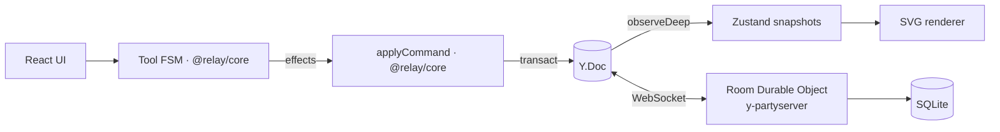

# Relay F0 + F1 (Foundation + MVP) Implementation Plan

> **For agentic workers:** REQUIRED SUB-SKILL: Use superpowers:subagent-driven-development (recommended) or superpowers:executing-plans to implement this plan task-by-task. Steps use checkbox (`- [ ]`) syntax for tracking.

**Goal:** A deployable-shaped monorepo where two browsers share one room: rectangles, sticky notes and text shapes sync live, with named cursors, presence avatars, selection, drag-to-move, text editing and Durable Object persistence.

**Architecture:** npm-workspaces monorepo. `packages/core` holds all deterministic logic (schema, commands, geometry, tool FSM, presence parsing) and is consumed as TypeScript source by `apps/web` (Next.js, client-only board) and `apps/sync-server` (Cloudflare Worker + one `y-partyserver` Durable Object per room with SQLite persistence and HMAC capability keys).

**Tech Stack:** TypeScript 5.9, Yjs 13.6, y-partyserver 2.2 / partyserver 0.5, Wrangler 4, Next.js 16 + React 19, Tailwind CSS 4, Zustand 5, fractional-indexing, Vitest 4, fast-check 4, Playwright 1.63, Biome 2.

**Spec:** `docs/superpowers/specs/2026-09-24-relay-design.md`

## Global Constraints

- Total cost $0; no credit card on any service. No paid dependency or service may be introduced.
- `yjs` must resolve to a single copy (`overrides` in root `package.json`); stay on `yjs` 13.6.x (v14 is RC).
- Vitest must stay on 4.x (`@cloudflare/vitest-pool-workers` peer range is `^4.1.0`).
- TypeScript pinned to `~5.9` (TS 7 native compiler is not yet assumed compatible with Next.js).
- All board mutations go through `applyCommand` from `@relay/core`; UI code never writes Yjs types directly.
- Awareness cursor updates throttled to 50 ms; drag commits throttled to 50 ms.
- Shapes are stored as `Y.Map<id, Y.Map>`; z-order uses fractional-index strings; text uses `Y.Text`.
- Access: capability keys `HMAC(ROOM_SECRET, roomId + ":edit" | ":view")`; room `demo` is open with edit role. Invalid key → WebSocket closed with code `4401`.
- Limits: document 1 MB, message 256 KB, ~60 messages/s per connection (burst 120), 25 connections per room.
- Specs and plans are written in English; code identifiers in English.
- Every commit message ends with the line `Co-Authored-By: Claude Opus 5.5 <noreply@anthropic.com>` (preceded by a blank line).

## File Map

```
relay/
├─ package.json                 workspaces, scripts, overrides
├─ tsconfig.base.json           shared strict TS config
├─ biome.json                   lint + format
├─ .gitattributes               LF line endings
├─ Makefile                     thin wrappers over npm scripts
├─ docker-compose.yml           dev container (web + sync)
├─ playwright.config.ts         E2E config (starts both dev servers)
├─ README.md / README.es.md     bilingual README
├─ .claude/launch.json          preview servers for the desktop app
├─ .github/workflows/ci.yml     lint, typecheck, unit/integration, e2e
├─ .github/workflows/nightly.yml  10k-run convergence property test
├─ docs/spikes/2026-09-24-hibernation.md
├─ e2e/collab.spec.ts
├─ packages/core/
│  ├─ src/index.ts              public barrel
│  ├─ src/schema/{types,defaults,doc,snapshot,normalize}.ts
│  ├─ src/geometry/{rect,camera}.ts
│  ├─ src/commands/{types,origins,apply}.ts
│  ├─ src/text/diff.ts
│  ├─ src/util/throttle.ts
│  ├─ src/presence/{identity,state}.ts
│  ├─ src/tools/machine.ts
│  └─ test/*.test.ts
├─ apps/sync-server/
│  ├─ wrangler.jsonc
│  ├─ src/{index,room,auth,limits,env}.ts
│  └─ test/{auth,limits,integration}.test.ts, test/helpers/worker.ts, test/tsconfig.json
└─ apps/web/
   ├─ next.config.ts, postcss.config.mjs, vitest.config.ts
   ├─ app/{layout.tsx,globals.css,page.tsx}, app/r/[roomId]/page.tsx
   ├─ src/config.ts
   ├─ src/sync/{connection,key,presence}.ts
   ├─ src/store/{docStore,presenceStore}.ts
   ├─ src/board/{session,controller}.ts, src/board/{BoardLoader,Board}.tsx
   ├─ src/render/{Canvas,ShapeView,SelectionLayer,RemoteCursors,TextEditor}.tsx
   ├─ src/ui/{NewBoardButton,Header,Toolbar,StatusBanner}.tsx, src/ui/useShortcuts.ts
   └─ test/{key,docStore,controller}.test.ts
```

---

### Task 1: Monorepo foundation

**Files:**
- Create: `package.json`, `tsconfig.base.json`, `biome.json`, `.gitattributes`, `Makefile`, `README.md`, `README.es.md`, `.github/workflows/ci.yml`
- Create: `packages/core/package.json`, `packages/core/tsconfig.json`, `packages/core/src/index.ts`

**Interfaces:**
- Consumes: nothing.
- Produces: root scripts `lint`, `typecheck`, `test`, `dev`, `e2e`; workspace package `@relay/core` exporting from `./src/index.ts`.

- [ ] **Step 1: Root `package.json`**

```json
{
  "name": "relay",
  "private": true,
  "type": "module",
  "workspaces": ["packages/*", "apps/*"],
  "scripts": {
    "dev": "concurrently -n sync,web -c yellow,blue \"npm run dev -w @relay/sync-server\" \"npm run dev -w @relay/web\"",
    "lint": "biome check .",
    "format": "biome check --write .",
    "typecheck": "npm run typecheck --workspaces --if-present",
    "test": "npm run test --workspaces --if-present",
    "e2e": "playwright test"
  },
  "overrides": {
    "yjs": "^13.6.33"
  },
  "engines": {
    "node": ">=22"
  }
}
```

- [ ] **Step 2: Shared TS config `tsconfig.base.json`**

```json
{
  "compilerOptions": {
    "target": "ES2022",
    "module": "ESNext",
    "moduleResolution": "Bundler",
    "lib": ["ES2023"],
    "strict": true,
    "noUncheckedIndexedAccess": true,
    "esModuleInterop": true,
    "skipLibCheck": true,
    "isolatedModules": true,
    "verbatimModuleSyntax": true,
    "resolveJsonModule": true,
    "noEmit": true,
    "types": []
  }
}
```

- [ ] **Step 3: `biome.json`, `.gitattributes`, `Makefile`**

`biome.json`:
```json
{
  "$schema": "./node_modules/@biomejs/biome/configuration_schema.json",
  "files": {
    "includes": [
      "**",
      "!**/node_modules",
      "!**/.next",
      "!**/.wrangler",
      "!**/dist",
      "!**/playwright-report",
      "!**/test-results",
      "!**/next-env.d.ts"
    ]
  },
  "formatter": { "indentStyle": "space", "indentWidth": 2, "lineWidth": 100 },
  "javascript": { "formatter": { "quoteStyle": "single", "semicolons": "always" } },
  "linter": { "enabled": true, "rules": { "recommended": true } }
}
```

`.gitattributes`:
```
* text=auto eol=lf
```

`Makefile`:
```make
.PHONY: install dev lint typecheck test e2e check
install: ; npm ci
dev: ; npm run dev
lint: ; npm run lint
typecheck: ; npm run typecheck
test: ; npm test
e2e: ; npm run e2e
check: lint typecheck test
```

- [ ] **Step 4: `@relay/core` skeleton**

`packages/core/package.json`:
```json
{
  "name": "@relay/core",
  "version": "0.0.0",
  "private": true,
  "type": "module",
  "exports": { ".": "./src/index.ts" },
  "scripts": {
    "test": "vitest run --passWithNoTests",
    "typecheck": "tsc --noEmit"
  }
}
```

`packages/core/tsconfig.json`:
```json
{
  "extends": "../../tsconfig.base.json",
  "include": ["src", "test"]
}
```

`packages/core/src/index.ts`:
```ts
export {};
```

- [ ] **Step 5: Install dev tooling and core deps**

Run:
```bash
npm i -D @biomejs/biome@^2 concurrently@^9 fast-check@^4 typescript@~5.9 vitest@^4.1
npm i -w @relay/core yjs@^13.6.33 fractional-indexing@^3
```
Expected: `package-lock.json` created; `node_modules/.bin/biome`, `tsc`, `vitest` exist. If `fractional-indexing@^3` is not the newest major, keep `^3` only if `^4` fails to import under `moduleResolution: Bundler`; otherwise use `npm i -w @relay/core fractional-indexing@^4`. The API used (`generateKeyBetween(a, b)`) is identical in both.

- [ ] **Step 6: CI workflow `.github/workflows/ci.yml`**

```yaml
name: CI
on:
  push:
    branches: [main]
  pull_request:
jobs:
  check:
    runs-on: ubuntu-latest
    steps:
      - uses: actions/checkout@v4
      - uses: actions/setup-node@v4
        with:
          node-version: 24
          cache: npm
      - run: npm ci
      - run: npm run lint
      - run: npm run typecheck
      - run: npm test
```

- [ ] **Step 7: README stubs**

`README.md`:
```markdown
# Relay

[](https://github.com/jccarmenate/live-cooperating-dashboard/actions/workflows/ci.yml)

A live multiplayer whiteboard: cursors, shapes and edits sync instantly between everyone in a room.
Next.js · TypeScript · Yjs · Cloudflare Durable Objects (y-partyserver) · Zustand · Tailwind CSS.

> Work in progress — see the [design spec](docs/superpowers/specs/2026-09-24-relay-design.md).

[Leer en español](README.es.md)

## Quick start

    npm install
    npm run dev   # web on http://localhost:3000, sync server on http://localhost:8787
```

`README.es.md`:
```markdown
# Relay

[](https://github.com/jccarmenate/live-cooperating-dashboard/actions/workflows/ci.yml)

Pizarra multijugador en vivo: cursores, formas y ediciones se sincronizan al instante entre todos los miembros de una sala.
Next.js · TypeScript · Yjs · Cloudflare Durable Objects (y-partyserver) · Zustand · Tailwind CSS.

> En desarrollo — ver la [spec de diseño](docs/superpowers/specs/2026-09-24-relay-design.md).

[Read in English](README.md)

## Inicio rápido

    npm install
    npm run dev   # web en http://localhost:3000, servidor de sync en http://localhost:8787
```

- [ ] **Step 8: Verify the toolchain**

Run: `npm run lint && npm run typecheck && npm test`
Expected: all three exit 0 (core test run reports "No test files found, exiting with code 0"). If Biome reports a config schema mismatch, run `npx biome migrate --write` and re-run.

- [ ] **Step 9: Commit**

```bash
git add -A
git commit -m "chore: scaffold npm-workspaces monorepo with core package and CI

Co-Authored-By: Claude Opus 5.5 <noreply@anthropic.com>"
```

---

### Task 2: Core schema — types, defaults, doc roots, snapshots, normalization

**Files:**
- Create: `packages/core/src/schema/types.ts`, `defaults.ts`, `doc.ts`, `snapshot.ts`, `normalize.ts`
- Modify: `packages/core/src/index.ts`
- Modify: `docs/superpowers/specs/2026-09-24-relay-design.md` (add `authorName` to the shape schema)
- Test: `packages/core/test/schema.test.ts`

**Interfaces:**
- Consumes: nothing.
- Produces:
  - Types `ShapeType`, `FontRole`, `Style`, `Point`, `Rect`, `Shape`, `BoardMeta`; consts `SHAPE_TYPES`, `TEXT_TYPES: ReadonlySet<ShapeType>`, `SCHEMA_VERSION = 1`.
  - `PALETTE`, `DEFAULT_STYLE: Record<ShapeType, Style>`, `DEFAULT_SIZE: Record<'rect'|'sticky'|'text', {w,h}>`.
  - `getRoots(doc: Y.Doc): Roots` with `{ meta: Y.Map<unknown>; shapes: Y.Map<YShape>; connectors: Y.Map<Y.Map<unknown>> }`; `initMeta(doc, { title, breadcrumb }): boolean`.
  - `readShape(id: string, m: Y.Map<unknown>): Shape | null`; `readMeta(meta: Y.Map<unknown>): BoardMeta`.
  - `compareZ(a, b): number`; `normalizeShapes(raw: Readonly<Record<string, Shape>>): Normalized` where `Normalized = { shapes: Record<string, Shape>; order: string[] }`.

- [ ] **Step 1: Write the failing test `packages/core/test/schema.test.ts`**

```ts
import { describe, expect, it } from 'vitest';
import * as Y from 'yjs';
import {
  DEFAULT_STYLE,
  getRoots,
  initMeta,
  normalizeShapes,
  readMeta,
  readShape,
  type Shape,
} from '../src';

function shape(partial: Partial<Shape> & Pick<Shape, 'id'>): Shape {
  return {
    type: 'rect',
    x: 0,
    y: 0,
    w: 10,
    h: 10,
    z: 'a0',
    style: DEFAULT_STYLE.rect,
    createdBy: 'u',
    authorName: 'U',
    createdAt: 0,
    ...partial,
  };
}

describe('readShape', () => {
  it('returns null for unknown types', () => {
    const doc = new Y.Doc();
    const m = new Y.Map<unknown>();
    getRoots(doc).shapes.set('s1', m);
    m.set('type', 'hexagon');
    expect(readShape('s1', m)).toBeNull();
  });

  it('reads fields, text and falls back to default style', () => {
    const doc = new Y.Doc();
    const m = new Y.Map<unknown>();
    getRoots(doc).shapes.set('s1', m);
    doc.transact(() => {
      m.set('type', 'sticky');
      m.set('x', 5);
      m.set('y', 6);
      m.set('w', 180);
      m.set('h', 140);
      m.set('z', 'a1');
      m.set('text', new Y.Text('hello'));
      m.set('createdBy', 'u1');
      m.set('authorName', 'Brisk Otter');
      m.set('createdAt', 42);
    });
    expect(readShape('s1', m)).toEqual({
      id: 's1',
      type: 'sticky',
      x: 5,
      y: 6,
      w: 180,
      h: 140,
      z: 'a1',
      style: DEFAULT_STYLE.sticky,
      text: 'hello',
      createdBy: 'u1',
      authorName: 'Brisk Otter',
      createdAt: 42,
    });
  });

  it('replaces non-finite numbers with 0', () => {
    const doc = new Y.Doc();
    const m = new Y.Map<unknown>();
    getRoots(doc).shapes.set('s1', m);
    m.set('type', 'rect');
    m.set('x', 'nope');
    expect(readShape('s1', m)?.x).toBe(0);
  });
});

describe('meta', () => {
  it('readMeta has defaults', () => {
    const doc = new Y.Doc();
    expect(readMeta(getRoots(doc).meta)).toEqual({
      schemaVersion: 1,
      title: 'Untitled board',
      breadcrumb: [],
    });
  });

  it('initMeta only initializes once', () => {
    const doc = new Y.Doc();
    expect(initMeta(doc, { title: 'Sprint 14 Retro', breadcrumb: ['Q3 Planning'] })).toBe(true);
    expect(initMeta(doc, { title: 'Other', breadcrumb: [] })).toBe(false);
    expect(readMeta(getRoots(doc).meta)).toEqual({
      schemaVersion: 1,
      title: 'Sprint 14 Retro',
      breadcrumb: ['Q3 Planning'],
    });
  });
});

describe('normalizeShapes', () => {
  it('orders by z, then id', () => {
    const raw = {
      b: shape({ id: 'b', z: 'a1' }),
      a: shape({ id: 'a', z: 'a1' }),
      c: shape({ id: 'c', z: 'a0' }),
    };
    expect(normalizeShapes(raw).order).toEqual(['c', 'a', 'b']);
  });

  it('keeps object identity for untouched shapes', () => {
    const a = shape({ id: 'a' });
    expect(normalizeShapes({ a }).shapes.a).toBe(a);
  });

  it('treats missing or non-frame parents as root', () => {
    const raw = {
      f: shape({ id: 'f', type: 'frame' }),
      ok: shape({ id: 'ok', parentId: 'f', columnId: 'c1' }),
      orphan: shape({ id: 'orphan', parentId: 'gone', columnId: 'c1' }),
      bad: shape({ id: 'bad', parentId: 'ok' }),
    };
    const { shapes } = normalizeShapes(raw);
    expect(shapes.ok?.parentId).toBe('f');
    expect(shapes.orphan?.parentId).toBeUndefined();
    expect(shapes.orphan?.columnId).toBeUndefined();
    expect(shapes.bad?.parentId).toBeUndefined();
  });
});
```

- [ ] **Step 2: Run it to verify it fails**

Run: `npm test -w @relay/core`
Expected: FAIL — `DEFAULT_STYLE` / `getRoots` are not exported from `../src`.

- [ ] **Step 3: Implement `packages/core/src/schema/types.ts`**

```ts
export type ShapeType = 'rect' | 'ellipse' | 'line' | 'text' | 'sticky' | 'code' | 'frame';

export const SHAPE_TYPES: readonly ShapeType[] = [
  'rect',
  'ellipse',
  'line',
  'text',
  'sticky',
  'code',
  'frame',
];

/** Shape types that own a `Y.Text` under the `text` key. */
export const TEXT_TYPES: ReadonlySet<ShapeType> = new Set<ShapeType>([
  'rect',
  'ellipse',
  'text',
  'sticky',
  'code',
]);

export type FontRole = 'sans' | 'mono' | 'display';

export interface Style {
  fill: string;
  stroke: string;
  font: FontRole;
}

export interface Point {
  x: number;
  y: number;
}

export interface Rect {
  x: number;
  y: number;
  w: number;
  h: number;
}

export interface Shape extends Rect {
  id: string;
  type: ShapeType;
  /** Fractional-index key; ties are broken by id. */
  z: string;
  parentId?: string;
  columnId?: string;
  style: Style;
  text?: string;
  tag?: string;
  lang?: string;
  createdBy: string;
  authorName: string;
  createdAt: number;
}

export interface BoardMeta {
  schemaVersion: number;
  title: string;
  breadcrumb: string[];
}

export const SCHEMA_VERSION = 1;
```

- [ ] **Step 4: Implement `packages/core/src/schema/defaults.ts`**

```ts
import type { ShapeType, Style } from './types';

export const PALETTE = {
  paper: '#F4F1EA',
  ink: '#111111',
  sun: '#F5D547',
  cobalt: '#3B3BF5',
  flame: '#E85A1B',
  white: '#FFFFFF',
} as const;

export const DEFAULT_STYLE: Record<ShapeType, Style> = {
  rect: { fill: PALETTE.white, stroke: PALETTE.ink, font: 'sans' },
  ellipse: { fill: PALETTE.white, stroke: PALETTE.ink, font: 'sans' },
  line: { fill: 'none', stroke: PALETTE.ink, font: 'sans' },
  text: { fill: 'none', stroke: 'none', font: 'display' },
  sticky: { fill: PALETTE.sun, stroke: PALETTE.ink, font: 'sans' },
  code: { fill: PALETTE.white, stroke: PALETTE.ink, font: 'mono' },
  frame: { fill: PALETTE.white, stroke: PALETTE.ink, font: 'mono' },
};

export const DEFAULT_SIZE: Record<'rect' | 'sticky' | 'text', { w: number; h: number }> = {
  rect: { w: 160, h: 96 },
  sticky: { w: 180, h: 140 },
  text: { w: 320, h: 56 },
};
```

- [ ] **Step 5: Implement `packages/core/src/schema/doc.ts`**

```ts
import type * as Y from 'yjs';
import { SCHEMA_VERSION } from './types';

export type YShape = Y.Map<unknown>;

export interface Roots {
  meta: Y.Map<unknown>;
  shapes: Y.Map<YShape>;
  connectors: Y.Map<Y.Map<unknown>>;
}

export function getRoots(doc: Y.Doc): Roots {
  return {
    meta: doc.getMap<unknown>('meta'),
    shapes: doc.getMap<YShape>('shapes'),
    connectors: doc.getMap<Y.Map<unknown>>('connectors'),
  };
}

/** Initializes board metadata once. Returns false if already initialized. */
export function initMeta(doc: Y.Doc, init: { title: string; breadcrumb: string[] }): boolean {
  const { meta } = getRoots(doc);
  if (meta.has('schemaVersion')) return false;
  doc.transact(() => {
    meta.set('schemaVersion', SCHEMA_VERSION);
    meta.set('title', init.title);
    meta.set('breadcrumb', init.breadcrumb);
  });
  return true;
}
```

- [ ] **Step 6: Implement `packages/core/src/schema/snapshot.ts`**

```ts
import * as Y from 'yjs';
import { DEFAULT_STYLE } from './defaults';
import {
  type BoardMeta,
  SCHEMA_VERSION,
  SHAPE_TYPES,
  type Shape,
  type ShapeType,
  type Style,
} from './types';

const isShapeType = (v: unknown): v is ShapeType =>
  typeof v === 'string' && (SHAPE_TYPES as readonly string[]).includes(v);

const num = (v: unknown, fallback = 0): number =>
  typeof v === 'number' && Number.isFinite(v) ? v : fallback;

const str = (v: unknown): string | undefined => (typeof v === 'string' ? v : undefined);

function readStyle(v: unknown, type: ShapeType): Style {
  const d = DEFAULT_STYLE[type];
  if (!v || typeof v !== 'object') return d;
  const o = v as Record<string, unknown>;
  const font = o.font === 'sans' || o.font === 'mono' || o.font === 'display' ? o.font : d.font;
  return { fill: str(o.fill) ?? d.fill, stroke: str(o.stroke) ?? d.stroke, font };
}

/** Builds an immutable snapshot of one shape, or null if it is not a valid shape. */
export function readShape(id: string, m: Y.Map<unknown>): Shape | null {
  const type = m.get('type');
  if (!isShapeType(type)) return null;
  const shape: Shape = {
    id,
    type,
    x: num(m.get('x')),
    y: num(m.get('y')),
    w: num(m.get('w')),
    h: num(m.get('h')),
    z: str(m.get('z')) ?? 'a0',
    style: readStyle(m.get('style'), type),
    createdBy: str(m.get('createdBy')) ?? 'unknown',
    authorName: str(m.get('authorName')) ?? 'Unknown',
    createdAt: num(m.get('createdAt')),
  };
  const parentId = str(m.get('parentId'));
  if (parentId) shape.parentId = parentId;
  const columnId = str(m.get('columnId'));
  if (columnId) shape.columnId = columnId;
  const tag = str(m.get('tag'));
  if (tag) shape.tag = tag;
  const lang = str(m.get('lang'));
  if (lang) shape.lang = lang;
  const text = m.get('text');
  if (text instanceof Y.Text) shape.text = text.toString();
  return shape;
}

export function readMeta(meta: Y.Map<unknown>): BoardMeta {
  const breadcrumb = meta.get('breadcrumb');
  return {
    schemaVersion: num(meta.get('schemaVersion'), SCHEMA_VERSION),
    title: str(meta.get('title')) ?? 'Untitled board',
    breadcrumb: Array.isArray(breadcrumb)
      ? breadcrumb.filter((b): b is string => typeof b === 'string')
      : [],
  };
}
```

- [ ] **Step 7: Implement `packages/core/src/schema/normalize.ts`**

```ts
import type { Shape } from './types';

/** Total order on shapes: fractional-index z (plain string compare), then id. */
export function compareZ(a: Pick<Shape, 'z' | 'id'>, b: Pick<Shape, 'z' | 'id'>): number {
  if (a.z !== b.z) return a.z < b.z ? -1 : 1;
  if (a.id !== b.id) return a.id < b.id ? -1 : 1;
  return 0;
}

export interface Normalized {
  shapes: Record<string, Shape>;
  order: string[];
}

/**
 * Read-side normalization (spec: "normalize on read, not on write").
 * A parentId that does not point to an existing frame is treated as root.
 * Untouched shapes keep object identity so per-shape selectors stay stable.
 */
export function normalizeShapes(raw: Readonly<Record<string, Shape>>): Normalized {
  const shapes: Record<string, Shape> = {};
  for (const s of Object.values(raw)) {
    if (s.parentId !== undefined && raw[s.parentId]?.type !== 'frame') {
      const { parentId: _parent, columnId: _column, ...rest } = s;
      shapes[s.id] = rest;
    } else {
      shapes[s.id] = s;
    }
  }
  const order = Object.values(shapes)
    .sort(compareZ)
    .map((s) => s.id);
  return { shapes, order };
}
```

- [ ] **Step 8: Update the barrel `packages/core/src/index.ts`**

```ts
export * from './schema/defaults';
export * from './schema/doc';
export * from './schema/normalize';
export * from './schema/snapshot';
export * from './schema/types';
```

- [ ] **Step 9: Run the tests to verify they pass**

Run: `npm test -w @relay/core && npm run typecheck -w @relay/core`
Expected: PASS (8 tests), typecheck exit 0.

- [ ] **Step 10: Amend the spec's shape schema**

In `docs/superpowers/specs/2026-09-24-relay-design.md`, in the `shapes` block under "### Yjs Document", replace the line
`              createdBy   user id`
with
```
              createdBy   user id
              authorName  display name at creation time (shown on stickies)
```

- [ ] **Step 11: Commit**

```bash
git add -A
git commit -m "feat(core): add board schema, snapshots and read-side normalization

Co-Authored-By: Claude Opus 5.5 <noreply@anthropic.com>"
```

---

### Task 3: Core geometry — rects and camera

**Files:**
- Create: `packages/core/src/geometry/rect.ts`, `packages/core/src/geometry/camera.ts`
- Modify: `packages/core/src/index.ts`
- Test: `packages/core/test/geometry.test.ts`

**Interfaces:**
- Consumes: `Point`, `Rect` from Task 2.
- Produces:
  - `rectFromPoints(a: Point, b: Point): Rect`, `containsPoint(r: Rect, p: Point): boolean`, `unionRects(rects: readonly Rect[]): Rect | null`, `centerOf(r: Rect): Point`.
  - `interface Camera { x: number; y: number; zoom: number }` with `screen = (world + cam.xy) * zoom`; `MIN_ZOOM = 0.1`, `MAX_ZOOM = 4`; `screenToWorld(cam, p)`, `worldToScreen(cam, p)`, `panBy(cam, dx, dy)` (screen pixels), `zoomAt(cam, screenPoint, nextZoom)`.

- [ ] **Step 1: Write the failing test `packages/core/test/geometry.test.ts`**

```ts
import { describe, expect, it } from 'vitest';
import {
  type Camera,
  centerOf,
  containsPoint,
  MAX_ZOOM,
  MIN_ZOOM,
  panBy,
  rectFromPoints,
  screenToWorld,
  unionRects,
  worldToScreen,
  zoomAt,
} from '../src';

describe('rect', () => {
  it('builds a positive rect from any two corners', () => {
    expect(rectFromPoints({ x: 10, y: 20 }, { x: 0, y: 5 })).toEqual({ x: 0, y: 5, w: 10, h: 15 });
  });

  it('containsPoint is inclusive of edges', () => {
    const r = { x: 0, y: 0, w: 10, h: 10 };
    expect(containsPoint(r, { x: 10, y: 10 })).toBe(true);
    expect(containsPoint(r, { x: 10.01, y: 5 })).toBe(false);
  });

  it('unionRects', () => {
    expect(unionRects([])).toBeNull();
    expect(
      unionRects([
        { x: 0, y: 0, w: 10, h: 10 },
        { x: -5, y: 5, w: 5, h: 20 },
      ]),
    ).toEqual({ x: -5, y: 0, w: 15, h: 25 });
  });

  it('centerOf', () => {
    expect(centerOf({ x: 0, y: 10, w: 20, h: 40 })).toEqual({ x: 10, y: 30 });
  });
});

describe('camera', () => {
  const cam: Camera = { x: 100, y: -50, zoom: 2 };

  it('screen and world transforms are inverses', () => {
    const world = { x: 12.5, y: -7 };
    expect(screenToWorld(cam, worldToScreen(cam, world))).toEqual(world);
    expect(worldToScreen(cam, { x: 0, y: 0 })).toEqual({ x: 200, y: -100 });
  });

  it('panBy moves by screen pixels', () => {
    const next = panBy(cam, 20, -10);
    expect(next).toEqual({ x: 110, y: -55, zoom: 2 });
  });

  it('zoomAt keeps the world point under the cursor fixed', () => {
    const p = { x: 300, y: 200 };
    const before = screenToWorld(cam, p);
    const next = zoomAt(cam, p, 3);
    expect(next.zoom).toBe(3);
    const after = screenToWorld(next, p);
    expect(after.x).toBeCloseTo(before.x);
    expect(after.y).toBeCloseTo(before.y);
  });

  it('zoomAt clamps zoom', () => {
    expect(zoomAt(cam, { x: 0, y: 0 }, 100).zoom).toBe(MAX_ZOOM);
    expect(zoomAt(cam, { x: 0, y: 0 }, 0).zoom).toBe(MIN_ZOOM);
  });
});
```

- [ ] **Step 2: Run it to verify it fails**

Run: `npm test -w @relay/core -- geometry`
Expected: FAIL — `rectFromPoints` is not exported.

- [ ] **Step 3: Implement `packages/core/src/geometry/rect.ts`**

```ts
import type { Point, Rect } from '../schema/types';

export function rectFromPoints(a: Point, b: Point): Rect {
  return {
    x: Math.min(a.x, b.x),
    y: Math.min(a.y, b.y),
    w: Math.abs(b.x - a.x),
    h: Math.abs(b.y - a.y),
  };
}

export function containsPoint(r: Rect, p: Point): boolean {
  return p.x >= r.x && p.x <= r.x + r.w && p.y >= r.y && p.y <= r.y + r.h;
}

export function unionRects(rects: readonly Rect[]): Rect | null {
  if (rects.length === 0) return null;
  let minX = Number.POSITIVE_INFINITY;
  let minY = Number.POSITIVE_INFINITY;
  let maxX = Number.NEGATIVE_INFINITY;
  let maxY = Number.NEGATIVE_INFINITY;
  for (const r of rects) {
    minX = Math.min(minX, r.x);
    minY = Math.min(minY, r.y);
    maxX = Math.max(maxX, r.x + r.w);
    maxY = Math.max(maxY, r.y + r.h);
  }
  return { x: minX, y: minY, w: maxX - minX, h: maxY - minY };
}

export function centerOf(r: Rect): Point {
  return { x: r.x + r.w / 2, y: r.y + r.h / 2 };
}
```

- [ ] **Step 4: Implement `packages/core/src/geometry/camera.ts`**

```ts
import type { Point } from '../schema/types';

/** screen = (world + {x, y}) * zoom */
export interface Camera {
  x: number;
  y: number;
  zoom: number;
}

export const MIN_ZOOM = 0.1;
export const MAX_ZOOM = 4;

const clampZoom = (z: number) => Math.min(MAX_ZOOM, Math.max(MIN_ZOOM, z));

export function screenToWorld(cam: Camera, p: Point): Point {
  return { x: p.x / cam.zoom - cam.x, y: p.y / cam.zoom - cam.y };
}

export function worldToScreen(cam: Camera, p: Point): Point {
  return { x: (p.x + cam.x) * cam.zoom, y: (p.y + cam.y) * cam.zoom };
}

/** Pans by a delta expressed in screen pixels. */
export function panBy(cam: Camera, dx: number, dy: number): Camera {
  return { x: cam.x + dx / cam.zoom, y: cam.y + dy / cam.zoom, zoom: cam.zoom };
}

/** Zooms keeping the world point under `screenPoint` fixed. */
export function zoomAt(cam: Camera, screenPoint: Point, nextZoom: number): Camera {
  const zoom = clampZoom(nextZoom);
  const world = screenToWorld(cam, screenPoint);
  return { x: screenPoint.x / zoom - world.x, y: screenPoint.y / zoom - world.y, zoom };
}
```

- [ ] **Step 5: Extend the barrel `packages/core/src/index.ts`** (append)

```ts
export * from './geometry/camera';
export * from './geometry/rect';
```

- [ ] **Step 6: Run the tests to verify they pass**

Run: `npm test -w @relay/core`
Expected: PASS (all schema + geometry tests).

- [ ] **Step 7: Commit**

```bash
git add -A
git commit -m "feat(core): add rect helpers and camera transforms

Co-Authored-By: Claude Opus 5.5 <noreply@anthropic.com>"
```

---

### Task 4: Core commands — `applyCommand`

**Files:**
- Create: `packages/core/src/commands/types.ts`, `origins.ts`, `apply.ts`
- Modify: `packages/core/src/index.ts`
- Test: `packages/core/test/commands.test.ts`

**Interfaces:**
- Consumes: `getRoots`, `TEXT_TYPES`, `Shape` (Task 2).
- Produces:
  - `type NewShape = Omit<Shape, 'z'> & { z?: string }`.
  - `type Command = { type: 'CreateShape'; shape: NewShape } | { type: 'MoveShapes'; moves: { id: string; x: number; y: number }[] } | { type: 'SetText'; id: string; index: number; deleteCount: number; insert: string } | { type: 'DeleteShapes'; ids: string[] }`.
  - `LOCAL_ORIGIN = 'relay:local'`, `AI_ORIGIN = 'relay:ai'`.
  - `applyCommand(doc: Y.Doc, cmd: Command, origin?: unknown): void`; `topZ(doc: Y.Doc): string | null`.

- [ ] **Step 1: Write the failing test `packages/core/test/commands.test.ts`**

```ts
import { describe, expect, it } from 'vitest';
import * as Y from 'yjs';
import {
  applyCommand,
  DEFAULT_STYLE,
  getRoots,
  LOCAL_ORIGIN,
  type NewShape,
  readShape,
} from '../src';

function sticky(id: string, extra: Partial<NewShape> = {}): NewShape {
  return {
    id,
    type: 'sticky',
    x: 0,
    y: 0,
    w: 180,
    h: 140,
    style: DEFAULT_STYLE.sticky,
    text: 'hi',
    createdBy: 'u1',
    authorName: 'Brisk Otter',
    createdAt: 1,
    ...extra,
  };
}

function read(doc: Y.Doc, id: string) {
  const m = getRoots(doc).shapes.get(id);
  return m ? readShape(id, m) : null;
}

describe('applyCommand', () => {
  it('CreateShape stores fields, Y.Text and a z key', () => {
    const doc = new Y.Doc();
    applyCommand(doc, { type: 'CreateShape', shape: sticky('s1') });
    const s = read(doc, 's1');
    expect(s?.text).toBe('hi');
    expect(s?.z).toBe('a0');
    expect(getRoots(doc).shapes.get('s1')?.get('text')).toBeInstanceOf(Y.Text);
  });

  it('CreateShape stacks new shapes on top', () => {
    const doc = new Y.Doc();
    applyCommand(doc, { type: 'CreateShape', shape: sticky('s1') });
    applyCommand(doc, { type: 'CreateShape', shape: sticky('s2') });
    const z1 = read(doc, 's1')?.z ?? '';
    const z2 = read(doc, 's2')?.z ?? '';
    expect(z2 > z1).toBe(true);
  });

  it('CreateShape is a no-op for an existing id', () => {
    const doc = new Y.Doc();
    applyCommand(doc, { type: 'CreateShape', shape: sticky('s1', { x: 1 }) });
    applyCommand(doc, { type: 'CreateShape', shape: sticky('s1', { x: 99 }) });
    expect(read(doc, 's1')?.x).toBe(1);
  });

  it('MoveShapes updates positions and ignores missing ids', () => {
    const doc = new Y.Doc();
    applyCommand(doc, { type: 'CreateShape', shape: sticky('s1') });
    applyCommand(doc, {
      type: 'MoveShapes',
      moves: [
        { id: 's1', x: 10, y: 20 },
        { id: 'gone', x: 1, y: 1 },
      ],
    });
    expect(read(doc, 's1')).toMatchObject({ x: 10, y: 20 });
  });

  it('SetText inserts, deletes and clamps', () => {
    const doc = new Y.Doc();
    applyCommand(doc, { type: 'CreateShape', shape: sticky('s1', { text: 'hello' }) });
    applyCommand(doc, { type: 'SetText', id: 's1', index: 5, deleteCount: 0, insert: '!' });
    expect(read(doc, 's1')?.text).toBe('hello!');
    applyCommand(doc, { type: 'SetText', id: 's1', index: 0, deleteCount: 1, insert: 'J' });
    expect(read(doc, 's1')?.text).toBe('Jello!');
    applyCommand(doc, { type: 'SetText', id: 's1', index: 99, deleteCount: 99, insert: '?' });
    expect(read(doc, 's1')?.text).toBe('Jello!?');
  });

  it('DeleteShapes removes shapes and attached connectors', () => {
    const doc = new Y.Doc();
    applyCommand(doc, { type: 'CreateShape', shape: sticky('a') });
    applyCommand(doc, { type: 'CreateShape', shape: sticky('b') });
    const { connectors } = getRoots(doc);
    const c1 = new Y.Map<unknown>();
    connectors.set('c1', c1);
    c1.set('from', { shapeId: 'a', anchor: 'auto' });
    c1.set('to', { shapeId: 'b', anchor: 'auto' });
    const c2 = new Y.Map<unknown>();
    connectors.set('c2', c2);
    c2.set('from', { x: 0, y: 0 });
    c2.set('to', { shapeId: 'b', anchor: 'auto' });
    applyCommand(doc, { type: 'DeleteShapes', ids: ['a'] });
    expect(getRoots(doc).shapes.has('a')).toBe(false);
    expect(connectors.has('c1')).toBe(false);
    expect(connectors.has('c2')).toBe(true);
  });

  it('passes the origin to the transaction', () => {
    const doc = new Y.Doc();
    const origins: unknown[] = [];
    doc.on('afterTransaction', (tr) => origins.push(tr.origin));
    applyCommand(doc, { type: 'CreateShape', shape: sticky('s1') }, LOCAL_ORIGIN);
    expect(origins).toEqual([LOCAL_ORIGIN]);
  });
});
```

- [ ] **Step 2: Run it to verify it fails**

Run: `npm test -w @relay/core -- commands`
Expected: FAIL — `applyCommand` is not exported.

- [ ] **Step 3: Implement `packages/core/src/commands/types.ts`**

```ts
import type { Shape } from '../schema/types';

export type NewShape = Omit<Shape, 'z'> & { z?: string };

export type Command =
  | { type: 'CreateShape'; shape: NewShape }
  | { type: 'MoveShapes'; moves: { id: string; x: number; y: number }[] }
  | { type: 'SetText'; id: string; index: number; deleteCount: number; insert: string }
  | { type: 'DeleteShapes'; ids: string[] };
```

- [ ] **Step 4: Implement `packages/core/src/commands/origins.ts`**

```ts
/** Transaction origins tracked by the per-user UndoManager. */
export const LOCAL_ORIGIN = 'relay:local';
export const AI_ORIGIN = 'relay:ai';
```

- [ ] **Step 5: Implement `packages/core/src/commands/apply.ts`**

```ts
import { generateKeyBetween } from 'fractional-indexing';
import * as Y from 'yjs';
import { getRoots } from '../schema/doc';
import { TEXT_TYPES } from '../schema/types';
import type { Command } from './types';

const clamp = (v: number, lo: number, hi: number) => Math.min(hi, Math.max(lo, v));

/** Highest z key among current shapes, or null if there are none. */
export function topZ(doc: Y.Doc): string | null {
  let max: string | null = null;
  for (const m of getRoots(doc).shapes.values()) {
    const z = m.get('z');
    if (typeof z === 'string' && (max === null || z > max)) max = z;
  }
  return max;
}

function keyAbove(top: string | null): string {
  try {
    return generateKeyBetween(top, null);
  } catch {
    // A malformed key from a misbehaving client must not block creation.
    return generateKeyBetween(null, null);
  }
}

function refersTo(end: unknown, ids: ReadonlySet<string>): boolean {
  if (typeof end !== 'object' || end === null || !('shapeId' in end)) return false;
  const shapeId = (end as { shapeId: unknown }).shapeId;
  return typeof shapeId === 'string' && ids.has(shapeId);
}

function apply(doc: Y.Doc, cmd: Command): void {
  const { shapes, connectors } = getRoots(doc);
  switch (cmd.type) {
    case 'CreateShape': {
      const { text, z, ...fields } = cmd.shape;
      if (shapes.has(fields.id)) return;
      const m = new Y.Map<unknown>();
      for (const [key, value] of Object.entries(fields)) {
        if (value !== undefined) m.set(key, value);
      }
      m.set('z', z ?? keyAbove(topZ(doc)));
      if (TEXT_TYPES.has(fields.type)) m.set('text', new Y.Text(text ?? ''));
      shapes.set(fields.id, m);
      return;
    }
    case 'MoveShapes': {
      for (const { id, x, y } of cmd.moves) {
        const m = shapes.get(id);
        if (!m) continue;
        m.set('x', x);
        m.set('y', y);
      }
      return;
    }
    case 'SetText': {
      const text = shapes.get(cmd.id)?.get('text');
      if (!(text instanceof Y.Text)) return;
      const index = clamp(cmd.index, 0, text.length);
      const deleteCount = clamp(cmd.deleteCount, 0, text.length - index);
      if (deleteCount > 0) text.delete(index, deleteCount);
      if (cmd.insert) text.insert(index, cmd.insert);
      return;
    }
    case 'DeleteShapes': {
      const ids = new Set(cmd.ids);
      for (const id of ids) shapes.delete(id);
      const doomed: string[] = [];
      for (const [cid, c] of connectors.entries()) {
        if (refersTo(c.get('from'), ids) || refersTo(c.get('to'), ids)) doomed.push(cid);
      }
      for (const cid of doomed) connectors.delete(cid);
      return;
    }
  }
}

/** Applies a command atomically inside a Yjs transaction with the given origin. */
export function applyCommand(doc: Y.Doc, cmd: Command, origin: unknown = null): void {
  doc.transact(() => apply(doc, cmd), origin);
}
```

- [ ] **Step 6: Extend the barrel** (append to `packages/core/src/index.ts`)

```ts
export * from './commands/apply';
export * from './commands/origins';
export * from './commands/types';
```

- [ ] **Step 7: Run the tests to verify they pass**

Run: `npm test -w @relay/core && npm run typecheck -w @relay/core`
Expected: PASS.

- [ ] **Step 8: Commit**

```bash
git add -A
git commit -m "feat(core): add typed commands applied inside Yjs transactions

Co-Authored-By: Claude Opus 5.5 <noreply@anthropic.com>"
```

---

### Task 5: Core text diff, caret transform and throttle

**Files:**
- Create: `packages/core/src/text/diff.ts`, `packages/core/src/util/throttle.ts`
- Modify: `packages/core/src/index.ts`
- Test: `packages/core/test/text.test.ts`, `packages/core/test/throttle.test.ts`

**Interfaces:**
- Consumes: nothing.
- Produces:
  - `interface TextDiff { index: number; deleteCount: number; insert: string }`; `diffText(prev: string, next: string): TextDiff | null`; `transformCaret(pos: number, d: TextDiff): number`.
  - `interface Throttled<A extends unknown[]> { (...args: A): void; flush(): void; cancel(): void }`; `throttle<A>(fn, ms): Throttled<A>` — leading call runs immediately, later calls within `ms` coalesce into one trailing call with the latest args.

- [ ] **Step 1: Write the failing tests**

`packages/core/test/text.test.ts`:
```ts
import { describe, expect, it } from 'vitest';
import { diffText, transformCaret } from '../src';

describe('diffText', () => {
  it('returns null for equal strings', () => {
    expect(diffText('abc', 'abc')).toBeNull();
  });

  it('detects insertions, deletions and replacements', () => {
    expect(diffText('hello', 'hello!')).toEqual({ index: 5, deleteCount: 0, insert: '!' });
    expect(diffText('hello', 'hllo')).toEqual({ index: 1, deleteCount: 1, insert: '' });
    expect(diffText('cat', 'cut')).toEqual({ index: 1, deleteCount: 1, insert: 'u' });
    expect(diffText('', 'new')).toEqual({ index: 0, deleteCount: 0, insert: 'new' });
  });

  it('applying the diff reproduces the target', () => {
    const cases: [string, string][] = [
      ['aaa', 'aaaa'],
      ['abcabc', 'abc'],
      ['x', ''],
      ['sprint retro', 'sprint 14 retro'],
    ];
    for (const [a, b] of cases) {
      const d = diffText(a, b);
      if (!d) throw new Error('expected a diff');
      expect(a.slice(0, d.index) + d.insert + a.slice(d.index + d.deleteCount)).toBe(b);
    }
  });
});

describe('transformCaret', () => {
  const d = { index: 5, deleteCount: 2, insert: 'XYZ' };
  it('keeps carets before the edit', () => {
    expect(transformCaret(3, d)).toBe(3);
    expect(transformCaret(5, d)).toBe(5);
  });
  it('shifts carets after the edit', () => {
    expect(transformCaret(10, d)).toBe(11);
  });
  it('moves carets inside a deleted range to the end of the insertion', () => {
    expect(transformCaret(6, d)).toBe(8);
  });
});
```

`packages/core/test/throttle.test.ts`:
```ts
import { afterEach, beforeEach, describe, expect, it, vi } from 'vitest';
import { throttle } from '../src';

describe('throttle', () => {
  beforeEach(() => vi.useFakeTimers());
  afterEach(() => vi.useRealTimers());

  it('runs the first call immediately and coalesces the rest into one trailing call', () => {
    const calls: number[] = [];
    const t = throttle((n: number) => calls.push(n), 50);
    t(1);
    t(2);
    t(3);
    expect(calls).toEqual([1]);
    vi.advanceTimersByTime(50);
    expect(calls).toEqual([1, 3]);
  });

  it('flush runs the pending call now', () => {
    const calls: number[] = [];
    const t = throttle((n: number) => calls.push(n), 50);
    t(1);
    t(2);
    t.flush();
    expect(calls).toEqual([1, 2]);
    vi.advanceTimersByTime(100);
    expect(calls).toEqual([1, 2]);
  });

  it('cancel drops the pending call', () => {
    const calls: number[] = [];
    const t = throttle((n: number) => calls.push(n), 50);
    t(1);
    t(2);
    t.cancel();
    vi.advanceTimersByTime(100);
    expect(calls).toEqual([1]);
  });
});
```

- [ ] **Step 2: Run them to verify they fail**

Run: `npm test -w @relay/core -- text throttle`
Expected: FAIL — `diffText` / `throttle` not exported.

- [ ] **Step 3: Implement `packages/core/src/text/diff.ts`**

```ts
export interface TextDiff {
  index: number;
  deleteCount: number;
  insert: string;
}

/** Single-span diff (common prefix + common suffix). Indices are UTF-16, like Y.Text. */
export function diffText(prev: string, next: string): TextDiff | null {
  if (prev === next) return null;
  let start = 0;
  const minLen = Math.min(prev.length, next.length);
  while (start < minLen && prev[start] === next[start]) start++;
  let endPrev = prev.length;
  let endNext = next.length;
  while (endPrev > start && endNext > start && prev[endPrev - 1] === next[endNext - 1]) {
    endPrev--;
    endNext--;
  }
  return { index: start, deleteCount: endPrev - start, insert: next.slice(start, endNext) };
}

/** Maps a caret position through a remote edit. */
export function transformCaret(pos: number, d: TextDiff): number {
  if (pos <= d.index) return pos;
  if (pos >= d.index + d.deleteCount) return pos - d.deleteCount + d.insert.length;
  return d.index + d.insert.length;
}
```

- [ ] **Step 4: Implement `packages/core/src/util/throttle.ts`**

```ts
export interface Throttled<A extends unknown[]> {
  (...args: A): void;
  flush(): void;
  cancel(): void;
}

/** Leading + trailing throttle: the latest args win within each window. */
export function throttle<A extends unknown[]>(fn: (...args: A) => void, ms: number): Throttled<A> {
  let last = Number.NEGATIVE_INFINITY;
  let timer: ReturnType<typeof setTimeout> | null = null;
  let pending: A | null = null;

  const invoke = () => {
    timer = null;
    if (!pending) return;
    const args = pending;
    pending = null;
    last = Date.now();
    fn(...args);
  };

  const throttled = ((...args: A) => {
    pending = args;
    const wait = ms - (Date.now() - last);
    if (wait <= 0) {
      if (timer) {
        clearTimeout(timer);
        timer = null;
      }
      invoke();
    } else if (!timer) {
      timer = setTimeout(invoke, wait);
    }
  }) as Throttled<A>;

  throttled.flush = () => {
    if (timer) {
      clearTimeout(timer);
      invoke();
    }
  };
  throttled.cancel = () => {
    if (timer) clearTimeout(timer);
    timer = null;
    pending = null;
  };
  return throttled;
}
```

- [ ] **Step 5: Extend the barrel** (append)

```ts
export * from './text/diff';
export * from './util/throttle';
```

- [ ] **Step 6: Run the tests to verify they pass**

Run: `npm test -w @relay/core`
Expected: PASS.

- [ ] **Step 7: Commit**

```bash
git add -A
git commit -m "feat(core): add text diff, caret transform and throttle utilities

Co-Authored-By: Claude Opus 5.5 <noreply@anthropic.com>"
```

---

### Task 6: Core presence — identity and awareness parsing

**Files:**
- Create: `packages/core/src/presence/identity.ts`, `packages/core/src/presence/state.ts`
- Modify: `packages/core/src/index.ts`
- Test: `packages/core/test/presence.test.ts`

**Interfaces:**
- Consumes: `Point` (Task 2).
- Produces:
  - `interface Identity { id: string; name: string; color: string }`; `ADJECTIVES`, `ANIMALS`, `PRESENCE_COLORS`; `makeIdentity(rand?, uuid?)`; `isIdentity(v)`; `interface KeyValueStorage { getItem(k): string | null; setItem(k, v): void }`; `IDENTITY_KEY = 'relay:identity'`; `loadIdentity(storage: KeyValueStorage | null, make?): Identity`; `initials(name): string`.
  - `interface PresenceState { user: Identity; cursor: Point | null; selection: string[]; editing: string | null }`; `interface Peer extends PresenceState { clientId: number }`; `parsePresence(raw: unknown): PresenceState | null`; `peersFrom(states: Map<number, unknown>, selfClientId: number): Peer[]`; `onlineUsers(peers: readonly Peer[], self: Identity): Identity[]`.

- [ ] **Step 1: Write the failing test `packages/core/test/presence.test.ts`**

```ts
import { describe, expect, it } from 'vitest';
import {
  IDENTITY_KEY,
  type Identity,
  initials,
  isIdentity,
  loadIdentity,
  makeIdentity,
  onlineUsers,
  parsePresence,
  type Peer,
  peersFrom,
  PRESENCE_COLORS,
} from '../src';

const alice: Identity = { id: 'a', name: 'Brisk Otter', color: '#E85A1B' };
const bob: Identity = { id: 'b', name: 'Calm Heron', color: '#3B3BF5' };

class MemoryStorage {
  data = new Map<string, string>();
  getItem(k: string) {
    return this.data.get(k) ?? null;
  }
  setItem(k: string, v: string) {
    this.data.set(k, v);
  }
}

describe('identity', () => {
  it('makeIdentity is deterministic given rand and uuid', () => {
    const id = makeIdentity(() => 0, () => 'uuid-1');
    expect(id).toEqual({ id: 'uuid-1', name: 'Brisk Otter', color: PRESENCE_COLORS[0] });
    expect(isIdentity(id)).toBe(true);
  });

  it('loadIdentity persists and reuses the identity', () => {
    const storage = new MemoryStorage();
    const first = loadIdentity(storage, () => alice);
    const second = loadIdentity(storage, () => bob);
    expect(first).toEqual(alice);
    expect(second).toEqual(alice);
  });

  it('loadIdentity replaces corrupt data and tolerates missing storage', () => {
    const storage = new MemoryStorage();
    storage.setItem(IDENTITY_KEY, '{not json');
    expect(loadIdentity(storage, () => bob)).toEqual(bob);
    expect(loadIdentity(null, () => alice)).toEqual(alice);
  });

  it('initials', () => {
    expect(initials('Brisk Otter')).toBe('BO');
    expect(initials('mara')).toBe('M');
    expect(initials('  ')).toBe('?');
  });
});

describe('presence parsing', () => {
  it('parsePresence validates and defaults fields', () => {
    expect(parsePresence(null)).toBeNull();
    expect(parsePresence({ user: { id: 1 } })).toBeNull();
    expect(parsePresence({ user: alice })).toEqual({
      user: alice,
      cursor: null,
      selection: [],
      editing: null,
    });
    expect(
      parsePresence({ user: alice, cursor: { x: 1, y: 2 }, selection: ['s1', 7], editing: 's1' }),
    ).toEqual({ user: alice, cursor: { x: 1, y: 2 }, selection: ['s1'], editing: 's1' });
  });

  it('peersFrom excludes self and invalid states, sorted by clientId', () => {
    const states = new Map<number, unknown>([
      [3, { user: bob }],
      [1, { user: alice }],
      [2, { garbage: true }],
    ]);
    const peers = peersFrom(states, 1);
    expect(peers.map((p) => p.clientId)).toEqual([3]);
  });

  it('onlineUsers dedupes by user id and lists self first', () => {
    const peers: Peer[] = [
      { clientId: 2, user: bob, cursor: null, selection: [], editing: null },
      { clientId: 3, user: bob, cursor: null, selection: [], editing: null },
      { clientId: 4, user: alice, cursor: null, selection: [], editing: null },
    ];
    expect(onlineUsers(peers, alice)).toEqual([alice, bob]);
  });
});
```

- [ ] **Step 2: Run it to verify it fails**

Run: `npm test -w @relay/core -- presence`
Expected: FAIL — `makeIdentity` not exported.

- [ ] **Step 3: Implement `packages/core/src/presence/identity.ts`**

```ts
export interface Identity {
  id: string;
  name: string;
  color: string;
}

export const ADJECTIVES = [
  'Brisk', 'Calm', 'Bold', 'Swift', 'Quiet', 'Lucky', 'Keen', 'Sunny', 'Witty', 'Nimble',
] as const;

export const ANIMALS = [
  'Otter', 'Heron', 'Lynx', 'Falcon', 'Badger', 'Fox', 'Panda', 'Koala', 'Raven', 'Tiger',
] as const;

export const PRESENCE_COLORS = [
  '#E85A1B', '#3B3BF5', '#0E9F6E', '#C026D3', '#0891B2', '#B45309',
] as const;

const pick = <T>(xs: readonly T[], r: number): T =>
  xs[Math.min(xs.length - 1, Math.floor(r * xs.length))] as T;

export function makeIdentity(
  rand: () => number = Math.random,
  uuid: () => string = () => crypto.randomUUID(),
): Identity {
  return {
    id: uuid(),
    name: `${pick(ADJECTIVES, rand())} ${pick(ANIMALS, rand())}`,
    color: pick(PRESENCE_COLORS, rand()),
  };
}

export function isIdentity(v: unknown): v is Identity {
  if (typeof v !== 'object' || v === null) return false;
  const o = v as Record<string, unknown>;
  return typeof o.id === 'string' && typeof o.name === 'string' && typeof o.color === 'string';
}

export interface KeyValueStorage {
  getItem(key: string): string | null;
  setItem(key: string, value: string): void;
}

export const IDENTITY_KEY = 'relay:identity';

/** Returns the persisted identity, creating and persisting one if missing or corrupt. */
export function loadIdentity(
  storage: KeyValueStorage | null,
  make: () => Identity = () => makeIdentity(),
): Identity {
  try {
    const raw = storage?.getItem(IDENTITY_KEY);
    if (raw) {
      const parsed: unknown = JSON.parse(raw);
      if (isIdentity(parsed)) return parsed;
    }
  } catch {
    // corrupt or inaccessible storage: fall through and regenerate
  }
  const identity = make();
  try {
    storage?.setItem(IDENTITY_KEY, JSON.stringify(identity));
  } catch {
    // storage may be blocked (private mode); identity is then per-session
  }
  return identity;
}

export function initials(name: string): string {
  const letters = name
    .split(/\s+/)
    .filter(Boolean)
    .slice(0, 2)
    .map((w) => w[0]?.toUpperCase() ?? '')
    .join('');
  return letters || '?';
}
```

- [ ] **Step 4: Implement `packages/core/src/presence/state.ts`**

```ts
import type { Point } from '../schema/types';
import { type Identity, isIdentity } from './identity';

export interface PresenceState {
  user: Identity;
  /** World coordinates, or null when the pointer is off the canvas. */
  cursor: Point | null;
  selection: string[];
  /** Id of the shape whose text this user is editing. */
  editing: string | null;
}

export interface Peer extends PresenceState {
  clientId: number;
}

const isPoint = (v: unknown): v is Point =>
  typeof v === 'object' &&
  v !== null &&
  Number.isFinite((v as Point).x) &&
  Number.isFinite((v as Point).y);

/** Validates an untrusted awareness state. */
export function parsePresence(raw: unknown): PresenceState | null {
  if (typeof raw !== 'object' || raw === null) return null;
  const o = raw as Record<string, unknown>;
  if (!isIdentity(o.user)) return null;
  return {
    user: { id: o.user.id, name: o.user.name.slice(0, 40), color: o.user.color },
    cursor: isPoint(o.cursor) ? { x: o.cursor.x, y: o.cursor.y } : null,
    selection: Array.isArray(o.selection)
      ? o.selection.filter((s): s is string => typeof s === 'string')
      : [],
    editing: typeof o.editing === 'string' ? o.editing : null,
  };
}

export function peersFrom(states: Map<number, unknown>, selfClientId: number): Peer[] {
  const peers: Peer[] = [];
  for (const [clientId, raw] of states) {
    if (clientId === selfClientId) continue;
    const state = parsePresence(raw);
    if (state) peers.push({ clientId, ...state });
  }
  return peers.sort((a, b) => a.clientId - b.clientId);
}

/** Unique users currently present (a user may have several tabs), self first. */
export function onlineUsers(peers: readonly Peer[], self: Identity): Identity[] {
  const seen = new Set<string>([self.id]);
  const users: Identity[] = [self];
  for (const p of peers) {
    if (seen.has(p.user.id)) continue;
    seen.add(p.user.id);
    users.push(p.user);
  }
  return users;
}
```

- [ ] **Step 5: Extend the barrel** (append)

```ts
export * from './presence/identity';
export * from './presence/state';
```

- [ ] **Step 6: Run the tests to verify they pass**

Run: `npm test -w @relay/core && npm run lint`
Expected: PASS. If Biome reformats the constant arrays, run `npm run format` and re-run.

- [ ] **Step 7: Commit**

```bash
git add -A
git commit -m "feat(core): add anonymous identity and awareness parsing

Co-Authored-By: Claude Opus 5.5 <noreply@anthropic.com>"
```

---

### Task 7: Core tool state machine

**Files:**
- Create: `packages/core/src/tools/machine.ts`
- Modify: `packages/core/src/index.ts`
- Test: `packages/core/test/tools.test.ts`

**Interfaces:**
- Consumes: `Command`, `NewShape` (Task 4); `DEFAULT_SIZE`, `DEFAULT_STYLE`, `TEXT_TYPES`, `Point`, `Rect`, `Shape` (Task 2); `rectFromPoints` (Task 3).
- Produces:
  - `type ToolId = 'select' | 'rect' | 'text' | 'sticky'`.
  - `interface PointerInfo { world: Point; shift: boolean; hitId: string | null }`.
  - `type ToolEvent = { type: 'pointerDown' | 'pointerMove' | 'pointerUp' | 'doubleClick'; p: PointerInfo } | { type: 'setTool'; tool: ToolId } | { type: 'deleteSelection' } | { type: 'cancel' }`.
  - `type ToolState` (modes `idle` | `dragging` | `drawing`, every mode carries `tool` and `selection: string[]`).
  - `type Effect = { type: 'command'; command: Command; throttle: boolean } | { type: 'preview'; rect: Rect | null } | { type: 'editText'; id: string } | { type: 'endGesture' }`.
  - `interface ToolContext { shapes: Readonly<Record<string, Shape>>; userId: string; userName: string; newId: () => string; now: () => number }`.
  - `step(state, event, ctx): { state: ToolState; effects: Effect[] }`; `initialToolState(): ToolState`; `DRAG_THRESHOLD = 3`; `MIN_DRAW = 4`.

- [ ] **Step 1: Write the failing test `packages/core/test/tools.test.ts`**

```ts
import { describe, expect, it } from 'vitest';
import {
  DEFAULT_STYLE,
  type Effect,
  initialToolState,
  type PointerInfo,
  type Shape,
  step,
  type ToolContext,
  type ToolState,
} from '../src';

const rectShape: Shape = {
  id: 'r1',
  type: 'rect',
  x: 100,
  y: 100,
  w: 160,
  h: 96,
  z: 'a0',
  style: DEFAULT_STYLE.rect,
  text: '',
  createdBy: 'u1',
  authorName: 'Brisk Otter',
  createdAt: 0,
};

function ctx(shapes: Record<string, Shape> = { r1: rectShape }): ToolContext {
  let n = 0;
  return {
    shapes,
    userId: 'u1',
    userName: 'Brisk Otter',
    newId: () => `new${++n}`,
    now: () => 1000,
  };
}

const at = (x: number, y: number, hitId: string | null = null, shift = false): PointerInfo => ({
  world: { x, y },
  shift,
  hitId,
});

const commands = (effects: Effect[]) =>
  effects.flatMap((e) => (e.type === 'command' ? [e.command] : []));

describe('select tool', () => {
  it('clicking empty canvas clears the selection', () => {
    const s: ToolState = { mode: 'idle', tool: 'select', selection: ['r1'] };
    const r = step(s, { type: 'pointerDown', p: at(0, 0) }, ctx());
    expect(r.state).toEqual({ mode: 'idle', tool: 'select', selection: [] });
  });

  it('clicking a shape selects it and starts a drag', () => {
    const r = step(initialToolState(), { type: 'pointerDown', p: at(120, 120, 'r1') }, ctx());
    expect(r.state.mode).toBe('dragging');
    expect(r.state.selection).toEqual(['r1']);
  });

  it('shift-click toggles membership', () => {
    const c = ctx({ r1: rectShape, r2: { ...rectShape, id: 'r2' } });
    const s: ToolState = { mode: 'idle', tool: 'select', selection: ['r1'] };
    const added = step(s, { type: 'pointerDown', p: at(0, 0, 'r2', true) }, c);
    expect(added.state.selection).toEqual(['r1', 'r2']);
    const removed = step(
      { mode: 'idle', tool: 'select', selection: ['r1', 'r2'] },
      { type: 'pointerDown', p: at(0, 0, 'r2', true) },
      c,
    );
    expect(removed.state).toEqual({ mode: 'idle', tool: 'select', selection: ['r1'] });
  });

  it('dragging emits throttled moves, then a final move and endGesture', () => {
    const c = ctx();
    let r = step(initialToolState(), { type: 'pointerDown', p: at(120, 120, 'r1') }, c);
    r = step(r.state, { type: 'pointerMove', p: at(121, 120) }, c);
    expect(r.effects).toEqual([]); // below threshold
    r = step(r.state, { type: 'pointerMove', p: at(130, 125) }, c);
    expect(r.effects).toEqual([
      {
        type: 'command',
        command: { type: 'MoveShapes', moves: [{ id: 'r1', x: 110, y: 105 }] },
        throttle: true,
      },
    ]);
    r = step(r.state, { type: 'pointerUp', p: at(140, 130) }, c);
    expect(r.state).toEqual({ mode: 'idle', tool: 'select', selection: ['r1'] });
    expect(r.effects).toEqual([
      {
        type: 'command',
        command: { type: 'MoveShapes', moves: [{ id: 'r1', x: 120, y: 110 }] },
        throttle: false,
      },
      { type: 'endGesture' },
    ]);
  });

  it('a click without movement emits nothing', () => {
    const c = ctx();
    const down = step(initialToolState(), { type: 'pointerDown', p: at(120, 120, 'r1') }, c);
    const up = step(down.state, { type: 'pointerUp', p: at(121, 121) }, c);
    expect(up.effects).toEqual([]);
  });

  it('cancel during a drag restores original positions', () => {
    const c = ctx();
    let r = step(initialToolState(), { type: 'pointerDown', p: at(120, 120, 'r1') }, c);
    r = step(r.state, { type: 'pointerMove', p: at(200, 200) }, c);
    r = step(r.state, { type: 'cancel' }, c);
    expect(commands(r.effects)).toEqual([
      { type: 'MoveShapes', moves: [{ id: 'r1', x: 100, y: 100 }] },
    ]);
    expect(r.state.mode).toBe('idle');
  });

  it('deleteSelection deletes and clears', () => {
    const s: ToolState = { mode: 'idle', tool: 'select', selection: ['r1'] };
    const r = step(s, { type: 'deleteSelection' }, ctx());
    expect(commands(r.effects)).toEqual([{ type: 'DeleteShapes', ids: ['r1'] }]);
    expect(r.state.selection).toEqual([]);
  });

  it('double-click on a text-capable shape opens the editor', () => {
    const r = step(initialToolState(), { type: 'doubleClick', p: at(0, 0, 'r1') }, ctx());
    expect(r.effects).toEqual([{ type: 'editText', id: 'r1' }]);
    expect(r.state.selection).toEqual(['r1']);
  });
});

describe('creation tools', () => {
  it('sticky creates a centered sticky, selects it and opens the editor', () => {
    const r = step(
      { mode: 'idle', tool: 'sticky', selection: [] },
      { type: 'pointerDown', p: at(500, 400) },
      ctx(),
    );
    expect(commands(r.effects)).toEqual([
      {
        type: 'CreateShape',
        shape: {
          id: 'new1',
          type: 'sticky',
          x: 410,
          y: 330,
          w: 180,
          h: 140,
          style: DEFAULT_STYLE.sticky,
          text: '',
          createdBy: 'u1',
          authorName: 'Brisk Otter',
          createdAt: 1000,
        },
      },
    ]);
    expect(r.effects).toContainEqual({ type: 'editText', id: 'new1' });
    expect(r.state).toEqual({ mode: 'idle', tool: 'select', selection: ['new1'] });
  });

  it('rect tool draws with a preview and creates on release', () => {
    const c = ctx();
    let r = step(
      { mode: 'idle', tool: 'rect', selection: [] },
      { type: 'pointerDown', p: at(10, 10) },
      c,
    );
    r = step(r.state, { type: 'pointerMove', p: at(60, 40) }, c);
    expect(r.effects).toEqual([{ type: 'preview', rect: { x: 10, y: 10, w: 50, h: 30 } }]);
    r = step(r.state, { type: 'pointerUp', p: at(60, 40) }, c);
    expect(r.effects[0]).toEqual({ type: 'preview', rect: null });
    expect(commands(r.effects)[0]).toMatchObject({
      type: 'CreateShape',
      shape: { type: 'rect', x: 10, y: 10, w: 50, h: 30 },
    });
    expect(r.state).toEqual({ mode: 'idle', tool: 'select', selection: ['new1'] });
  });

  it('a click with the rect tool creates a default-sized rect', () => {
    const c = ctx();
    const down = step(
      { mode: 'idle', tool: 'rect', selection: [] },
      { type: 'pointerDown', p: at(10, 10) },
      c,
    );
    const up = step(down.state, { type: 'pointerUp', p: at(11, 11) }, c);
    expect(commands(up.effects)[0]).toMatchObject({
      shape: { x: 10, y: 10, w: 160, h: 96 },
    });
  });

  it('setTool clears the selection unless switching to select', () => {
    const s: ToolState = { mode: 'idle', tool: 'select', selection: ['r1'] };
    expect(step(s, { type: 'setTool', tool: 'rect' }, ctx()).state.selection).toEqual([]);
    expect(step(s, { type: 'setTool', tool: 'select' }, ctx()).state.selection).toEqual(['r1']);
  });
});
```

- [ ] **Step 2: Run it to verify it fails**

Run: `npm test -w @relay/core -- tools`
Expected: FAIL — `step` not exported.

- [ ] **Step 3: Implement `packages/core/src/tools/machine.ts`**

```ts
import type { Command, NewShape } from '../commands/types';
import { rectFromPoints } from '../geometry/rect';
import { DEFAULT_SIZE, DEFAULT_STYLE } from '../schema/defaults';
import { type Point, type Rect, type Shape, TEXT_TYPES } from '../schema/types';

export type ToolId = 'select' | 'rect' | 'text' | 'sticky';

export interface PointerInfo {
  world: Point;
  shift: boolean;
  hitId: string | null;
}

export type ToolEvent =
  | { type: 'pointerDown'; p: PointerInfo }
  | { type: 'pointerMove'; p: PointerInfo }
  | { type: 'pointerUp'; p: PointerInfo }
  | { type: 'doubleClick'; p: PointerInfo }
  | { type: 'setTool'; tool: ToolId }
  | { type: 'deleteSelection' }
  | { type: 'cancel' };

type IdleState = { mode: 'idle'; tool: ToolId; selection: string[] };
type DraggingState = {
  mode: 'dragging';
  tool: 'select';
  selection: string[];
  origin: Point;
  starts: Record<string, Point>;
  moved: boolean;
};
type DrawingState = {
  mode: 'drawing';
  tool: 'rect';
  selection: string[];
  origin: Point;
  current: Point;
};

export type ToolState = IdleState | DraggingState | DrawingState;

export type Effect =
  | { type: 'command'; command: Command; throttle: boolean }
  | { type: 'preview'; rect: Rect | null }
  | { type: 'editText'; id: string }
  | { type: 'endGesture' };

export interface ToolContext {
  shapes: Readonly<Record<string, Shape>>;
  userId: string;
  userName: string;
  newId: () => string;
  now: () => number;
}

export interface StepResult {
  state: ToolState;
  effects: Effect[];
}

/** World-space distance a pointer must travel before a press becomes a drag. */
export const DRAG_THRESHOLD = 3;
/** Smaller drawn rects are treated as a click and get the default size. */
export const MIN_DRAW = 4;

export const initialToolState = (): ToolState => ({ mode: 'idle', tool: 'select', selection: [] });

const idle = (tool: ToolId, selection: string[]): IdleState => ({ mode: 'idle', tool, selection });
const none = (state: ToolState): StepResult => ({ state, effects: [] });
const command = (c: Command, throttle = false): Effect => ({ type: 'command', command: c, throttle });

function newShape(ctx: ToolContext, type: 'rect' | 'sticky' | 'text', rect: Rect): NewShape {
  return {
    id: ctx.newId(),
    type,
    ...rect,
    style: DEFAULT_STYLE[type],
    text: '',
    createdBy: ctx.userId,
    authorName: ctx.userName,
    createdAt: ctx.now(),
  };
}

function movesFor(state: DraggingState, p: Point) {
  const dx = p.x - state.origin.x;
  const dy = p.y - state.origin.y;
  return Object.entries(state.starts).map(([id, s]) => ({ id, x: s.x + dx, y: s.y + dy }));
}

const pastThreshold = (a: Point, b: Point) => Math.hypot(b.x - a.x, b.y - a.y) >= DRAG_THRESHOLD;

function pointerDownIdle(state: IdleState, p: PointerInfo, ctx: ToolContext): StepResult {
  switch (state.tool) {
    case 'select': {
      const hit = p.hitId && ctx.shapes[p.hitId] ? p.hitId : null;
      if (!hit) return none(idle('select', []));
      let selection: string[];
      if (p.shift) {
        selection = state.selection.includes(hit)
          ? state.selection.filter((id) => id !== hit)
          : [...state.selection, hit];
      } else {
        selection = state.selection.includes(hit) ? state.selection : [hit];
      }
      if (!selection.includes(hit)) return none(idle('select', selection));
      const starts: Record<string, Point> = {};
      for (const id of selection) {
        const s = ctx.shapes[id];
        if (s) starts[id] = { x: s.x, y: s.y };
      }
      return none({
        mode: 'dragging',
        tool: 'select',
        selection,
        origin: p.world,
        starts,
        moved: false,
      });
    }
    case 'rect':
      return {
        state: { mode: 'drawing', tool: 'rect', selection: [], origin: p.world, current: p.world },
        effects: [{ type: 'preview', rect: rectFromPoints(p.world, p.world) }],
      };
    case 'sticky':
    case 'text': {
      const size = DEFAULT_SIZE[state.tool];
      const shape = newShape(ctx, state.tool, {
        x: p.world.x - size.w / 2,
        y: p.world.y - size.h / 2,
        ...size,
      });
      return {
        state: idle('select', [shape.id]),
        effects: [
          command({ type: 'CreateShape', shape }),
          { type: 'endGesture' },
          { type: 'editText', id: shape.id },
        ],
      };
    }
  }
}

function stepIdle(state: IdleState, event: ToolEvent, ctx: ToolContext): StepResult {
  switch (event.type) {
    case 'setTool':
      return none(idle(event.tool, event.tool === 'select' ? state.selection : []));
    case 'deleteSelection':
      if (state.selection.length === 0) return none(state);
      return {
        state: idle(state.tool, []),
        effects: [command({ type: 'DeleteShapes', ids: state.selection }), { type: 'endGesture' }],
      };
    case 'doubleClick': {
      const shape = event.p.hitId ? ctx.shapes[event.p.hitId] : undefined;
      if (!shape || !TEXT_TYPES.has(shape.type)) return none(state);
      return { state: idle('select', [shape.id]), effects: [{ type: 'editText', id: shape.id }] };
    }
    case 'pointerDown':
      return pointerDownIdle(state, event.p, ctx);
    default:
      return none(state);
  }
}

function stepDragging(state: DraggingState, event: ToolEvent): StepResult {
  switch (event.type) {
    case 'pointerMove': {
      const moved = state.moved || pastThreshold(state.origin, event.p.world);
      if (!moved) return none(state);
      return {
        state: { ...state, moved: true },
        effects: [command({ type: 'MoveShapes', moves: movesFor(state, event.p.world) }, true)],
      };
    }
    case 'pointerUp': {
      const moved = state.moved || pastThreshold(state.origin, event.p.world);
      const next = idle('select', state.selection);
      if (!moved) return none(next);
      return {
        state: next,
        effects: [
          command({ type: 'MoveShapes', moves: movesFor(state, event.p.world) }),
          { type: 'endGesture' },
        ],
      };
    }
    case 'cancel': {
      const next = idle('select', state.selection);
      if (!state.moved) return none(next);
      return {
        state: next,
        effects: [command({ type: 'MoveShapes', moves: movesFor(state, state.origin) }), { type: 'endGesture' }],
      };
    }
    default:
      return none(state);
  }
}

function stepDrawing(state: DrawingState, event: ToolEvent, ctx: ToolContext): StepResult {
  switch (event.type) {
    case 'pointerMove':
      return {
        state: { ...state, current: event.p.world },
        effects: [{ type: 'preview', rect: rectFromPoints(state.origin, event.p.world) }],
      };
    case 'pointerUp': {
      let rect = rectFromPoints(state.origin, event.p.world);
      if (rect.w < MIN_DRAW || rect.h < MIN_DRAW) {
        rect = { x: state.origin.x, y: state.origin.y, ...DEFAULT_SIZE.rect };
      }
      const shape = newShape(ctx, 'rect', rect);
      return {
        state: idle('select', [shape.id]),
        effects: [
          { type: 'preview', rect: null },
          command({ type: 'CreateShape', shape }),
          { type: 'endGesture' },
        ],
      };
    }
    case 'cancel':
      return { state: idle('rect', []), effects: [{ type: 'preview', rect: null }] };
    default:
      return none(state);
  }
}

/** Pure tool reducer: (state, event) → (state, effects). */
export function step(state: ToolState, event: ToolEvent, ctx: ToolContext): StepResult {
  switch (state.mode) {
    case 'idle':
      return stepIdle(state, event, ctx);
    case 'dragging':
      return stepDragging(state, event);
    case 'drawing':
      return stepDrawing(state, event, ctx);
  }
}
```

- [ ] **Step 4: Extend the barrel** (append)

```ts
export * from './tools/machine';
```

- [ ] **Step 5: Run the tests to verify they pass**

Run: `npm test -w @relay/core && npm run typecheck -w @relay/core && npm run lint`
Expected: PASS.

- [ ] **Step 6: Commit**

```bash
git add -A
git commit -m "feat(core): add pure tool state machine for select, rect, sticky and text

Co-Authored-By: Claude Opus 5.5 <noreply@anthropic.com>"
```

---

### Task 8: Convergence property test + nightly job

**Files:**
- Create: `packages/core/test/convergence.test.ts`, `.github/workflows/nightly.yml`

**Interfaces:**
- Consumes: `applyCommand`, `getRoots`, `readShape`, `normalizeShapes`, `DEFAULT_STYLE`, `Shape` (Tasks 2–4).
- Produces: env var `RELAY_FC_RUNS` (default 200) controlling property runs.

- [ ] **Step 1: Write the test `packages/core/test/convergence.test.ts`**

```ts
import fc from 'fast-check';
import { describe, expect, it } from 'vitest';
import * as Y from 'yjs';
import {
  applyCommand,
  DEFAULT_STYLE,
  getRoots,
  normalizeShapes,
  readShape,
  type Shape,
} from '../src';

const RUNS = Number(process.env.RELAY_FC_RUNS ?? 200);
const REMOTE = 'remote';
const N = 3;

interface Net {
  docs: Y.Doc[];
  /** queues[from][to] */
  queues: Uint8Array[][][];
}

function makeNet(): Net {
  const docs = Array.from({ length: N }, (_, i) => {
    const d = new Y.Doc();
    d.clientID = i + 1;
    getRoots(d);
    return d;
  });
  const queues = docs.map(() => docs.map(() => [] as Uint8Array[]));
  docs.forEach((d, from) => {
    d.on('update', (update: Uint8Array, origin: unknown) => {
      if (origin === REMOTE) return;
      for (let to = 0; to < N; to++) if (to !== from) queues[from]?.[to]?.push(update);
    });
  });
  return { docs, queues };
}

function deliver(net: Net, from: number, to: number, count: number) {
  const q = net.queues[from]?.[to];
  const doc = net.docs[to];
  if (!q || !doc) return;
  for (let i = 0; i < count && q.length > 0; i++) {
    const u = q.shift();
    if (u) Y.applyUpdate(doc, u, REMOTE);
  }
}

function flushAll(net: Net) {
  for (let from = 0; from < N; from++)
    for (let to = 0; to < N; to++) deliver(net, from, to, Number.POSITIVE_INFINITY);
}

type Step =
  | { kind: 'create'; r: number; type: 'rect' | 'sticky' | 'text'; x: number; y: number }
  | { kind: 'move'; r: number; pick: number; x: number; y: number }
  | { kind: 'text'; r: number; pick: number; index: number; del: number; insert: string }
  | { kind: 'delete'; r: number; pick: number }
  | { kind: 'deliver'; from: number; to: number; count: number };

const replica = fc.integer({ min: 0, max: N - 1 });
const coord = fc.integer({ min: -1000, max: 1000 });

const stepArb: fc.Arbitrary<Step> = fc.oneof(
  fc.record({
    kind: fc.constant('create' as const),
    r: replica,
    type: fc.constantFrom('rect' as const, 'sticky' as const, 'text' as const),
    x: coord,
    y: coord,
  }),
  fc.record({ kind: fc.constant('move' as const), r: replica, pick: fc.nat(), x: coord, y: coord }),
  fc.record({
    kind: fc.constant('text' as const),
    r: replica,
    pick: fc.nat(),
    index: fc.nat(20),
    del: fc.nat(3),
    insert: fc.string({ maxLength: 4 }),
  }),
  fc.record({ kind: fc.constant('delete' as const), r: replica, pick: fc.nat() }),
  fc.record({
    kind: fc.constant('deliver' as const),
    from: replica,
    to: replica,
    count: fc.integer({ min: 1, max: 3 }),
  }),
);

function pickId(doc: Y.Doc, pick: number): string | undefined {
  const ids = [...getRoots(doc).shapes.keys()].sort();
  return ids.length ? ids[pick % ids.length] : undefined;
}

function run(net: Net, steps: Step[]) {
  let n = 0;
  for (const s of steps) {
    if (s.kind === 'deliver') {
      if (s.from !== s.to) deliver(net, s.from, s.to, s.count);
      continue;
    }
    const doc = net.docs[s.r];
    if (!doc) continue;
    if (s.kind === 'create') {
      applyCommand(doc, {
        type: 'CreateShape',
        shape: {
          id: `r${s.r}-${n++}`,
          type: s.type,
          x: s.x,
          y: s.y,
          w: 100,
          h: 80,
          style: DEFAULT_STYLE[s.type],
          text: '',
          createdBy: `u${s.r}`,
          authorName: `User ${s.r}`,
          createdAt: 0,
        },
      });
      continue;
    }
    const id = pickId(doc, s.pick);
    if (!id) continue;
    if (s.kind === 'move') applyCommand(doc, { type: 'MoveShapes', moves: [{ id, x: s.x, y: s.y }] });
    if (s.kind === 'text')
      applyCommand(doc, { type: 'SetText', id, index: s.index, deleteCount: s.del, insert: s.insert });
    if (s.kind === 'delete') applyCommand(doc, { type: 'DeleteShapes', ids: [id] });
  }
}

function snapshot(doc: Y.Doc) {
  const raw: Record<string, Shape> = {};
  for (const [id, m] of getRoots(doc).shapes.entries()) {
    const s = readShape(id, m);
    if (s) raw[id] = s;
  }
  return normalizeShapes(raw);
}

describe('convergence', () => {
  it(
    'replicas converge under arbitrary concurrent commands and delivery order',
    () => {
      fc.assert(
        fc.property(fc.array(stepArb, { maxLength: 60 }), (steps) => {
          const net = makeNet();
          run(net, steps);
          flushAll(net);
          const [first, ...rest] = net.docs.map((d) => getRoots(d).shapes.toJSON());
          for (const json of rest) expect(json).toEqual(first);
          const snaps = net.docs.map(snapshot);
          for (const [i, snap] of snaps.entries()) {
            expect(snap.order.length).toBe(getRoots(net.docs[i] as Y.Doc).shapes.size);
            expect(snap.order).toEqual(snaps[0]?.order);
          }
        }),
        { numRuns: RUNS },
      );
    },
    600_000,
  );

  it('a concurrent move and delete converge to deleted', () => {
    const net = makeNet();
    run(net, [{ kind: 'create', r: 0, type: 'rect', x: 0, y: 0 }]);
    flushAll(net);
    const [a, b] = net.docs as [Y.Doc, Y.Doc, Y.Doc];
    applyCommand(a, { type: 'MoveShapes', moves: [{ id: 'r0-0', x: 50, y: 50 }] });
    applyCommand(b, { type: 'DeleteShapes', ids: ['r0-0'] });
    flushAll(net);
    for (const d of net.docs) expect(getRoots(d).shapes.has('r0-0')).toBe(false);
  });

  it('concurrent inserts at the same index keep both texts', () => {
    const net = makeNet();
    run(net, [{ kind: 'create', r: 0, type: 'sticky', x: 0, y: 0 }]);
    flushAll(net);
    const [a, b] = net.docs as [Y.Doc, Y.Doc, Y.Doc];
    applyCommand(a, { type: 'SetText', id: 'r0-0', index: 0, deleteCount: 0, insert: 'AA' });
    applyCommand(b, { type: 'SetText', id: 'r0-0', index: 0, deleteCount: 0, insert: 'BB' });
    flushAll(net);
    const text = snapshot(a).shapes['r0-0']?.text ?? '';
    expect(text).toHaveLength(4);
    expect(text).toContain('AA');
    expect(text).toContain('BB');
    expect(snapshot(b).shapes['r0-0']?.text).toBe(text);
  });
});
```

- [ ] **Step 2: Run the tests**

Run: `npm test -w @relay/core -- convergence`
Expected: PASS (3 tests). Also run once with more runs to be sure: `RELAY_FC_RUNS=2000 npm test -w @relay/core -- convergence` (PowerShell: `$env:RELAY_FC_RUNS=2000; npm test -w @relay/core -- convergence`). Expected: PASS. If a counterexample appears, fast-check prints the shrunk step list — fix the command or normalization bug it reveals, do not weaken the assertion.

- [ ] **Step 3: Nightly workflow `.github/workflows/nightly.yml`**

```yaml
name: Nightly
on:
  schedule:
    - cron: '0 5 * * *'
  workflow_dispatch:
jobs:
  convergence:
    runs-on: ubuntu-latest
    steps:
      - uses: actions/checkout@v4
      - uses: actions/setup-node@v4
        with:
          node-version: 24
          cache: npm
      - run: npm ci
      - run: npm test -w @relay/core -- convergence
        env:
          RELAY_FC_RUNS: 10000
```

- [ ] **Step 4: Commit**

```bash
git add -A
git commit -m "test(core): add property-based convergence test across three replicas

Co-Authored-By: Claude Opus 5.5 <noreply@anthropic.com>"
```

---

### Task 9: Sync server — capability keys and limits

**Files:**
- Create: `apps/sync-server/package.json`, `apps/sync-server/tsconfig.json`, `apps/sync-server/test/tsconfig.json`, `apps/sync-server/vitest.config.ts`
- Create: `apps/sync-server/src/auth.ts`, `apps/sync-server/src/limits.ts`
- Test: `apps/sync-server/test/auth.test.ts`, `apps/sync-server/test/limits.test.ts`

**Interfaces:**
- Consumes: nothing.
- Produces:
  - `type Role = 'edit' | 'view'`; `DEMO_ROOM = 'demo'`; `ROLE_HEADER = 'x-relay-role'`; `base32(bytes): string`; `base64url(bytes): string`; `newRoomId(): string` (26 chars, lowercase base32); `deriveKey(secret, roomId, role): Promise<string>`; `roleForKey(secret, roomId, key: string | null): Promise<Role | null>`.
  - `LIMITS = { maxDocBytes: 1_048_576, maxMessageBytes: 262_144, maxConnections: 25, ratePerSecond: 60, burst: 120 }`; `class TokenBucket { constructor(rate, burst, now?); take(now?): boolean }`; `messageBytes(m: string | ArrayBuffer | ArrayBufferView): number`.

- [ ] **Step 1: Package scaffold**

`apps/sync-server/package.json`:
```json
{
  "name": "@relay/sync-server",
  "version": "0.0.0",
  "private": true,
  "type": "module",
  "scripts": {
    "dev": "wrangler dev --port 8787 --var ROOM_SECRET:dev-only-secret",
    "deploy": "wrangler deploy",
    "test": "vitest run",
    "typecheck": "tsc --noEmit && tsc --noEmit -p test"
  }
}
```

`apps/sync-server/tsconfig.json`:
```json
{
  "extends": "../../tsconfig.base.json",
  "compilerOptions": {
    "types": ["@cloudflare/workers-types"]
  },
  "include": ["src"]
}
```

`apps/sync-server/test/tsconfig.json`:
```json
{
  "extends": "../../../tsconfig.base.json",
  "compilerOptions": {
    "lib": ["ES2023", "DOM"],
    "types": ["node"]
  },
  "include": ["./**/*.ts", "../src/auth.ts", "../src/limits.ts"]
}
```

`apps/sync-server/vitest.config.ts`:
```ts
import { defineConfig } from 'vitest/config';

export default defineConfig({
  test: {
    include: ['test/**/*.test.ts'],
    testTimeout: 30_000,
    hookTimeout: 120_000,
  },
});
```

Install:
```bash
npm i -w @relay/sync-server y-partyserver@^2.2 partyserver@^0.5 yjs@^13.6.33
npm i -w @relay/sync-server -D wrangler@^4 @cloudflare/workers-types@^4.20260424.1 ws@^8 @types/ws@^8 @types/node@^24
```
Then add `"@relay/core": "*"` to `apps/sync-server/package.json` `dependencies` and run `npm install`.
Expected: install succeeds without peer-dependency errors (`y-partyserver` requires `@cloudflare/workers-types@^4`, which is why v4 is pinned).

- [ ] **Step 2: Write the failing tests**

`apps/sync-server/test/auth.test.ts`:
```ts
import { describe, expect, it } from 'vitest';
import { base32, DEMO_ROOM, deriveKey, newRoomId, roleForKey } from '../src/auth';

describe('auth', () => {
  it('newRoomId is 26 lowercase base32 chars and unique', () => {
    const a = newRoomId();
    const b = newRoomId();
    expect(a).toMatch(/^[a-z2-7]{26}$/);
    expect(a).not.toBe(b);
  });

  it('base32 encodes known vectors (RFC 4648, lowercase, no padding)', () => {
    const enc = (s: string) => base32(new TextEncoder().encode(s));
    expect(enc('f')).toBe('my');
    expect(enc('foobar')).toBe('mzxw6ytboi');
  });

  it('derives distinct, deterministic edit and view keys', async () => {
    const edit = await deriveKey('s3cret', 'room1', 'edit');
    const view = await deriveKey('s3cret', 'room1', 'view');
    expect(edit).toMatch(/^[A-Za-z0-9_-]{22}$/);
    expect(edit).not.toBe(view);
    expect(await deriveKey('s3cret', 'room1', 'edit')).toBe(edit);
    expect(await deriveKey('other', 'room1', 'edit')).not.toBe(edit);
  });

  it('roleForKey maps keys to roles', async () => {
    const edit = await deriveKey('s3cret', 'room1', 'edit');
    const view = await deriveKey('s3cret', 'room1', 'view');
    expect(await roleForKey('s3cret', 'room1', edit)).toBe('edit');
    expect(await roleForKey('s3cret', 'room1', view)).toBe('view');
    expect(await roleForKey('s3cret', 'room2', edit)).toBeNull();
    expect(await roleForKey('s3cret', 'room1', 'bogus')).toBeNull();
    expect(await roleForKey('s3cret', 'room1', null)).toBeNull();
  });

  it('the demo room is open for editing', async () => {
    expect(await roleForKey('s3cret', DEMO_ROOM, null)).toBe('edit');
  });

  it('refuses to derive keys without a secret', async () => {
    await expect(deriveKey('', 'room1', 'edit')).rejects.toThrow('ROOM_SECRET');
  });
});
```

`apps/sync-server/test/limits.test.ts`:
```ts
import { describe, expect, it } from 'vitest';
import { messageBytes, TokenBucket } from '../src/limits';

describe('TokenBucket', () => {
  it('allows a burst then refills at the given rate', () => {
    const b = new TokenBucket(10, 3, 0);
    expect([b.take(0), b.take(0), b.take(0), b.take(0)]).toEqual([true, true, true, false]);
    expect(b.take(100)).toBe(true); // 0.1 s * 10/s = 1 token
    expect(b.take(100)).toBe(false);
  });

  it('never exceeds the burst size', () => {
    const b = new TokenBucket(10, 2, 0);
    b.take(0);
    b.take(0);
    const results = [b.take(60_000), b.take(60_000), b.take(60_000)];
    expect(results).toEqual([true, true, false]);
  });
});

describe('messageBytes', () => {
  it('measures strings, buffers and views', () => {
    expect(messageBytes('abc')).toBe(3);
    expect(messageBytes(new ArrayBuffer(8))).toBe(8);
    expect(messageBytes(new Uint8Array(5))).toBe(5);
  });
});
```

- [ ] **Step 3: Run them to verify they fail**

Run: `npm test -w @relay/sync-server`
Expected: FAIL — cannot resolve `../src/auth`.

- [ ] **Step 4: Implement `apps/sync-server/src/auth.ts`**

```ts
export type Role = 'edit' | 'view';

export const DEMO_ROOM = 'demo';
/** Set by the Worker router after verifying the key; never trusted from clients. */
export const ROLE_HEADER = 'x-relay-role';

const BASE32 = 'abcdefghijklmnopqrstuvwxyz234567';
const encoder = new TextEncoder();

export function base32(bytes: Uint8Array): string {
  let bits = 0;
  let value = 0;
  let out = '';
  for (const byte of bytes) {
    value = (value << 8) | byte;
    bits += 8;
    while (bits >= 5) {
      out += BASE32[(value >>> (bits - 5)) & 31];
      bits -= 5;
    }
  }
  if (bits > 0) out += BASE32[(value << (5 - bits)) & 31];
  return out;
}

export function base64url(bytes: Uint8Array): string {
  let s = '';
  for (const b of bytes) s += String.fromCharCode(b);
  return btoa(s).replace(/\+/g, '-').replace(/\//g, '_').replace(/=+$/, '');
}

/** 128-bit random room id. */
export function newRoomId(): string {
  return base32(crypto.getRandomValues(new Uint8Array(16)));
}

export async function deriveKey(secret: string, roomId: string, role: Role): Promise<string> {
  if (!secret) throw new Error('ROOM_SECRET is not configured');
  const key = await crypto.subtle.importKey(
    'raw',
    encoder.encode(secret),
    { name: 'HMAC', hash: 'SHA-256' },
    false,
    ['sign'],
  );
  const sig = new Uint8Array(await crypto.subtle.sign('HMAC', key, encoder.encode(`${roomId}:${role}`)));
  return base64url(sig.slice(0, 16));
}

function constantTimeEqual(a: string, b: string): boolean {
  if (a.length !== b.length) return false;
  let diff = 0;
  for (let i = 0; i < a.length; i++) diff |= a.charCodeAt(i) ^ b.charCodeAt(i);
  return diff === 0;
}

export async function roleForKey(
  secret: string,
  roomId: string,
  key: string | null,
): Promise<Role | null> {
  if (roomId === DEMO_ROOM) return 'edit';
  if (!key) return null;
  if (constantTimeEqual(key, await deriveKey(secret, roomId, 'edit'))) return 'edit';
  if (constantTimeEqual(key, await deriveKey(secret, roomId, 'view'))) return 'view';
  return null;
}
```

- [ ] **Step 5: Implement `apps/sync-server/src/limits.ts`**

```ts
export const LIMITS = {
  maxDocBytes: 1024 * 1024,
  maxMessageBytes: 256 * 1024,
  maxConnections: 25,
  ratePerSecond: 60,
  burst: 120,
} as const;

export class TokenBucket {
  #tokens: number;
  #last: number;

  constructor(
    private readonly rate: number,
    private readonly burst: number,
    now: number = Date.now(),
  ) {
    this.#tokens = burst;
    this.#last = now;
  }

  take(now: number = Date.now()): boolean {
    this.#tokens = Math.min(this.burst, this.#tokens + ((now - this.#last) / 1000) * this.rate);
    this.#last = now;
    if (this.#tokens < 1) return false;
    this.#tokens -= 1;
    return true;
  }
}

export function messageBytes(m: string | ArrayBuffer | ArrayBufferView): number {
  return typeof m === 'string' ? m.length : m.byteLength;
}
```

- [ ] **Step 6: Run the tests to verify they pass**

Run: `npm test -w @relay/sync-server`
Expected: PASS (9 tests).

- [ ] **Step 7: Commit**

```bash
git add -A
git commit -m "feat(sync): add HMAC capability keys, room ids and rate limits

Co-Authored-By: Claude Opus 5.5 <noreply@anthropic.com>"
```

---

### Task 10: Sync server — Room Durable Object, router, persistence, integration tests

**Files:**
- Create: `apps/sync-server/wrangler.jsonc`, `apps/sync-server/src/env.ts`, `apps/sync-server/src/room.ts`, `apps/sync-server/src/index.ts`
- Create: `apps/sync-server/test/helpers/worker.ts`, `apps/sync-server/test/integration.test.ts`
- Create: `docs/spikes/2026-09-24-hibernation.md`
- Modify: `docs/superpowers/specs/2026-09-24-relay-design.md` (Capability Links + Limits wording)

**Interfaces:**
- Consumes: `DEMO_ROOM`, `ROLE_HEADER`, `Role`, `deriveKey`, `newRoomId`, `roleForKey` (Task 9); `LIMITS`, `TokenBucket`, `messageBytes` (Task 9); `initMeta` (Task 2).
- Produces:
  - HTTP: `GET /health` → `ok`; `POST /api/rooms` → `{ roomId, editKey, viewKey }` (CORS for `ALLOWED_ORIGINS`).
  - WebSocket: `/parties/room/:roomId?key=<key>` (y-partyserver protocol; client option `party: 'room'`). Close codes: `4401` unauthorized, `4503` room full, `4429` rate limited, `1009` message too large.
  - `Env { Room: DurableObjectNamespace; ROOM_SECRET: string; ALLOWED_ORIGINS: string }`.

- [ ] **Step 1: `apps/sync-server/wrangler.jsonc`**

```jsonc
{
  "$schema": "node_modules/wrangler/config-schema.json",
  "name": "relay-sync",
  "main": "src/index.ts",
  "compatibility_date": "2026-09-01",
  "compatibility_flags": ["nodejs_compat"],
  "durable_objects": {
    "bindings": [{ "name": "Room", "class_name": "Room" }]
  },
  "migrations": [{ "tag": "v1", "new_sqlite_classes": ["Room"] }],
  "vars": {
    "ALLOWED_ORIGINS": "http://localhost:3000"
  }
}
```

If `wrangler dev` rejects the compatibility date as newer than its runtime, set it to the date wrangler suggests in the error.

- [ ] **Step 2: `apps/sync-server/src/env.ts`**

```ts
export interface Env {
  Room: DurableObjectNamespace;
  ROOM_SECRET: string;
  /** Comma-separated list of origins allowed to call the HTTP API. */
  ALLOWED_ORIGINS: string;
}
```

- [ ] **Step 3: `apps/sync-server/src/room.ts`**

```ts
import { initMeta } from '@relay/core';
import type { Connection, ConnectionContext, WSMessage } from 'partyserver';
import { YServer } from 'y-partyserver';
import * as Y from 'yjs';
import { DEMO_ROOM, ROLE_HEADER, type Role } from './auth';
import { LIMITS, messageBytes, TokenBucket } from './limits';

const roleOf = (connection: Connection): Role | undefined =>
  (connection.state as { role?: Role } | null)?.role;

/** One Durable Object per room: Yjs sync, capability roles, limits, SQLite persistence. */
export class Room extends YServer {
  static options = { hibernate: true };
  static callbackOptions = { debounceWait: 2000, debounceMaxWait: 10_000, timeout: 5000 };

  /** Set when the persisted document exceeds LIMITS.maxDocBytes; the room becomes read-only. */
  #frozen = false;
  readonly #buckets = new Map<string, TokenBucket>();

  async onLoad(): Promise<void> {
    const sql = this.ctx.storage.sql;
    sql.exec(
      'CREATE TABLE IF NOT EXISTS snapshot (id INTEGER PRIMARY KEY CHECK (id = 1), data BLOB NOT NULL, updated_at INTEGER NOT NULL)',
    );
    const row = sql.exec<{ data: ArrayBuffer }>('SELECT data FROM snapshot WHERE id = 1').toArray()[0];
    if (row) {
      const update = new Uint8Array(row.data);
      this.#frozen = update.byteLength > LIMITS.maxDocBytes;
      Y.applyUpdate(this.document, update);
    }
    initMeta(
      this.document,
      this.name === DEMO_ROOM
        ? { title: 'Sprint 14 Retro', breadcrumb: ['Q3 Planning'] }
        : { title: 'Untitled board', breadcrumb: [] },
    );
  }

  async onSave(): Promise<void> {
    const update = Y.encodeStateAsUpdate(this.document);
    this.#frozen = update.byteLength > LIMITS.maxDocBytes;
    this.ctx.storage.sql.exec(
      'INSERT INTO snapshot (id, data, updated_at) VALUES (1, ?, ?) ON CONFLICT(id) DO UPDATE SET data = excluded.data, updated_at = excluded.updated_at',
      new Uint8Array(update).buffer,
      Date.now(),
    );
  }

  isReadOnly(connection: Connection): boolean {
    return this.#frozen || roleOf(connection) !== 'edit';
  }

  onConnect(connection: Connection, ctx: ConnectionContext): void {
    if ([...this.getConnections()].length > LIMITS.maxConnections) {
      connection.close(4503, 'room full');
      return;
    }
    const header = ctx.request.headers.get(ROLE_HEADER);
    const role: Role | null = header === 'edit' || header === 'view' ? header : null;
    if (!role) {
      connection.close(4401, 'unauthorized');
      return;
    }
    connection.setState((prev: unknown) => ({ ...((prev as object | null) ?? {}), role }));
    super.onConnect(connection, ctx);
  }

  onMessage(connection: Connection, message: WSMessage): void {
    if (messageBytes(message) > LIMITS.maxMessageBytes) {
      connection.close(1009, 'message too large');
      return;
    }
    let bucket = this.#buckets.get(connection.id);
    if (!bucket) {
      bucket = new TokenBucket(LIMITS.ratePerSecond, LIMITS.burst);
      this.#buckets.set(connection.id, bucket);
    }
    if (!bucket.take()) {
      // Closing (not dropping) keeps clients consistent: the reconnect re-runs a full sync.
      connection.close(4429, 'rate limited');
      return;
    }
    super.onMessage(connection, message);
  }

  onClose(connection: Connection, code: number, reason: string, wasClean: boolean): void {
    this.#buckets.delete(connection.id);
    super.onClose(connection, code, reason, wasClean);
  }
}
```

- [ ] **Step 4: `apps/sync-server/src/index.ts`**

```ts
import { routePartykitRequest } from 'partyserver';
import { deriveKey, newRoomId, ROLE_HEADER, roleForKey } from './auth';
import type { Env } from './env';

export { Room } from './room';

function corsHeaders(req: Request, env: Env): Record<string, string> {
  const origin = req.headers.get('Origin');
  const allowed = env.ALLOWED_ORIGINS.split(',').map((o) => o.trim());
  if (!origin || !allowed.includes(origin)) return {};
  return {
    'Access-Control-Allow-Origin': origin,
    'Access-Control-Allow-Methods': 'POST, OPTIONS',
    'Access-Control-Allow-Headers': 'Content-Type',
    Vary: 'Origin',
  };
}

async function createRoom(env: Env) {
  const roomId = newRoomId();
  const [editKey, viewKey] = await Promise.all([
    deriveKey(env.ROOM_SECRET, roomId, 'edit'),
    deriveKey(env.ROOM_SECRET, roomId, 'view'),
  ]);
  return { roomId, editKey, viewKey };
}

export default {
  async fetch(req: Request, env: Env): Promise<Response> {
    const url = new URL(req.url);
    if (url.pathname === '/health') return new Response('ok');

    if (url.pathname === '/api/rooms') {
      const cors = corsHeaders(req, env);
      if (req.method === 'OPTIONS') return new Response(null, { status: 204, headers: cors });
      if (req.method !== 'POST') return new Response('Method not allowed', { status: 405, headers: cors });
      return Response.json(await createRoom(env), { headers: cors });
    }

    const routed = await routePartykitRequest(req, env as unknown as Record<string, unknown>, {
      onBeforeConnect: async (request, lobby) => {
        const key = new URL(request.url).searchParams.get('key');
        const role = await roleForKey(env.ROOM_SECRET, lobby.name, key);
        const forwarded = new Request(request);
        forwarded.headers.set(ROLE_HEADER, role ?? 'none');
        return forwarded;
      },
      // Rooms are only reachable over WebSocket.
      onBeforeRequest: () => new Response('Not found', { status: 404 }),
    });
    return routed ?? new Response('Not found', { status: 404 });
  },
} satisfies ExportedHandler<Env>;
```

Before moving on, confirm the `lobby` argument exposes `name` in the installed version: run `grep -n "name" node_modules/partyserver/dist/index.d.ts | grep -i lobby` (or open the `Lobby` type). If the room name lives under a different property, use that property instead of `lobby.name`.

- [ ] **Step 5: Typecheck**

Run: `npm run typecheck -w @relay/sync-server`
Expected: exit 0. If `sql.exec<{ data: ArrayBuffer }>` fails the `SqlStorageValue` record constraint, change it to `sql.exec('SELECT data FROM snapshot WHERE id = 1').toArray()[0] as { data: ArrayBuffer } | undefined`.

- [ ] **Step 6: Test harness `apps/sync-server/test/helpers/worker.ts`**

```ts
import { type ChildProcess, spawn } from 'node:child_process';
import { once } from 'node:events';
import { fileURLToPath } from 'node:url';

export interface RunningWorker {
  port: number;
  stop(): Promise<void>;
}

const SERVER_DIR = fileURLToPath(new URL('../..', import.meta.url));

async function waitForHealth(port: number, child: ChildProcess, logs: string[]): Promise<void> {
  const deadline = Date.now() + 90_000;
  while (Date.now() < deadline) {
    if (child.exitCode !== null) throw new Error(`wrangler exited early:\n${logs.join('')}`);
    try {
      const res = await fetch(`http://127.0.0.1:${port}/health`);
      if (res.ok) return;
    } catch {
      // not up yet
    }
    await new Promise((r) => setTimeout(r, 500));
  }
  throw new Error(`wrangler did not become healthy:\n${logs.join('')}`);
}

export async function startWorker(opts: { port: number; persistDir: string }): Promise<RunningWorker> {
  const logs: string[] = [];
  const child = spawn(
    'npx',
    [
      'wrangler',
      'dev',
      '--port',
      String(opts.port),
      '--ip',
      '127.0.0.1',
      '--persist-to',
      opts.persistDir,
      '--var',
      'ROOM_SECRET:test-secret',
    ],
    {
      cwd: SERVER_DIR,
      shell: process.platform === 'win32',
      env: { ...process.env, CI: '1', WRANGLER_SEND_METRICS: 'false' },
    },
  );
  child.stdout?.on('data', (d) => logs.push(String(d)));
  child.stderr?.on('data', (d) => logs.push(String(d)));
  await waitForHealth(opts.port, child, logs);
  return {
    port: opts.port,
    async stop() {
      if (child.exitCode !== null) return;
      const exited = once(child, 'exit');
      if (process.platform === 'win32' && child.pid) {
        spawn('taskkill', ['/pid', String(child.pid), '/T', '/F']);
      } else {
        child.kill('SIGINT');
      }
      await exited;
    },
  };
}
```

- [ ] **Step 7: Write the integration test `apps/sync-server/test/integration.test.ts`**

```ts
import { mkdtempSync } from 'node:fs';
import { tmpdir } from 'node:os';
import { join } from 'node:path';
import { applyCommand, DEFAULT_STYLE, getRoots, readMeta } from '@relay/core';
import { afterAll, beforeAll, describe, expect, it } from 'vitest';
import WebSocket from 'ws';
import YProvider from 'y-partyserver/provider';
import * as Y from 'yjs';
import { type RunningWorker, startWorker } from './helpers/worker';

const PORT = 8799;
const persistDir = mkdtempSync(join(tmpdir(), 'relay-do-'));
let worker: RunningWorker | undefined;
const open: YProvider[] = [];

beforeAll(async () => {
  worker = await startWorker({ port: PORT, persistDir });
});

afterAll(async () => {
  for (const p of open) p.destroy();
  await worker?.stop();
});

function connect(room: string, key: string | null) {
  const doc = new Y.Doc();
  const provider = new YProvider(`127.0.0.1:${PORT}`, room, doc, {
    party: 'room',
    params: key ? { key } : {},
    WebSocketPolyfill: WebSocket as unknown as typeof globalThis.WebSocket,
    disableBc: true,
  });
  open.push(provider);
  return { doc, provider };
}

async function createRoom(): Promise<{ roomId: string; editKey: string; viewKey: string }> {
  const res = await fetch(`http://127.0.0.1:${PORT}/api/rooms`, { method: 'POST' });
  expect(res.ok).toBe(true);
  return (await res.json()) as { roomId: string; editKey: string; viewKey: string };
}

async function waitFor(predicate: () => boolean, timeoutMs = 5000): Promise<void> {
  const deadline = Date.now() + timeoutMs;
  while (!predicate()) {
    if (Date.now() > deadline) throw new Error('timed out waiting for condition');
    await new Promise((r) => setTimeout(r, 25));
  }
}

const synced = (p: YProvider) => waitFor(() => p.synced);

function addSticky(doc: Y.Doc, id: string) {
  applyCommand(doc, {
    type: 'CreateShape',
    shape: {
      id,
      type: 'sticky',
      x: 0,
      y: 0,
      w: 180,
      h: 140,
      style: DEFAULT_STYLE.sticky,
      text: 'hello',
      createdBy: 'u1',
      authorName: 'Test',
      createdAt: 0,
    },
  });
}

describe('sync server', () => {
  it('creates rooms with distinct capability keys', async () => {
    const a = await createRoom();
    const b = await createRoom();
    expect(a.roomId).not.toBe(b.roomId);
    expect(a.editKey).not.toBe(a.viewKey);
  });

  it('propagates edits between two editors', async () => {
    const { roomId, editKey } = await createRoom();
    const a = connect(roomId, editKey);
    const b = connect(roomId, editKey);
    await Promise.all([synced(a.provider), synced(b.provider)]);
    addSticky(a.doc, 's1');
    await waitFor(() => getRoots(b.doc).shapes.has('s1'));
  });

  it('viewers receive updates but cannot write', async () => {
    const { roomId, editKey, viewKey } = await createRoom();
    const editor = connect(roomId, editKey);
    const viewer = connect(roomId, viewKey);
    await Promise.all([synced(editor.provider), synced(viewer.provider)]);
    addSticky(editor.doc, 'from-editor');
    await waitFor(() => getRoots(viewer.doc).shapes.has('from-editor'));
    addSticky(viewer.doc, 'from-viewer');
    await new Promise((r) => setTimeout(r, 1000));
    expect(getRoots(editor.doc).shapes.has('from-viewer')).toBe(false);
  });

  it('closes connections with an invalid key using code 4401', async () => {
    const { roomId } = await createRoom();
    const { provider } = connect(roomId, 'bogus');
    const codes: number[] = [];
    provider.on('connection-close', (event: CloseEvent | null) => {
      if (event) codes.push(event.code);
    });
    await waitFor(() => codes.includes(4401));
    provider.destroy();
  });

  it('lets anyone into the demo room and initializes its metadata', async () => {
    const { doc, provider } = connect('demo', null);
    await synced(provider);
    await waitFor(() => readMeta(getRoots(doc).meta).title === 'Sprint 14 Retro');
  });

  it('persists documents across a server restart', async () => {
    const { roomId, editKey } = await createRoom();
    const a = connect(roomId, editKey);
    await synced(a.provider);
    addSticky(a.doc, 'durable');
    await new Promise((r) => setTimeout(r, 3000)); // > debounceWait (2 s)
    a.provider.destroy();
    await worker?.stop();
    worker = await startWorker({ port: PORT, persistDir });
    const b = connect(roomId, editKey);
    await synced(b.provider);
    await waitFor(() => getRoots(b.doc).shapes.has('durable'));
  });
});
```

- [ ] **Step 8: Run the integration tests**

Run: `npm test -w @relay/sync-server`
Expected: PASS (unit + 6 integration tests; first run may take ~30 s while wrangler starts). If the `connection-close` listener type does not match the provider's event typing, cast the handler: `provider.on('connection-close', ((event: CloseEvent | null) => {...}) as never)`.

- [ ] **Step 9: Record the hibernation spike `docs/spikes/2026-09-24-hibernation.md`**

```markdown
# Spike: WebSocket hibernation with y-partyserver

Date: 2026-09-24
Result: **Supported** — enabled via `static options = { hibernate: true }` on `Room`.

## Evidence (source inspection, partyserver 0.5.10 / y-partyserver 2.2.0)

- `partyserver`'s `Server` reads `static options.hibernate` and switches to a
  `HibernatingConnectionManager` built on the Durable Object hibernation API.
- `y-partyserver` stores the awareness client ids owned by each connection in
  the connection state (`__ypsAwarenessIds`), which partyserver persists to the
  WebSocket attachment "so it survives hibernation".
- On wake-up the DO runs `onStart` → our `onLoad`, which rebuilds the Y.Doc from
  the SQLite snapshot.

## Consequences for Relay

- In-memory state is lost on hibernation. `#frozen` is recomputed in `onLoad`;
  per-connection token buckets reset (acceptable: they only bound bursts).
- Connection roles live in connection state (`setState`), so they survive.
- The integration test "persists documents across a server restart" covers the
  same reload path hibernation uses.

## To verify after first deploy (F4)

- Cloudflare dashboard → Durable Objects → duration (GB-s) stays near zero for
  idle rooms with open sockets.
```

- [ ] **Step 10: Amend the spec**

In `docs/superpowers/specs/2026-09-24-relay-design.md`:
1. In "### Capability Links", replace the bullet starting `- Share URL:` with:
```
- Share URL: `/r/<roomId>#k=<key>`. The fragment is never sent to the web
  host; the client passes it as the `key` query parameter of the WebSocket
  URL. The Worker router verifies it in `onBeforeConnect` and forwards the
  resulting role in an `x-relay-role` header (always overwritten), so the DO
  assigns the role synchronously in `onConnect` and no early sync message is
  processed without a role.
```
2. In "### Limits", change the Document size row to
`| Document size | 1 MB (a room whose saved snapshot exceeds it becomes read-only) |`
and the Per-connection rate row to
`| Per-connection rate | Token bucket, 60 messages/s, burst 120; exceeding it closes the socket (4429) so the reconnect resyncs |`.
3. In "### Text Editing", replace `while preserving the caret via `Y.RelativePosition`` with
`while preserving the caret by mapping it through the single-span diff (equivalent to `Y.RelativePosition` for textarea edits)`.

- [ ] **Step 11: Lint, typecheck, commit**

Run: `npm run lint && npm run typecheck`
Expected: exit 0.

```bash
git add -A
git commit -m "feat(sync): add Room durable object with SQLite persistence and capability roles

Co-Authored-By: Claude Opus 5.5 <noreply@anthropic.com>"
```

---

### Task 11: Web app scaffold — Next.js, Tailwind tokens, landing, board route

**Files:**
- Create: `apps/web/package.json`, `apps/web/tsconfig.json`, `apps/web/next.config.ts`, `apps/web/postcss.config.mjs`, `apps/web/vitest.config.ts`
- Create: `apps/web/app/layout.tsx`, `apps/web/app/globals.css`, `apps/web/app/page.tsx`, `apps/web/app/r/[roomId]/page.tsx`
- Create: `apps/web/src/config.ts`, `apps/web/src/ui/NewBoardButton.tsx`, `apps/web/src/board/BoardLoader.tsx`, `apps/web/src/board/Board.tsx` (placeholder, replaced in Task 13)
- Create: `.claude/launch.json`

**Interfaces:**
- Consumes: sync server `POST /api/rooms` (Task 10).
- Produces: `SYNC_HOST`, `SYNC_HTTP` (from `src/config.ts`); route `/r/[roomId]` rendering `<Board roomId>` client-only; Tailwind tokens `paper`, `ink`, `sun`, `cobalt`, `flame`, `shadow-hard`, `shadow-hard-sm`, `font-display`, `font-sans`, `font-mono`; `@/*` path alias → `apps/web/src/*`.

- [ ] **Step 1: Package and config files**

`apps/web/package.json`:
```json
{
  "name": "@relay/web",
  "version": "0.0.0",
  "private": true,
  "type": "module",
  "scripts": {
    "dev": "next dev --port 3000",
    "build": "next build",
    "start": "next start --port 3000",
    "test": "vitest run --passWithNoTests",
    "typecheck": "next typegen && tsc --noEmit"
  }
}
```

Install:
```bash
npm i -w @relay/web next@^16 react@^19 react-dom@^19 zustand@^5 yjs@^13.6.33 y-partyserver@^2.2 y-protocols@^1 y-indexeddb@^9 lucide-react
npm i -w @relay/web -D tailwindcss@^4 @tailwindcss/postcss@^4 @types/react@^19 @types/react-dom@^19 @types/node@^24
```
Then add `"@relay/core": "*"` to `apps/web/package.json` `dependencies` and run `npm install`.

`apps/web/tsconfig.json`:
```json
{
  "extends": "../../tsconfig.base.json",
  "compilerOptions": {
    "lib": ["DOM", "DOM.Iterable", "ES2023"],
    "jsx": "preserve",
    "incremental": true,
    "types": ["node"],
    "plugins": [{ "name": "next" }],
    "paths": { "@/*": ["./src/*"] }
  },
  "include": [
    "next-env.d.ts",
    "app/**/*.ts",
    "app/**/*.tsx",
    "src/**/*.ts",
    "src/**/*.tsx",
    "test/**/*.ts",
    ".next/types/**/*.ts"
  ],
  "exclude": ["node_modules"]
}
```
(Next may rewrite `jsx` to `react-jsx` on first run; accept its change.)

`apps/web/next.config.ts`:
```ts
import type { NextConfig } from 'next';

const config: NextConfig = {
  reactStrictMode: true,
  transpilePackages: ['@relay/core'],
};

export default config;
```

`apps/web/postcss.config.mjs`:
```js
export default {
  plugins: { '@tailwindcss/postcss': {} },
};
```

`apps/web/vitest.config.ts`:
```ts
import { fileURLToPath } from 'node:url';
import { defineConfig } from 'vitest/config';

export default defineConfig({
  resolve: { alias: { '@': fileURLToPath(new URL('./src', import.meta.url)) } },
  test: { include: ['test/**/*.test.ts'], environment: 'node' },
});
```

Add to root `.gitignore`: `next-env.d.ts`.

- [ ] **Step 2: Styles and layout**

`apps/web/app/globals.css`:
```css
@import "tailwindcss";

@theme {
  --color-paper: #f4f1ea;
  --color-ink: #111111;
  --color-sun: #f5d547;
  --color-cobalt: #3b3bf5;
  --color-flame: #e85a1b;
  --shadow-hard: 4px 4px 0 0 #111111;
  --shadow-hard-sm: 2px 2px 0 0 #111111;
}

@theme inline {
  --font-display: var(--font-archivo-black), system-ui, sans-serif;
  --font-sans: var(--font-space-grotesk), system-ui, sans-serif;
  --font-mono: var(--font-jetbrains-mono), ui-monospace, monospace;
}

html,
body {
  height: 100%;
}
```

`apps/web/app/layout.tsx`:
```tsx
import type { Metadata } from 'next';
import { Archivo_Black, JetBrains_Mono, Space_Grotesk } from 'next/font/google';
import type { ReactNode } from 'react';
import './globals.css';

const display = Archivo_Black({ weight: '400', subsets: ['latin'], variable: '--font-archivo-black' });
const sans = Space_Grotesk({ subsets: ['latin'], variable: '--font-space-grotesk' });
const mono = JetBrains_Mono({ subsets: ['latin'], variable: '--font-jetbrains-mono' });

export const metadata: Metadata = {
  title: 'Relay',
  description: 'A live multiplayer whiteboard where cursors, shapes and edits sync instantly.',
};

export default function RootLayout({ children }: { children: ReactNode }) {
  return (
    <html lang="en" className={`${display.variable} ${sans.variable} ${mono.variable}`}>
      <body className="bg-paper font-sans text-ink antialiased">{children}</body>
    </html>
  );
}
```

- [ ] **Step 3: Config and landing page**

`apps/web/src/config.ts`:
```ts
/** host:port of the sync Worker; the provider picks ws:// for localhost and private IPs. */
export const SYNC_HOST = process.env.NEXT_PUBLIC_SYNC_HOST ?? 'localhost:8787';
export const SYNC_HTTP = process.env.NEXT_PUBLIC_SYNC_HTTP ?? `http://${SYNC_HOST}`;
```

`apps/web/src/ui/NewBoardButton.tsx`:
```tsx
'use client';

import { useRouter } from 'next/navigation';
import { useState } from 'react';
import { SYNC_HTTP } from '@/config';

export function NewBoardButton() {
  const router = useRouter();
  const [state, setState] = useState<'idle' | 'busy' | 'error'>('idle');

  async function create() {
    setState('busy');
    try {
      const res = await fetch(`${SYNC_HTTP}/api/rooms`, { method: 'POST' });
      if (!res.ok) throw new Error(`HTTP ${res.status}`);
      const { roomId, editKey } = (await res.json()) as { roomId: string; editKey: string };
      router.push(`/r/${roomId}#k=${encodeURIComponent(editKey)}`);
    } catch {
      setState('error');
    }
  }

  return (
    <div className="flex flex-col gap-2">
      <button
        type="button"
        onClick={create}
        disabled={state === 'busy'}
        className="border-[3px] border-ink bg-white px-5 py-3 font-display text-sm uppercase shadow-hard transition-transform active:translate-x-0.5 active:translate-y-0.5 active:shadow-hard-sm disabled:opacity-60"
      >
        {state === 'busy' ? 'Creating…' : 'New board'}
      </button>
      {state === 'error' && (
        <p role="alert" className="font-mono text-xs text-flame">
          Sync server unreachable. Is it running on {SYNC_HTTP}?
        </p>
      )}
    </div>
  );
}
```

`apps/web/app/page.tsx`:
```tsx
import Link from 'next/link';
import { NewBoardButton } from '@/ui/NewBoardButton';

export default function Home() {
  return (
    <main className="grid min-h-dvh place-items-center px-4 py-10">
      <div className="w-full max-w-xl border-[3px] border-ink bg-white p-8 shadow-hard">
        <div className="flex items-center gap-3">
          <span className="grid size-10 place-items-center bg-ink font-display text-paper">R</span>
          <h1 className="font-display text-3xl tracking-wide">RELAY</h1>
        </div>
        <p className="mt-4 font-mono text-sm leading-relaxed">
          A shared canvas where cursors, shapes and edits sync instantly between users.
        </p>
        <div className="mt-8 flex flex-wrap items-start gap-3">
          <Link
            href="/r/demo"
            className="border-[3px] border-ink bg-sun px-5 py-3 font-display text-sm uppercase shadow-hard transition-transform active:translate-x-0.5 active:translate-y-0.5 active:shadow-hard-sm"
          >
            Open live demo
          </Link>
          <NewBoardButton />
        </div>
      </div>
    </main>
  );
}
```

- [ ] **Step 4: Board route (client-only)**

`apps/web/app/r/[roomId]/page.tsx`:
```tsx
import { BoardLoader } from '@/board/BoardLoader';

export default async function RoomPage({ params }: { params: Promise<{ roomId: string }> }) {
  const { roomId } = await params;
  return <BoardLoader roomId={roomId} />;
}
```

`apps/web/src/board/BoardLoader.tsx`:
```tsx
'use client';

import dynamic from 'next/dynamic';

const Board = dynamic(() => import('./Board').then((m) => m.Board), {
  ssr: false,
  loading: () => <p className="p-6 font-mono text-sm">Connecting…</p>,
});

export function BoardLoader({ roomId }: { roomId: string }) {
  return <Board roomId={roomId} />;
}
```

`apps/web/src/board/Board.tsx` (placeholder until Task 13):
```tsx
'use client';

export function Board({ roomId }: { roomId: string }) {
  return <p className="p-6 font-mono text-sm">Board {roomId}</p>;
}
```

- [ ] **Step 5: Preview config `.claude/launch.json`**

```json
{
  "version": "0.0.1",
  "configurations": [
    {
      "name": "web",
      "runtimeExecutable": "npm",
      "runtimeArgs": ["run", "dev", "-w", "@relay/web"],
      "port": 3000
    },
    {
      "name": "sync",
      "runtimeExecutable": "npm",
      "runtimeArgs": ["run", "dev", "-w", "@relay/sync-server"],
      "port": 8787
    }
  ]
}
```

- [ ] **Step 6: Verify build and render**

Run: `npm run typecheck -w @relay/web && npm run build -w @relay/web`
Expected: both succeed.

Then start the `sync` and `web` preview servers, open `http://localhost:3000`, and confirm: the landing card renders with Archivo Black heading and hard shadow; clicking **New board** navigates to `/r/<26-char id>#k=<key>` showing "Board <id>"; **Open live demo** navigates to `/r/demo`. Check the console for errors (none expected).

- [ ] **Step 7: Commit**

```bash
git add -A
git commit -m "feat(web): scaffold Next.js app with neo-brutalist tokens, landing and room route

Co-Authored-By: Claude Opus 5.5 <noreply@anthropic.com>"
```

---

### Task 12: Web sync layer, stores and board controller

**Files:**
- Create: `apps/web/src/sync/key.ts`, `apps/web/src/sync/connection.ts`, `apps/web/src/sync/presence.ts`
- Create: `apps/web/src/store/docStore.ts`, `apps/web/src/store/presenceStore.ts`
- Create: `apps/web/src/board/controller.ts`, `apps/web/src/board/session.ts`
- Test: `apps/web/test/key.test.ts`, `apps/web/test/docStore.test.ts`, `apps/web/test/controller.test.ts`

**Interfaces:**
- Consumes: from `@relay/core`: `getRoots`, `readShape`, `readMeta`, `normalizeShapes`, `applyCommand`, `LOCAL_ORIGIN`, `step`, `initialToolState`, `throttle`, `peersFrom`, `loadIdentity`, types `Shape`, `BoardMeta`, `Camera`, `Rect`, `Point`, `ToolEvent`, `ToolState`, `Effect`, `TextDiff`, `Identity`, `Peer`, `PresenceState`. `SYNC_HOST` (Task 11).
- Produces:
  - `keyFromHash(hash: string): string | null`.
  - `type ConnStatus = 'connecting' | 'online' | 'offline' | 'unauthorized'`; `connectRoom({ roomId, key, host }): RoomConnection` with `{ doc: Y.Doc; provider: YProvider; status: StoreApi<{ status: ConnStatus }>; destroy(): void }`.
  - `createPresencePublisher(awareness, user): PresencePublisher` with `setCursor(p: Point | null)`, `setSelection(ids)`, `setEditing(id | null)`, `destroy()`.
  - `interface DocState { shapes: Record<string, Shape>; order: string[]; meta: BoardMeta }`; `createDocStore(doc): { store: StoreApi<DocState>; destroy(): void }`.
  - `createPresenceStore(awareness): { store: StoreApi<{ peers: Peer[] }>; destroy(): void }`.
  - `interface BoardUiState { tool: ToolState; preview: Rect | null; editingId: string | null; camera: Camera }`; `createBoardController({ doc, docStore, user, newId?, now? }): BoardController` with `ui`, `dispatch(e)`, `setCamera(c)`, `applyText(id, diff)`, `stopEditing()`, `destroy()`.
  - `createBoardSession(roomId, key): BoardSession` with `{ roomId, user, conn, doc: StoreApi<DocState>, presence: StoreApi<{ peers: Peer[] }>, publisher, controller, destroy() }`.

- [ ] **Step 1: Write the failing tests**

`apps/web/test/key.test.ts`:
```ts
import { describe, expect, it } from 'vitest';
import { keyFromHash } from '../src/sync/key';

describe('keyFromHash', () => {
  it('extracts k from the fragment', () => {
    expect(keyFromHash('#k=abc_-1')).toBe('abc_-1');
    expect(keyFromHash('#x=1&k=a%2Bb')).toBe('a+b');
  });
  it('returns null when absent', () => {
    expect(keyFromHash('')).toBeNull();
    expect(keyFromHash('#kk=1')).toBeNull();
  });
});
```

`apps/web/test/docStore.test.ts`:
```ts
import { applyCommand, DEFAULT_STYLE, getRoots, initMeta, type NewShape } from '@relay/core';
import { describe, expect, it } from 'vitest';
import * as Y from 'yjs';
import { createDocStore } from '../src/store/docStore';

const sticky = (id: string, x = 0): NewShape => ({
  id,
  type: 'sticky',
  x,
  y: 0,
  w: 180,
  h: 140,
  style: DEFAULT_STYLE.sticky,
  text: 'hi',
  createdBy: 'u1',
  authorName: 'Brisk Otter',
  createdAt: 0,
});

describe('createDocStore', () => {
  it('snapshots existing shapes on creation', () => {
    const doc = new Y.Doc();
    applyCommand(doc, { type: 'CreateShape', shape: sticky('a') });
    const { store } = createDocStore(doc);
    expect(store.getState().order).toEqual(['a']);
    expect(store.getState().shapes.a?.text).toBe('hi');
  });

  it('updates only changed shapes and keeps identity of the rest', () => {
    const doc = new Y.Doc();
    const { store } = createDocStore(doc);
    applyCommand(doc, { type: 'CreateShape', shape: sticky('a') });
    applyCommand(doc, { type: 'CreateShape', shape: sticky('b') });
    const before = store.getState().shapes;
    applyCommand(doc, { type: 'MoveShapes', moves: [{ id: 'b', x: 50, y: 60 }] });
    const after = store.getState().shapes;
    expect(after.a).toBe(before.a);
    expect(after.b).not.toBe(before.b);
    expect(after.b).toMatchObject({ x: 50, y: 60 });
  });

  it('reflects text edits and deletions', () => {
    const doc = new Y.Doc();
    const { store } = createDocStore(doc);
    applyCommand(doc, { type: 'CreateShape', shape: sticky('a') });
    applyCommand(doc, { type: 'SetText', id: 'a', index: 2, deleteCount: 0, insert: '!' });
    expect(store.getState().shapes.a?.text).toBe('hi!');
    applyCommand(doc, { type: 'DeleteShapes', ids: ['a'] });
    expect(store.getState().shapes.a).toBeUndefined();
    expect(store.getState().order).toEqual([]);
  });

  it('tracks meta and stops listening after destroy', () => {
    const doc = new Y.Doc();
    const { store, destroy } = createDocStore(doc);
    initMeta(doc, { title: 'Sprint 14 Retro', breadcrumb: ['Q3 Planning'] });
    expect(store.getState().meta.title).toBe('Sprint 14 Retro');
    destroy();
    applyCommand(doc, { type: 'CreateShape', shape: sticky('late') });
    expect(store.getState().shapes.late).toBeUndefined();
    expect(getRoots(doc).shapes.has('late')).toBe(true);
  });
});
```

`apps/web/test/controller.test.ts`:
```ts
import { applyCommand, DEFAULT_STYLE, getRoots, type PointerInfo } from '@relay/core';
import { afterEach, beforeEach, describe, expect, it, vi } from 'vitest';
import * as Y from 'yjs';
import { createBoardController } from '../src/board/controller';
import { createDocStore } from '../src/store/docStore';

const user = { id: 'u1', name: 'Brisk Otter', color: '#E85A1B' };
const at = (x: number, y: number, hitId: string | null = null): PointerInfo => ({
  world: { x, y },
  shift: false,
  hitId,
});

function setup() {
  const doc = new Y.Doc();
  const docs = createDocStore(doc);
  let n = 0;
  const controller = createBoardController({
    doc,
    docStore: docs.store,
    user,
    newId: () => `s${++n}`,
    now: () => 1000,
  });
  return { doc, docs, controller };
}

describe('board controller', () => {
  beforeEach(() => vi.useFakeTimers());
  afterEach(() => vi.useRealTimers());

  it('creates a sticky and opens the editor', () => {
    const { doc, controller } = setup();
    controller.dispatch({ type: 'setTool', tool: 'sticky' });
    controller.dispatch({ type: 'pointerDown', p: at(300, 200) });
    expect(getRoots(doc).shapes.has('s1')).toBe(true);
    expect(controller.ui.getState().editingId).toBe('s1');
    expect(controller.ui.getState().tool.selection).toEqual(['s1']);
  });

  it('drags with throttled commits and lands exactly on the final position', () => {
    const { doc, controller } = setup();
    applyCommand(doc, {
      type: 'CreateShape',
      shape: {
        id: 'r1',
        type: 'rect',
        x: 0,
        y: 0,
        w: 100,
        h: 100,
        style: DEFAULT_STYLE.rect,
        text: '',
        createdBy: 'u1',
        authorName: 'Brisk Otter',
        createdAt: 0,
      },
    });
    const x = () => getRoots(doc).shapes.get('r1')?.get('x');
    controller.dispatch({ type: 'pointerDown', p: at(10, 10, 'r1') });
    controller.dispatch({ type: 'pointerMove', p: at(20, 10) });
    expect(x()).toBe(10); // leading call commits immediately
    controller.dispatch({ type: 'pointerMove', p: at(30, 10) });
    expect(x()).toBe(10); // throttled
    controller.dispatch({ type: 'pointerUp', p: at(40, 10) });
    expect(x()).toBe(30); // final commit
    vi.advanceTimersByTime(200);
    expect(x()).toBe(30); // stale throttled move was cancelled
  });

  it('applyText writes a diff into Y.Text', () => {
    const { doc, docs, controller } = setup();
    controller.dispatch({ type: 'setTool', tool: 'sticky' });
    controller.dispatch({ type: 'pointerDown', p: at(0, 0) });
    controller.applyText('s1', { index: 0, deleteCount: 0, insert: 'Ship it' });
    expect(docs.store.getState().shapes.s1?.text).toBe('Ship it');
    expect(getRoots(doc).shapes.get('s1')?.get('text')?.toString()).toBe('Ship it');
  });

  it('closes the editor when the edited shape disappears', () => {
    const { doc, controller } = setup();
    controller.dispatch({ type: 'setTool', tool: 'sticky' });
    controller.dispatch({ type: 'pointerDown', p: at(0, 0) });
    applyCommand(doc, { type: 'DeleteShapes', ids: ['s1'] });
    expect(controller.ui.getState().editingId).toBeNull();
  });
});
```

- [ ] **Step 2: Run them to verify they fail**

Run: `npm test -w @relay/web`
Expected: FAIL — modules `../src/sync/key`, `../src/store/docStore`, `../src/board/controller` not found.

- [ ] **Step 3: Implement `apps/web/src/sync/key.ts`**

```ts
/** Reads the capability key from a URL fragment like `#k=<key>`. */
export function keyFromHash(hash: string): string | null {
  const match = /(?:^#|&)k=([^&]+)/.exec(hash);
  return match?.[1] ? decodeURIComponent(match[1]) : null;
}
```

- [ ] **Step 4: Implement `apps/web/src/store/docStore.ts`**

```ts
import {
  type BoardMeta,
  getRoots,
  normalizeShapes,
  readMeta,
  readShape,
  type Shape,
} from '@relay/core';
import type * as Y from 'yjs';
import { createStore, type StoreApi } from 'zustand/vanilla';

export interface DocState {
  shapes: Record<string, Shape>;
  order: string[];
  meta: BoardMeta;
}

/** Projects the Y.Doc into immutable snapshots, rebuilding only the shapes a transaction touched. */
export function createDocStore(doc: Y.Doc): { store: StoreApi<DocState>; destroy(): void } {
  const { shapes: yShapes, meta } = getRoots(doc);
  const raw: Record<string, Shape> = {};

  const store = createStore<DocState>(() => ({ shapes: {}, order: [], meta: readMeta(meta) }));

  const rebuild = (ids: Iterable<string>) => {
    for (const id of ids) {
      const m = yShapes.get(id);
      const shape = m ? readShape(id, m) : null;
      if (shape) raw[id] = shape;
      else delete raw[id];
    }
    store.setState(normalizeShapes(raw));
  };

  const onShapes = (events: Y.YEvent<Y.AbstractType<unknown>>[]) => {
    const touched = new Set<string>();
    for (const event of events) {
      if (event.target === yShapes) {
        for (const key of event.changes.keys.keys()) touched.add(key);
      } else if (event.path.length > 0) {
        touched.add(String(event.path[0]));
      }
    }
    rebuild(touched);
  };
  const onMeta = () => store.setState({ meta: readMeta(meta) });

  yShapes.observeDeep(onShapes);
  meta.observe(onMeta);
  rebuild(yShapes.keys());

  return {
    store,
    destroy() {
      yShapes.unobserveDeep(onShapes);
      meta.unobserve(onMeta);
    },
  };
}
```

- [ ] **Step 5: Implement `apps/web/src/board/controller.ts`**

```ts
import {
  applyCommand,
  type Camera,
  type Command,
  type Effect,
  type Identity,
  initialToolState,
  LOCAL_ORIGIN,
  type Rect,
  step,
  type TextDiff,
  type ToolEvent,
  type ToolState,
  throttle,
} from '@relay/core';
import type * as Y from 'yjs';
import { createStore, type StoreApi } from 'zustand/vanilla';
import type { DocState } from '../store/docStore';

export interface BoardUiState {
  tool: ToolState;
  preview: Rect | null;
  editingId: string | null;
  camera: Camera;
}

export interface BoardController {
  ui: StoreApi<BoardUiState>;
  dispatch(event: ToolEvent): void;
  setCamera(camera: Camera): void;
  applyText(id: string, diff: TextDiff): void;
  stopEditing(): void;
  destroy(): void;
}

export function createBoardController(opts: {
  doc: Y.Doc;
  docStore: StoreApi<DocState>;
  user: Identity;
  newId?: () => string;
  now?: () => number;
}): BoardController {
  const newId = opts.newId ?? (() => crypto.randomUUID());
  const now = opts.now ?? Date.now;
  const ui = createStore<BoardUiState>(() => ({
    tool: initialToolState(),
    preview: null,
    editingId: null,
    camera: { x: 0, y: 0, zoom: 1 },
  }));

  const commit = (command: Command) => applyCommand(opts.doc, command, LOCAL_ORIGIN);
  const throttledCommit = throttle(commit, 50);

  const run = (effects: Effect[]) => {
    for (const effect of effects) {
      switch (effect.type) {
        case 'command':
          if (effect.throttle) {
            throttledCommit(effect.command);
          } else {
            throttledCommit.cancel();
            commit(effect.command);
          }
          break;
        case 'preview':
          ui.setState({ preview: effect.rect });
          break;
        case 'editText':
          ui.setState({ editingId: effect.id });
          break;
        case 'endGesture':
          // F2: UndoManager.stopCapturing() goes here.
          break;
      }
    }
  };

  // Close the editor if the edited shape is deleted (locally or remotely).
  const unsubscribe = opts.docStore.subscribe((doc) => {
    const { editingId } = ui.getState();
    if (editingId && !doc.shapes[editingId]) ui.setState({ editingId: null });
  });

  return {
    ui,
    dispatch(event) {
      const { state, effects } = step(ui.getState().tool, event, {
        shapes: opts.docStore.getState().shapes,
        userId: opts.user.id,
        userName: opts.user.name,
        newId,
        now,
      });
      ui.setState({ tool: state });
      run(effects);
    },
    setCamera(camera) {
      ui.setState({ camera });
    },
    applyText(id, diff) {
      commit({ type: 'SetText', id, ...diff });
    },
    stopEditing() {
      ui.setState({ editingId: null });
    },
    destroy() {
      throttledCommit.cancel();
      unsubscribe();
    },
  };
}
```

- [ ] **Step 6: Run the web tests to verify they pass**

Run: `npm test -w @relay/web`
Expected: PASS (key, docStore, controller).

- [ ] **Step 7: Implement `apps/web/src/sync/connection.ts`**

```ts
import { IndexeddbPersistence } from 'y-indexeddb';
import YProvider from 'y-partyserver/provider';
import * as Y from 'yjs';
import { createStore, type StoreApi } from 'zustand/vanilla';

export type ConnStatus = 'connecting' | 'online' | 'offline' | 'unauthorized';

export interface RoomConnection {
  doc: Y.Doc;
  provider: YProvider;
  status: StoreApi<{ status: ConnStatus }>;
  destroy(): void;
}

export function connectRoom(opts: { roomId: string; key: string | null; host: string }): RoomConnection {
  const doc = new Y.Doc();
  const local = new IndexeddbPersistence(`relay:${opts.roomId}`, doc);
  const provider = new YProvider(opts.host, opts.roomId, doc, {
    party: 'room',
    params: opts.key ? { key: opts.key } : {},
  });
  const status = createStore<{ status: ConnStatus }>(() => ({ status: 'connecting' }));

  provider.on('status', ({ status: s }: { status: string }) => {
    if (status.getState().status === 'unauthorized') return;
    status.setState({
      status: s === 'connected' ? 'online' : s === 'connecting' ? 'connecting' : 'offline',
    });
  });
  provider.on('connection-close', (event: CloseEvent | null) => {
    if (event?.code === 4401) {
      status.setState({ status: 'unauthorized' });
      provider.disconnect();
    }
  });

  return {
    doc,
    provider,
    status,
    destroy() {
      provider.destroy();
      void local.destroy();
      doc.destroy();
    },
  };
}
```
If the provider's typed events reject these handler signatures, wrap them as `((...) => {...}) as never` — the runtime payloads are `[{ status }]` and `[CloseEvent | null, provider]`.

- [ ] **Step 8: Implement `apps/web/src/sync/presence.ts`**

```ts
import { type Identity, type Point, type PresenceState, throttle } from '@relay/core';
import type { Awareness } from 'y-protocols/awareness';

export interface PresencePublisher {
  setCursor(p: Point | null): void;
  setSelection(ids: string[]): void;
  setEditing(id: string | null): void;
  destroy(): void;
}

export function createPresencePublisher(awareness: Awareness, user: Identity): PresencePublisher {
  const initial: PresenceState = { user, cursor: null, selection: [], editing: null };
  awareness.setLocalState(initial);
  const setCursor = throttle((cursor: Point | null) => {
    awareness.setLocalStateField('cursor', cursor);
  }, 50);
  return {
    setCursor,
    setSelection: (ids) => awareness.setLocalStateField('selection', ids),
    setEditing: (id) => awareness.setLocalStateField('editing', id),
    destroy() {
      setCursor.cancel();
      awareness.setLocalState(null);
    },
  };
}
```

- [ ] **Step 9: Implement `apps/web/src/store/presenceStore.ts`**

```ts
import { type Peer, peersFrom } from '@relay/core';
import type { Awareness } from 'y-protocols/awareness';
import { createStore, type StoreApi } from 'zustand/vanilla';

export function createPresenceStore(awareness: Awareness): {
  store: StoreApi<{ peers: Peer[] }>;
  destroy(): void;
} {
  const store = createStore<{ peers: Peer[] }>(() => ({ peers: [] }));
  const update = () => store.setState({ peers: peersFrom(awareness.getStates(), awareness.clientID) });
  awareness.on('change', update);
  update();
  return { store, destroy: () => awareness.off('change', update) };
}
```

- [ ] **Step 10: Implement `apps/web/src/board/session.ts`**

```ts
import { type Identity, loadIdentity, type Peer } from '@relay/core';
import type { StoreApi } from 'zustand/vanilla';
import { SYNC_HOST } from '../config';
import { createDocStore, type DocState } from '../store/docStore';
import { createPresenceStore } from '../store/presenceStore';
import { connectRoom, type RoomConnection } from '../sync/connection';
import { createPresencePublisher, type PresencePublisher } from '../sync/presence';
import { type BoardController, createBoardController } from './controller';

export interface BoardSession {
  roomId: string;
  user: Identity;
  conn: RoomConnection;
  doc: StoreApi<DocState>;
  presence: StoreApi<{ peers: Peer[] }>;
  publisher: PresencePublisher;
  controller: BoardController;
  destroy(): void;
}

function safeLocalStorage(): Storage | null {
  try {
    return window.localStorage;
  } catch {
    return null;
  }
}

export function createBoardSession(roomId: string, key: string | null): BoardSession {
  const user = loadIdentity(safeLocalStorage());
  const conn = connectRoom({ roomId, key, host: SYNC_HOST });
  const docStore = createDocStore(conn.doc);
  const presence = createPresenceStore(conn.provider.awareness);
  const publisher = createPresencePublisher(conn.provider.awareness, user);
  const controller = createBoardController({ doc: conn.doc, docStore: docStore.store, user });

  const unsubscribe = controller.ui.subscribe((state, prev) => {
    if (state.tool.selection !== prev.tool.selection) publisher.setSelection(state.tool.selection);
    if (state.editingId !== prev.editingId) publisher.setEditing(state.editingId);
  });

  return {
    roomId,
    user,
    conn,
    doc: docStore.store,
    presence: presence.store,
    publisher,
    controller,
    destroy() {
      unsubscribe();
      controller.destroy();
      publisher.destroy();
      presence.destroy();
      docStore.destroy();
      conn.destroy();
    },
  };
}
```

- [ ] **Step 11: Verify and commit**

Run: `npm test -w @relay/web && npm run typecheck -w @relay/web && npm run lint`
Expected: PASS / exit 0.

```bash
git add -A
git commit -m "feat(web): add room connection, Yjs-to-Zustand bridge and board controller

Co-Authored-By: Claude Opus 5.5 <noreply@anthropic.com>"
```

---

### Task 13: Canvas, shape rendering, selection and text editing

**Files:**
- Create: `apps/web/src/render/Canvas.tsx`, `ShapeView.tsx`, `SelectionLayer.tsx`, `TextEditor.tsx`
- Modify: `apps/web/src/board/Board.tsx` (replace placeholder)

**Interfaces:**
- Consumes: `BoardSession` (Task 12); from `@relay/core`: `screenToWorld`, `worldToScreen`, `panBy`, `diffText`, `transformCaret`, `initials`, `PALETTE`, types `Shape`, `PointerInfo`.
- Produces: `<Canvas session>`, `<ShapeView id session>`, `<SelectionLayer session>`, `<TextEditor session>`, `<Board roomId>`. DOM contract: shapes carry `data-shape-id`; canvas has `data-testid="canvas"`; editor has `data-testid="text-editor"`.

- [ ] **Step 1: `apps/web/src/render/ShapeView.tsx`**

```tsx
import { initials, PALETTE, type Shape } from '@relay/core';
import { memo } from 'react';
import { useStore } from 'zustand';
import type { BoardSession } from '../board/session';

const timeOf = (ts: number) =>
  new Date(ts).toLocaleTimeString([], { hour: '2-digit', minute: '2-digit', hour12: false });

function Shadow({ s }: { s: Shape }) {
  return <rect x={s.x + 4} y={s.y + 4} width={s.w} height={s.h} fill={PALETTE.ink} />;
}

function Body({ s, editing }: { s: Shape; editing: boolean }) {
  const hidden = editing ? 'invisible' : '';
  switch (s.type) {
    case 'sticky':
      return (
        <>
          <Shadow s={s} />
          <rect x={s.x} y={s.y} width={s.w} height={s.h} fill={s.style.fill} stroke={s.style.stroke} strokeWidth={2} />
          <foreignObject x={s.x} y={s.y} width={s.w} height={s.h}>
            <div className="flex h-full flex-col justify-between p-3">
              <p className={`whitespace-pre-wrap break-words text-[14px] font-semibold leading-snug ${hidden}`}>
                {s.text}
              </p>
              <p className="font-mono text-[9px] uppercase tracking-wider opacity-70">
                {initials(s.authorName)} · {timeOf(s.createdAt)}
              </p>
            </div>
          </foreignObject>
        </>
      );
    case 'text':
      return (
        <foreignObject x={s.x} y={s.y} width={s.w} height={s.h}>
          <p
            className={`whitespace-pre-wrap break-words font-display text-[28px] uppercase leading-tight ${hidden}`}
          >
            {s.text || (editing ? '' : 'Text')}
          </p>
        </foreignObject>
      );
    default:
      return (
        <>
          <Shadow s={s} />
          <rect x={s.x} y={s.y} width={s.w} height={s.h} fill={s.style.fill} stroke={s.style.stroke} strokeWidth={3} />
          <foreignObject x={s.x} y={s.y} width={s.w} height={s.h}>
            <div className="grid h-full place-items-center p-2 text-center">
              <p className={`whitespace-pre-wrap break-words text-[13px] font-bold uppercase ${hidden}`}>{s.text}</p>
            </div>
          </foreignObject>
        </>
      );
  }
}

export const ShapeView = memo(function ShapeView({ id, session }: { id: string; session: BoardSession }) {
  const shape = useStore(session.doc, (s) => s.shapes[id]);
  const editing = useStore(session.controller.ui, (s) => s.editingId === id);
  if (!shape) return null;
  return (
    <g data-shape-id={id} className="cursor-move">
      <Body s={shape} editing={editing} />
    </g>
  );
});
```

- [ ] **Step 2: `apps/web/src/render/SelectionLayer.tsx`**

```tsx
import { PALETTE } from '@relay/core';
import { useStore } from 'zustand';
import type { BoardSession } from '../board/session';

const PAD = 4;

export function SelectionLayer({ session }: { session: BoardSession }) {
  const selection = useStore(session.controller.ui, (s) => s.tool.selection);
  const zoom = useStore(session.controller.ui, (s) => s.camera.zoom);
  const shapes = useStore(session.doc, (s) => s.shapes);
  const peers = useStore(session.presence, (s) => s.peers);
  const stroke = 2 / zoom;

  const single = selection.length === 1 ? shapes[selection[0] ?? ''] : undefined;

  return (
    <g pointerEvents="none">
      {peers.flatMap((peer) =>
        peer.selection.map((id) => {
          const s = shapes[id];
          if (!s) return null;
          return (
            <g key={`${peer.clientId}:${id}`}>
              <rect
                x={s.x - PAD}
                y={s.y - PAD}
                width={s.w + PAD * 2}
                height={s.h + PAD * 2}
                fill="none"
                stroke={peer.user.color}
                strokeWidth={stroke}
                strokeDasharray={`${6 / zoom} ${4 / zoom}`}
              />
            </g>
          );
        }),
      )}
      {selection.map((id) => {
        const s = shapes[id];
        if (!s) return null;
        return (
          <rect
            key={id}
            x={s.x - PAD}
            y={s.y - PAD}
            width={s.w + PAD * 2}
            height={s.h + PAD * 2}
            fill="none"
            stroke={PALETTE.cobalt}
            strokeWidth={stroke}
          />
        );
      })}
      {single && (
        <g transform={`translate(${single.x + single.w / 2} ${single.y + single.h + PAD + 8 / zoom}) scale(${1 / zoom})`}>
          <rect x={-36} y={0} width={72} height={18} fill={PALETTE.cobalt} />
          <text
            x={0}
            y={13}
            textAnchor="middle"
            fill={PALETTE.white}
            className="font-mono"
            fontSize={10}
          >
            {`${Math.round(single.w)} × ${Math.round(single.h)}`}
          </text>
        </g>
      )}
    </g>
  );
}
```

- [ ] **Step 3: `apps/web/src/render/Canvas.tsx`**

```tsx
import { PALETTE, panBy, type PointerInfo, screenToWorld } from '@relay/core';
import { type PointerEvent, type MouseEvent, useRef, type WheelEvent } from 'react';
import { useStore } from 'zustand';
import type { BoardSession } from '../board/session';
import { SelectionLayer } from './SelectionLayer';
import { ShapeView } from './ShapeView';

export function Canvas({ session }: { session: BoardSession }) {
  const { controller, publisher } = session;
  const order = useStore(session.doc, (s) => s.order);
  const camera = useStore(controller.ui, (s) => s.camera);
  const preview = useStore(controller.ui, (s) => s.preview);
  const svgRef = useRef<SVGSVGElement>(null);

  const info = (e: PointerEvent | MouseEvent): PointerInfo => {
    const bounds = svgRef.current?.getBoundingClientRect();
    const screen = { x: e.clientX - (bounds?.left ?? 0), y: e.clientY - (bounds?.top ?? 0) };
    const hit = (e.target as Element).closest('[data-shape-id]');
    return {
      world: screenToWorld(controller.ui.getState().camera, screen),
      shift: e.shiftKey,
      hitId: hit?.getAttribute('data-shape-id') ?? null,
    };
  };

  const transform = `scale(${camera.zoom}) translate(${camera.x} ${camera.y})`;

  return (
    <svg
      ref={svgRef}
      data-testid="canvas"
      className="absolute inset-0 size-full touch-none select-none"
      onPointerDown={(e) => {
        if (e.button !== 0) return;
        e.currentTarget.setPointerCapture(e.pointerId);
        controller.dispatch({ type: 'pointerDown', p: info(e) });
      }}
      onPointerMove={(e) => {
        const p = info(e);
        publisher.setCursor(p.world);
        controller.dispatch({ type: 'pointerMove', p });
      }}
      onPointerUp={(e) => {
        if (e.currentTarget.hasPointerCapture(e.pointerId)) {
          e.currentTarget.releasePointerCapture(e.pointerId);
        }
        controller.dispatch({ type: 'pointerUp', p: info(e) });
      }}
      onPointerLeave={() => publisher.setCursor(null)}
      onDoubleClick={(e) => controller.dispatch({ type: 'doubleClick', p: info(e) })}
      onWheel={(e: WheelEvent) => controller.setCamera(panBy(camera, -e.deltaX, -e.deltaY))}
    >
      <defs>
        <pattern id="relay-dots" width={24} height={24} patternUnits="userSpaceOnUse" patternTransform={transform}>
          <circle cx={1} cy={1} r={1} fill="#11111130" />
        </pattern>
      </defs>
      <rect width="100%" height="100%" fill="url(#relay-dots)" />
      <g transform={transform}>
        {order.map((id) => (
          <ShapeView key={id} id={id} session={session} />
        ))}
        <SelectionLayer session={session} />
        {preview && (
          <rect
            x={preview.x}
            y={preview.y}
            width={preview.w}
            height={preview.h}
            fill="none"
            stroke={PALETTE.cobalt}
            strokeWidth={2 / camera.zoom}
            strokeDasharray={`${6 / camera.zoom} ${4 / camera.zoom}`}
            pointerEvents="none"
          />
        )}
      </g>
    </svg>
  );
}
```

- [ ] **Step 4: `apps/web/src/render/TextEditor.tsx`**

```tsx
import { diffText, transformCaret, worldToScreen } from '@relay/core';
import { useEffect, useLayoutEffect, useRef } from 'react';
import { useStore } from 'zustand';
import type { BoardSession } from '../board/session';

const STYLE_BY_TYPE: Record<string, string> = {
  sticky: 'p-3 text-[14px] font-semibold leading-snug',
  text: 'font-display text-[28px] uppercase leading-tight',
  rect: 'p-2 pt-[38px] text-center text-[13px] font-bold uppercase',
};

export function TextEditor({ session }: { session: BoardSession }) {
  const { controller } = session;
  const editingId = useStore(controller.ui, (s) => s.editingId);
  const shape = useStore(session.doc, (s) => (editingId ? s.shapes[editingId] : undefined));
  const camera = useStore(controller.ui, (s) => s.camera);
  const ref = useRef<HTMLTextAreaElement>(null);
  const lastText = useRef('');

  // Mount: load current text, focus, caret at end.
  // biome-ignore lint/correctness/useExhaustiveDependencies: run only when the edited shape changes
  useEffect(() => {
    const el = ref.current;
    if (!el || !editingId) return;
    el.value = shape?.text ?? '';
    lastText.current = el.value;
    el.focus();
    el.setSelectionRange(el.value.length, el.value.length);
  }, [editingId]);

  // Remote edits: apply to the textarea while preserving the caret.
  useLayoutEffect(() => {
    const el = ref.current;
    const next = shape?.text ?? '';
    if (!el || el.value === next) {
      lastText.current = next;
      return;
    }
    const d = diffText(el.value, next);
    const { selectionStart, selectionEnd } = el;
    el.value = next;
    lastText.current = next;
    if (d && document.activeElement === el) {
      el.setSelectionRange(transformCaret(selectionStart, d), transformCaret(selectionEnd, d));
    }
  }, [shape?.text]);

  if (!editingId || !shape) return null;
  const pos = worldToScreen(camera, { x: shape.x, y: shape.y });

  return (
    <div
      className="absolute left-0 top-0 origin-top-left"
      style={{
        transform: `translate(${pos.x}px, ${pos.y}px) scale(${camera.zoom})`,
        width: shape.w,
        height: shape.h,
      }}
    >
      <textarea
        ref={ref}
        data-testid="text-editor"
        aria-label="Edit text"
        className={`size-full resize-none bg-transparent outline-none ${STYLE_BY_TYPE[shape.type] ?? STYLE_BY_TYPE.rect}`}
        onInput={(e) => {
          const next = e.currentTarget.value;
          const d = diffText(lastText.current, next);
          lastText.current = next;
          if (d) controller.applyText(editingId, d);
        }}
        onKeyDown={(e) => {
          e.stopPropagation();
          if (e.key === 'Escape') e.currentTarget.blur();
        }}
        onBlur={() => controller.stopEditing()}
      />
    </div>
  );
}
```

- [ ] **Step 5: Replace `apps/web/src/board/Board.tsx`**

```tsx
'use client';

import { useEffect, useState } from 'react';
import { Canvas } from '../render/Canvas';
import { TextEditor } from '../render/TextEditor';
import { keyFromHash } from '../sync/key';
import { type BoardSession, createBoardSession } from './session';

export function Board({ roomId }: { roomId: string }) {
  const [session, setSession] = useState<BoardSession | null>(null);

  useEffect(() => {
    const s = createBoardSession(roomId, keyFromHash(window.location.hash));
    setSession(s);
    return () => s.destroy();
  }, [roomId]);

  if (!session) return null;

  return (
    <div className="fixed inset-0 flex flex-col bg-paper">
      <div className="relative flex-1 overflow-hidden">
        <Canvas session={session} />
        <TextEditor session={session} />
      </div>
    </div>
  );
}
```

- [ ] **Step 6: Verify in the browser**

Run: `npm run typecheck -w @relay/web && npm run lint`
Expected: exit 0.

Start the `sync` and `web` preview servers, open `http://localhost:3000/r/demo`. Since the toolbar arrives in Task 14, verify through the console: `read_console_messages` shows no errors; the dotted grid renders. Temporarily verify rendering by running in the page console:
`document.querySelector('[data-testid=canvas]') !== null` → `true`.
Full interaction verification happens after Task 14.

- [ ] **Step 7: Commit**

```bash
git add -A
git commit -m "feat(web): render shapes on an SVG canvas with selection and live text editing

Co-Authored-By: Claude Opus 5.5 <noreply@anthropic.com>"
```

---

### Task 14: Header, presence, remote cursors, toolbar and shortcuts

**Files:**
- Create: `apps/web/src/ui/Header.tsx`, `apps/web/src/ui/Toolbar.tsx`, `apps/web/src/ui/StatusBanner.tsx`, `apps/web/src/ui/useShortcuts.ts`, `apps/web/src/render/RemoteCursors.tsx`
- Modify: `apps/web/src/board/Board.tsx`

**Interfaces:**
- Consumes: `BoardSession` (Task 12); from `@relay/core`: `initials`, `onlineUsers`, `worldToScreen`, `ToolId`.
- Produces: DOM contract for E2E — `data-testid="online-count"` (text `N online`), `data-testid="conn-status"` with `data-status` ∈ `connecting|online|offline|unauthorized`, `data-testid="remote-cursor"` per peer cursor (contains the peer name), `data-testid="tool-<id>"` buttons with `aria-pressed`; unauthorized banner text "This link is invalid".

- [ ] **Step 1: `apps/web/src/ui/Header.tsx`**

```tsx
import { initials, onlineUsers } from '@relay/core';
import { useStore } from 'zustand';
import type { BoardSession } from '../board/session';
import type { ConnStatus } from '../sync/connection';

const STATUS_LABEL: Record<ConnStatus, string> = {
  connecting: 'Connecting…',
  online: 'Live',
  offline: 'Offline',
  unauthorized: 'No access',
};

export function Header({ session }: { session: BoardSession }) {
  const meta = useStore(session.doc, (s) => s.meta);
  const peers = useStore(session.presence, (s) => s.peers);
  const status = useStore(session.conn.status, (s) => s.status);
  const users = onlineUsers(peers, session.user);

  return (
    <header className="flex h-12 shrink-0 items-center justify-between gap-3 border-b-[3px] border-ink bg-white px-3">
      <div className="flex min-w-0 items-center gap-3">
        <a href="/" className="grid size-7 place-items-center bg-ink font-display text-sm text-paper">
          R
        </a>
        <span className="font-display text-sm tracking-wide">RELAY</span>
        <span className="h-5 w-px bg-ink/30 max-sm:hidden" />
        <nav aria-label="Breadcrumb" className="truncate font-mono text-xs max-sm:hidden">
          {meta.breadcrumb.map((b) => (
            <span key={b} className="text-ink/60">
              {b} /{' '}
            </span>
          ))}
          <span className="font-semibold">{meta.title}</span>
        </nav>
      </div>
      <div className="flex items-center gap-2">
        <div className="flex -space-x-1">
          {users.slice(0, 5).map((u) => (
            <span
              key={u.id}
              title={u.name}
              className="grid size-7 place-items-center border-2 border-ink font-mono text-[10px] font-bold text-white"
              style={{ background: u.color }}
            >
              {initials(u.name)}
            </span>
          ))}
        </div>
        <span data-testid="online-count" className="flex items-center gap-1.5 border-2 border-ink px-2 py-0.5 font-mono text-[11px]">
          <span className="inline-block size-2 bg-flame" aria-hidden />
          {users.length} online
        </span>
        <span
          data-testid="conn-status"
          data-status={status}
          className="font-mono text-[11px] uppercase text-ink/70 max-sm:hidden"
        >
          {STATUS_LABEL[status]}
        </span>
      </div>
    </header>
  );
}
```

- [ ] **Step 2: `apps/web/src/render/RemoteCursors.tsx`**

```tsx
import { worldToScreen } from '@relay/core';
import { useStore } from 'zustand';
import type { BoardSession } from '../board/session';

export function RemoteCursors({ session }: { session: BoardSession }) {
  const peers = useStore(session.presence, (s) => s.peers);
  const camera = useStore(session.controller.ui, (s) => s.camera);

  return (
    <div className="pointer-events-none absolute inset-0 overflow-hidden">
      {peers.map((peer) => {
        if (!peer.cursor) return null;
        const p = worldToScreen(camera, peer.cursor);
        return (
          <div
            key={peer.clientId}
            data-testid="remote-cursor"
            className="absolute left-0 top-0 transition-transform duration-75 ease-linear"
            style={{ transform: `translate(${p.x}px, ${p.y}px)` }}
          >
            <svg width="18" height="18" viewBox="0 0 18 18" aria-hidden>
              <path
                d="M1 1 L1 15 L5 11 L9 17 L11 16 L7 10 L13 10 Z"
                fill={peer.user.color}
                stroke="#111"
                strokeWidth="1.5"
              />
            </svg>
            <span
              className="ml-3 inline-block border-2 border-ink px-1.5 font-mono text-[10px] font-bold text-white"
              style={{ background: peer.user.color }}
            >
              {peer.user.name}
            </span>
          </div>
        );
      })}
    </div>
  );
}
```

- [ ] **Step 3: `apps/web/src/ui/Toolbar.tsx`**

```tsx
import type { ToolId } from '@relay/core';
import { MousePointer2, Square, StickyNote, Type } from 'lucide-react';
import type { ComponentType } from 'react';
import { useStore } from 'zustand';
import type { BoardSession } from '../board/session';

const TOOLS: { id: ToolId; label: string; key: string; Icon: ComponentType<{ className?: string }> }[] = [
  { id: 'select', label: 'Select', key: 'V', Icon: MousePointer2 },
  { id: 'rect', label: 'Rectangle', key: 'R', Icon: Square },
  { id: 'text', label: 'Text', key: 'T', Icon: Type },
  { id: 'sticky', label: 'Sticky note', key: 'S', Icon: StickyNote },
];

export function Toolbar({ session }: { session: BoardSession }) {
  const active = useStore(session.controller.ui, (s) => s.tool.tool);
  return (
    <nav
      aria-label="Tools"
      className="absolute left-3 top-3 flex flex-col gap-1.5 border-[3px] border-ink bg-white p-1.5 shadow-hard"
    >
      {TOOLS.map(({ id, label, key, Icon }) => (
        <button
          key={id}
          type="button"
          data-testid={`tool-${id}`}
          aria-label={`${label} (${key})`}
          aria-pressed={active === id}
          title={`${label} (${key})`}
          onClick={() => session.controller.dispatch({ type: 'setTool', tool: id })}
          className={`grid size-9 place-items-center border-2 border-ink ${active === id ? 'bg-sun' : 'bg-white hover:bg-paper'}`}
        >
          <Icon className="size-4" />
        </button>
      ))}
    </nav>
  );
}
```

- [ ] **Step 4: `apps/web/src/ui/useShortcuts.ts`**

```ts
import type { ToolId } from '@relay/core';
import { useEffect } from 'react';
import type { BoardController } from '../board/controller';

const TOOL_KEYS: Record<string, ToolId> = { v: 'select', r: 'rect', t: 'text', s: 'sticky' };

function isTyping(target: EventTarget | null): boolean {
  return (
    target instanceof HTMLElement &&
    (target.isContentEditable || target.tagName === 'INPUT' || target.tagName === 'TEXTAREA')
  );
}

export function useShortcuts(controller: BoardController) {
  useEffect(() => {
    const onKey = (e: KeyboardEvent) => {
      if (isTyping(e.target) || e.ctrlKey || e.metaKey || e.altKey) return;
      const tool = TOOL_KEYS[e.key.toLowerCase()];
      if (tool) {
        controller.dispatch({ type: 'setTool', tool });
        return;
      }
      if (e.key === 'Delete' || e.key === 'Backspace') {
        e.preventDefault();
        controller.dispatch({ type: 'deleteSelection' });
      } else if (e.key === 'Escape') {
        controller.dispatch({ type: 'cancel' });
      }
    };
    window.addEventListener('keydown', onKey);
    return () => window.removeEventListener('keydown', onKey);
  }, [controller]);
}
```

- [ ] **Step 5: `apps/web/src/ui/StatusBanner.tsx`**

```tsx
import { useStore } from 'zustand';
import type { BoardSession } from '../board/session';

export function StatusBanner({ session }: { session: BoardSession }) {
  const status = useStore(session.conn.status, (s) => s.status);
  if (status !== 'unauthorized') return null;
  return (
    <div className="absolute inset-0 grid place-items-center bg-paper/80 px-4">
      <div role="alert" className="max-w-sm border-[3px] border-ink bg-white p-6 shadow-hard">
        <p className="font-display text-lg uppercase">This link is invalid</p>
        <p className="mt-2 font-mono text-xs">Ask the board owner for a new share link.</p>
        <a href="/" className="mt-4 inline-block border-2 border-ink bg-sun px-3 py-1.5 font-mono text-xs uppercase">
          Back home
        </a>
      </div>
    </div>
  );
}
```

- [ ] **Step 6: Wire everything in `apps/web/src/board/Board.tsx`**

```tsx
'use client';

import { useEffect, useState } from 'react';
import { Canvas } from '../render/Canvas';
import { RemoteCursors } from '../render/RemoteCursors';
import { TextEditor } from '../render/TextEditor';
import { keyFromHash } from '../sync/key';
import { Header } from '../ui/Header';
import { StatusBanner } from '../ui/StatusBanner';
import { Toolbar } from '../ui/Toolbar';
import { useShortcuts } from '../ui/useShortcuts';
import { type BoardSession, createBoardSession } from './session';

function BoardView({ session }: { session: BoardSession }) {
  useShortcuts(session.controller);
  return (
    <div className="fixed inset-0 flex flex-col bg-paper">
      <Header session={session} />
      <div className="relative flex-1 overflow-hidden">
        <Canvas session={session} />
        <RemoteCursors session={session} />
        <TextEditor session={session} />
        <Toolbar session={session} />
        <StatusBanner session={session} />
      </div>
    </div>
  );
}

export function Board({ roomId }: { roomId: string }) {
  const [session, setSession] = useState<BoardSession | null>(null);

  useEffect(() => {
    const s = createBoardSession(roomId, keyFromHash(window.location.hash));
    setSession(s);
    return () => s.destroy();
  }, [roomId]);

  return session ? <BoardView session={session} /> : null;
}
```

- [ ] **Step 7: Verify in the browser**

Run: `npm run typecheck -w @relay/web && npm run lint`
Expected: exit 0.

With `sync` and `web` preview servers running, open `/r/demo` and verify:
1. Header shows `R RELAY`, breadcrumb `Q3 Planning / Sprint 14 Retro`, one avatar, `1 online`, status `LIVE`.
2. Press `S`, click the canvas → yellow sticky appears with an editor; type "Hello" → text shows; `Esc` closes the editor; the sticky footer shows initials and time.
3. Press `R`, drag → dashed preview, then a rect with hard shadow and `W × H` label.
4. Click-drag a shape moves it; `Delete` removes the selection.
5. Open a second tab on `/r/demo`: shapes appear there; moving the mouse in one tab shows a named cursor in the other (same browser → same identity, so the count stays `1 online`; cross-user counts are covered by E2E in Task 15).
6. Visit `/r/nonexistentroom#k=bogus` → "This link is invalid" banner.
Check `read_console_messages` for errors (none expected) and take a screenshot as evidence.

- [ ] **Step 8: Commit**

```bash
git add -A
git commit -m "feat(web): add header presence, remote cursors, toolbar and keyboard shortcuts

Co-Authored-By: Claude Opus 5.5 <noreply@anthropic.com>"
```

---

### Task 15: End-to-end tests, CI e2e job, dev container, README

**Files:**
- Create: `playwright.config.ts`, `e2e/collab.spec.ts`, `docker-compose.yml`
- Modify: `.github/workflows/ci.yml`, `README.md`, `README.es.md`, `.gitignore`

**Interfaces:**
- Consumes: DOM contract from Task 14; `POST /api/rooms` (Task 10).
- Produces: `npm run e2e`; CI `e2e` job.

- [ ] **Step 1: Install Playwright**

```bash
npm i -D @playwright/test@^1.63
npx playwright install chromium
```

- [ ] **Step 2: `playwright.config.ts`**

```ts
import { defineConfig, devices } from '@playwright/test';

export default defineConfig({
  testDir: './e2e',
  timeout: 60_000,
  fullyParallel: false,
  retries: process.env.CI ? 1 : 0,
  reporter: process.env.CI ? [['github'], ['html', { open: 'never' }]] : 'list',
  use: { baseURL: 'http://localhost:3000', trace: 'retain-on-failure' },
  projects: [{ name: 'chromium', use: { ...devices['Desktop Chrome'] } }],
  webServer: [
    {
      command: 'npm run dev -w @relay/sync-server',
      url: 'http://localhost:8787/health',
      reuseExistingServer: !process.env.CI,
      timeout: 120_000,
    },
    {
      command: 'npm run dev -w @relay/web',
      url: 'http://localhost:3000',
      reuseExistingServer: !process.env.CI,
      timeout: 180_000,
    },
  ],
});
```

- [ ] **Step 3: Write `e2e/collab.spec.ts`**

```ts
import { expect, type Page, test } from '@playwright/test';

const SYNC = 'http://localhost:8787';

async function openBoard(page: Page, path: string) {
  await page.goto(path);
  await expect(page.getByTestId('conn-status')).toHaveAttribute('data-status', 'online', {
    timeout: 20_000,
  });
}

test('two users collaborate live in a new board', async ({ browser, request }) => {
  const res = await request.post(`${SYNC}/api/rooms`);
  const { roomId, editKey } = (await res.json()) as { roomId: string; editKey: string };
  const path = `/r/${roomId}#k=${editKey}`;

  const a = await browser.newContext();
  const b = await browser.newContext();
  const pa = await a.newPage();
  const pb = await b.newPage();
  await openBoard(pa, path);
  await openBoard(pb, path);

  await expect(pa.getByTestId('online-count')).toHaveText('2 online');
  await expect(pb.getByTestId('online-count')).toHaveText('2 online');

  // A creates a sticky and types into it; B sees it.
  await pa.getByTestId('tool-sticky').click();
  await pa.getByTestId('canvas').click({ position: { x: 500, y: 300 } });
  await pa.getByTestId('text-editor').fill('Hello from A');
  await pa.keyboard.press('Escape');
  await expect(pb.getByText('Hello from A')).toBeVisible();

  // B sees A's named cursor.
  await pa.mouse.move(700, 450);
  await pa.mouse.move(720, 460);
  await expect(pb.getByTestId('remote-cursor').first()).toBeVisible();

  // A late joiner receives the persisted state.
  const c = await browser.newContext();
  const pc = await c.newPage();
  await openBoard(pc, path);
  await expect(pc.getByText('Hello from A')).toBeVisible();

  await Promise.all([a.close(), b.close(), c.close()]);
});

test('an invalid key is rejected', async ({ page }) => {
  await page.goto('/r/doesnotexist#k=bogus');
  await expect(page.getByText('This link is invalid')).toBeVisible({ timeout: 20_000 });
});
```

Note: `fill` on the textarea fires an `input` event, which drives `onInput` → `applyText`.

- [ ] **Step 4: Run the E2E suite**

Run: `npm run e2e`
Expected: 2 passed. On failure, open the trace (`npx playwright show-trace test-results/**/trace.zip`) and fix the cause; do not add sleeps.

- [ ] **Step 5: CI e2e job** — append to `.github/workflows/ci.yml` under `jobs:`

```yaml
  e2e:
    runs-on: ubuntu-latest
    needs: check
    steps:
      - uses: actions/checkout@v4
      - uses: actions/setup-node@v4
        with:
          node-version: 24
          cache: npm
      - run: npm ci
      - run: npx playwright install --with-deps chromium
      - run: npm run e2e
        env:
          CI: 'true'
      - uses: actions/upload-artifact@v4
        if: failure()
        with:
          name: playwright-report
          path: playwright-report
          retention-days: 7
```

- [ ] **Step 6: `docker-compose.yml`**

```yaml
services:
  relay:
    image: node:24-bookworm
    working_dir: /app
    volumes:
      - .:/app
      - node_modules:/app/node_modules
    command: >
      sh -c "npm ci &&
             npx concurrently -n sync,web
             'npm run dev -w @relay/sync-server -- --ip 0.0.0.0'
             'npm run dev -w @relay/web -- --hostname 0.0.0.0'"
    ports:
      - "3000:3000"
      - "8787:8787"
volumes:
  node_modules: {}
```

- [ ] **Step 7: README update**

Replace the "Quick start" section of `README.md` with:
````markdown
## Status

Phase F1 (MVP): rectangles, sticky notes and text shapes sync live; named cursors, presence
avatars, selection, drag-to-move, collaborative text editing, per-room persistence in a
Cloudflare Durable Object, capability links (edit/view keys).

## Architecture



## Quick start

    npm install
    npm run dev        # web on http://localhost:3000, sync on http://localhost:8787
    npm test           # unit, property and integration tests
    npm run e2e        # two-browser Playwright tests

Or with Docker: `docker compose up`.
````

Apply the equivalent Spanish text to `README.es.md` (sections "Estado", "Arquitectura", "Inicio rápido", same mermaid block and commands).

Add to `.gitignore`: `playwright-report/` and `test-results/` are already present; add `blob-report/`.

- [ ] **Step 8: Full verification**

Run: `npm run lint && npm run typecheck && npm test && npm run e2e`
Expected: all green.

- [ ] **Step 9: Commit and push**

```bash
git add -A
git commit -m "test: add two-browser Playwright suite, CI e2e job and dev container

Co-Authored-By: Claude Opus 5.5 <noreply@anthropic.com>"
git push
```
Then confirm the CI run on GitHub is green (`check` and `e2e` jobs).

---

## Self-Review Notes

- Spec coverage for F0/F1: monorepo/CI/Makefile/docker-compose (Tasks 1, 15); hibernation spike (Task 10); schema + modelling rules 1, 3, 6 (Tasks 2, 4); commands + LOCAL origin (Task 4); Zustand bridge with per-shape identity (Task 12); tool FSM with throttled drag commits (Tasks 7, 12); SVG renderer, dotted grid, `W × H` label (Task 13); textarea editor with caret preservation (Tasks 5, 13); awareness 50 ms throttle, cursors, presence, `N online` (Tasks 6, 12, 14); DO persistence, capability keys, 4401, demo room, limits (Tasks 9, 10); convergence property test + nightly 10k (Task 8); two-client E2E (Task 15).
- Deferred by design to later phases (per spec phases): undo/redo, ellipse/line/code/frame tools, connectors, marquee, resize handles (F2); zoom UI, minimap, coordinates readout, voting/timer and server time, typing ghost, comments (F3); share UI, demo seed + cron, per-IP room-creation limit, deploy (F4); AI (F5).
- Deviation from the spec, recorded in Task 10's spec amendment: the caret is preserved by transforming positions through the diff rather than `Y.RelativePosition`; it is equivalent for the single-span diffs the textarea produces.
