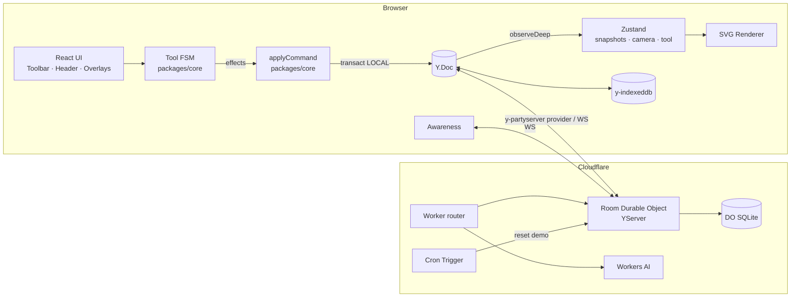

# Relay — Design Spec

Date: 2026-09-24
Status: Approved for planning

## Overview

Relay is a live multiplayer whiteboard: a shared canvas where cursors,
shapes and edits sync instantly between everyone in a room. It supports
rectangles, ellipses, lines, text, sticky notes, code blocks, frames with
columns (for retrospectives), anchored connectors, a shared voting timer,
comments, and an AI assistant that clusters and summarizes sticky notes.

The central idea is that **the document is a CRDT and everything else is a
pure function of it**. Yjs is the single source of truth for board content;
all mutations are typed commands applied inside Yjs transactions; geometry,
tool behaviour and normalization live in a framework-free core package that
is tested deterministically, including property-based convergence tests
across simulated replicas. React only renders snapshots and translates
pointer events into tool events.

This is a portfolio project targeting fullstack / AI engineering roles. It
is scoped so that a recruiter can open one link and immediately see two
cursors collaborating, while the repository shows real engineering: a
hand-written scene renderer, a tool state machine, CRDT modelling decisions,
convergence testing, and an AI feature with a measured evaluation.

**Hard constraint: total cost is $0, with no credit card registered on any
service.**

## Goals

- Real-time collaboration with sub-200 ms propagation between browsers over
  the real network (Vercel ↔ Cloudflare Workers).
- Implement the full feature set of the reference mockup (see Feature
  Inventory), delivered in phases that are each deployable.
- Guarantee convergence: a property-based test runs 10,000 random concurrent
  command sequences across three replicas and asserts identical state and
  schema invariants.
- A public demo room that opens in under 2 s with no cold start and resets
  nightly to a seeded board.
- An AI "Cluster & summarize" feature whose clustering is deterministic and
  whose LLM output is schema-validated, with an offline evaluation reporting
  Adjusted Rand Index and first-pass JSON validity.

## Non-Goals

- No user accounts or login. Identity is anonymous; access is controlled by
  capability links.
- No rich text. Text fields are plain text (`Y.Text`), edited via textarea.
- No nested frames, no rotation, no freehand drawing, no image upload.
- No board listing / dashboard of rooms. A room is reached by its link.
- No mobile/touch-optimized editing (the board is viewable on mobile).
- No self-hosted Node sync server; the Cloudflare Durable Object is the only
  backend.

## Key Decisions

| Decision | Choice | Rationale |
|---|---|---|
| Sync backend | `y-partyserver` on Cloudflare Workers + Durable Objects (SQLite) | Free plan without card, no VM cold start, one DO per room gives natural isolation and built-in storage |
| Frontend host | Next.js (App Router) on Vercel Hobby | Free, no card; the board route is client-only so no SSR cost |
| Renderer | Hand-written SVG renderer | Enough performance for hundreds of shapes; free DOM hit-testing, CSS styling and text layout; maximal portfolio value |
| Rejected: tldraw / Excalidraw | — | tldraw's free license requires visible branding; either library would own the technically interesting parts |
| Rejected: Canvas 2D / Konva | — | Only pays off at thousands of shapes; text editing, hit-testing and accessibility become manual |
| State | Yjs = document truth; Zustand = local UI state only | One writer path for content; camera, active tool and drag state never enter the CRDT |
| Mutations | Typed command union applied by `applyCommand` in `packages/core` | Testable without React; single place to enforce invariants |
| Z-order | Fractional-index strings on each shape | Avoids a shared order array and its concurrent-move conflicts |
| Text editing | `<textarea>` overlay diffed into `Y.Text` | Avoids contentEditable/IME complexity while keeping character-level merges |
| Identity | Anonymous random name + color persisted in `localStorage` | Zero friction for demo visitors |
| Access control | Capability links: HMAC-derived edit/view keys | No accounts, still supports read-only sharing enforced server-side |
| AI provider | Cloudflare Workers AI | Free daily allocation, same provider and account, fails closed instead of billing |
| Package manager | npm workspaces | Already installed (Node 25 ships no corepack); `overrides` pins a single `yjs` copy |
| Yjs version | `yjs` 13.6.x (stable) | v14 (`@y/y`) is still a release candidate |

## Architecture



### Repository Layout

```
relay/
├─ apps/
│  ├─ web/                     Next.js App Router → Vercel
│  │  ├─ app/page.tsx          landing: "Open live demo", "New board"
│  │  ├─ app/r/[roomId]/       board route (client-only, dynamic ssr:false)
│  │  └─ src/
│  │     ├─ sync/              provider, awareness, persistence, time offset
│  │     ├─ store/             Yjs→Zustand bridge, local UI store, undo
│  │     ├─ render/            Canvas, ShapeView, ConnectorView, Selection,
│  │     │                     RemoteCursors, Minimap, TextEditor
│  │     └─ ui/                Toolbar, Header, Presence, ZoomControls,
│  │                           VoteBadge, Comments, AiPanel
│  └─ sync-server/             Cloudflare Worker
│     ├─ src/index.ts          router: WS, /api/rooms, /api/.../ai/cluster
│     ├─ src/room.ts           Room DO extends YServer
│     ├─ src/auth.ts           HMAC key derivation / verification
│     ├─ src/limits.ts         token bucket, size caps
│     ├─ src/ai/               embeddings, clustering, naming, schema
│     └─ src/demo-seed.ts      seeded demo board
├─ packages/
│  └─ core/                    pure TypeScript, no React/DOM
│     ├─ schema/               types, doc constructors, migrations, normalize
│     ├─ commands/             command union + applyCommand
│     ├─ geometry/             bounds, hit-test, resize, camera, connectors
│     ├─ tools/                tool FSM
│     └─ ai/                   proposal types + validation (shared w/ server)
├─ e2e/                        Playwright
├─ eval/                       AI evaluation fixtures + runner
├─ docs/                       specs, architecture.md, screenshots
├─ Makefile
├─ docker-compose.yml          web + wrangler dev
└─ .github/workflows/          ci.yml, deploy.yml (manual)
```

`packages/core` is the heart of the system. Anything that can be tested
deterministically — commands, geometry, tool transitions, normalization,
convergence — lives there.

## Feature Inventory (from the reference mockup)

- Left toolbar: select, rectangle, ellipse, line/arrow, text, sticky note,
  code block `{ }`, help `?`.
- Header: logo, breadcrumbs (e.g. `Q3 Planning / Sprint 14 Retro`), presence
  avatars with initials, `N online` pill, connection status, COMMENTS and
  SHARE buttons.
- Canvas: dotted grid, pan, zoom at cursor (10%–400%), zoom controls
  `- 100% +`, world cursor coordinates readout, minimap with viewport
  rectangle.
- Frames with titled columns and derived counters (`WENT WELL · 2`); sticky
  notes with author initials and time/owner metadata; reparenting on drop.
- Connectors between shapes, straight or elbow, with arrowheads.
- Selection with 8 resize handles and a `W × H` dimension label; marquee
  multi-select.
- Remote named cursors, remote selections, remote "Typing..." ghost card.
- Large text shapes with a tag (e.g. `DECISION NEEDED`).
- Shared countdown badge `VOTE OPEN · m:ss` and per-sticky votes.
- Anchored comments with threads and resolve.
- Visual style: neo-brutalist — off-white background, 2–3 px black borders,
  hard offset shadow `4px 4px 0 #000`, yellow / blue / orange accents,
  Archivo Black headings, JetBrains Mono metadata.

## Data Model

### Yjs Document

```
meta        Y.Map   { schemaVersion: number, title: string, breadcrumb: string[] }
shapes      Y.Map<id, Y.Map>
              type        'rect'|'ellipse'|'line'|'text'|'sticky'|'code'|'frame'
              x, y, w, h  numbers, world coordinates
              z           fractional-index string
              parentId?   frame id
              columnId?   column id within parent frame
              style       atomic JSON { fill, stroke, font }
              text?       Y.Text (sticky, text, code, rect label)
              tag?        string
              lang?       string (code)
              createdBy   user id
              authorName  display name at creation time (shown on stickies)
              createdAt   epoch ms
              columns     Y.Array<{ id, title }>   (frame only)
connectors  Y.Map<id, Y.Map>
              from, to    { shapeId, anchor: 'n'|'s'|'e'|'w'|'auto' } | { x, y }
              routing     'straight' | 'elbow'
              head        'arrow' | 'none'
              z           fractional-index string
session     Y.Map   { vote: { open: boolean, endsAt: number, maxPerUser: number } }
votes       Y.Map<"<shapeId>:<userId>", true>
comments    Y.Map<id, Y.Map>
              anchor      { shapeId } | { x, y }
              resolved    boolean
              createdBy   user id
              thread      Y.Array<{ author, body, ts }>
```

Lines are shapes (`type: 'line'`) with endpoints encoded in `x, y, w, h`
(w/h may be negative); connectors are separate entities because their
geometry is derived from the shapes they attach to.

### Modelling Rules

1. **Map, not array, for shapes.** Concurrent edits to different shapes
   never conflict, and lookup is O(1). Arrays are index-based and conflict
   on concurrent delete/reorder.
2. **Flat keys where concurrent creation is possible.** If two clients
   concurrently create a nested `Y.Map` under the same key, one whole map is
   lost (last-writer-wins per key). `votes` therefore uses flat
   `shapeId:userId` keys. Nested structures are only created by the client
   that creates their parent (e.g. a comment's `thread`).
3. **Normalize on read, not on write.** The read-side normalizer drops
   connectors whose endpoint shape no longer exists, treats a `parentId`
   pointing to a missing frame as root, and breaks equal `z` values by id.
   The `DeleteShapes` command also deletes attached connectors in the same
   transaction; the read filter covers the concurrent connect-while-delete
   case. Frames cannot be nested, so parent cycles cannot occur.
4. **Derive, never store, aggregates.** Column counters and vote totals are
   computed from the document.
5. **Timer uses server time.** `endsAt` is an absolute server epoch; clients
   apply a server-provided clock offset.
6. **Schema versioning.** `meta.schemaVersion` plus forward-only migration
   functions in `packages/core/schema/migrations`.

### Awareness (ephemeral)

```ts
{
  user: { id: string; name: string; color: string };
  cursor: { x: number; y: number } | null;   // world coordinates
  selection: string[];
  editing: string | null;                    // shape id being text-edited
  typing: { rect: Rect; parentId?: string } | null;  // "Typing..." ghost
  viewport: { x: number; y: number; zoom: number; w: number; h: number };
  ai?: { status: 'thinking'; target: string };
}
```

Awareness updates are throttled to 50 ms (≈20 messages/s per active user).
Inactive clients are dropped by the standard awareness timeout.

## Client

### Sync Layer (`apps/web/src/sync`)

- `YProvider` from `y-partyserver/provider` connects to
  `/parties/room/<roomId>` with the capability key as a query parameter.
- `y-indexeddb` persists the doc locally for instant load and offline edits.
- Connection status (`connecting` / `online` / `offline · N pending`) is
  surfaced in the header.
- A custom `time` message from the server sets the clock offset.

### Commands and Undo

All mutations are values of a typed union — `CreateShape`, `MoveShapes`,
`Resize`, `DeleteShapes`, `Reparent`, `Connect`, `SetZ`, `SetText`,
`SetStyle`, `Vote`, `StartVote`, `AddComment`, `ResolveComment`,
`ApplyAiProposal`, … — applied by `applyCommand(doc, cmd)` inside
`doc.transact(fn, origin)`. UI code never touches Yjs types directly.

`Y.UndoManager` tracks the `LOCAL` and `AI` origins only, so each user undoes
only their own changes. Gestures call `stopCapturing()` on completion so a
whole drag or resize is one undo step.

The undo manager uses a 60 s capture timeout, so undo steps are delimited
explicitly: every gesture ends one (`endGesture`), and so does closing the
text editor — a whole text-editing session is a single undo step. Undo and
redo are ignored while a gesture is in progress.

### Yjs → Zustand Bridge

`observeDeep` on `shapes` and `connectors` collects the ids touched by each
transaction and rebuilds immutable snapshots only for those ids. The store
exposes `{ shapes: Record<id, Shape>, connectors: Record<id, Connector>,
order: id[] }` (normalized, sorted by `z`). Each `<ShapeView id>` subscribes
with its own selector and is memoized, so only changed shapes re-render.
Awareness feeds a separate `presence` slice. Camera, active tool and
in-progress gesture state live only in Zustand.

### Tool State Machine

A pure reducer in `packages/core/tools`:

```ts
step(state: ToolState, event: ToolEvent, ctx: ToolContext)
  → { state: ToolState; effects: Effect[] }
```

- Events: pointer down/move/up (world coordinates, modifiers, hit target),
  key down/up, cancel.
- Effects: `command`, `preview` (local-only visual state), `awareness`,
  `setTool`, `endGesture`.
- During drags and resizes, the FSM emits an `overlay` effect with the
  current geometry on every pointer move; the web app renders shapes with
  that local geometry (so the gesture is smooth at display rate) while
  `MoveShapes` / `ResizeShapes` commits to the document stay throttled at
  50 ms, and a final exact commit plus `overlay: null` ends the gesture.
  `endGesture` triggers `stopCapturing()`.

### Rendering

A single `<svg>` whose root `<g>` carries the camera transform. Layers,
back to front: dotted grid (`<pattern>` scaled with the camera), frames,
connectors, shapes, remote selections, local selection and handles with the
`W × H` label. Remote cursors and their name tags are an HTML overlay in
screen space so labels do not scale with zoom. Text inside shapes is
rendered via `foreignObject` so CSS handles wrapping.

Camera math: `screen = (world + cam.xy) * cam.zoom`,
`world = screen / cam.zoom - cam.xy`; zoom is anchored at the cursor.

### Hit-Testing and Spatial Index

Clicks resolve the shape under the pointer by position
(`document.elementFromPoint`), because pointer capture retargets events to
the `<svg>`. Resize handles carry `data-handle` and are reported to the tool
FSM as `PointerInfo.handle`. Marquee selection uses a linear scan over shape
bounds (`shapesInRect`), which is ample for the hundreds of shapes a board
holds; an R-tree (`rbush`) can replace it behind the same signature if
profiling ever shows a need. Lines are hit through a 14 px transparent stroke.

### Connectors

Endpoints attached to a shape are clipped to the shape boundary (rectangle
or ellipse intersection along the line between centers, or a fixed anchor).
Elbow routing produces an orthogonal polyline with at most two bends chosen
from the anchor sides. Obstacle-avoiding routing is out of scope.

### Text Editing

Double-click (or typing on a new sticky) mounts a `<textarea>` overlay
positioned over the shape. Local input is diffed against the current string
and applied to `Y.Text` as insert/delete; remote changes are applied to the
textarea while preserving the caret by mapping it through the single-span diff (equivalent to `Y.RelativePosition` for textarea edits). The editor
publishes `editing` in awareness so peers see an "editing" outline.

### Input

Shortcuts: `V` select, `R` rectangle, `O` ellipse, `L` line, `T` text,
`S` sticky, `Delete`, `Ctrl+Z` / `Ctrl+Shift+Z`, arrow keys to nudge
(Shift = 10 px). Pan with space-drag or middle mouse; zoom with
Ctrl/⌘+wheel or pinch.

## Server (`apps/sync-server`)

### Routes

| Route | Purpose |
|---|---|
| `WS /parties/room/:roomId` | Room Durable Object (`YServer` subclass) |
| `POST /api/rooms` | Create a room → `{ roomId, editKey, viewKey }` |
| `POST /api/rooms/:roomId/ai/cluster` | AI proposal (requires edit key) |

### Capability Links

- `roomId`: 128-bit random, base32.
- `editKey = HMAC(SECRET, roomId + ":edit")`,
  `viewKey = HMAC(SECRET, roomId + ":view")`, truncated and base64url.
- Share URL: `/r/<roomId>#k=<key>`. The fragment is never sent to the web
  host; the client passes it as the `key` query parameter of the WebSocket
  URL. The Worker router verifies it in `onBeforeConnect` and forwards the
  resulting role in an `x-relay-role` header (always overwritten), so the DO
  assigns the role synchronously in `onConnect` and no early sync message is
  processed without a role.
- Viewers: the DO drops incoming document-update messages; awareness is
  allowed so their cursors remain visible.
- Missing or invalid key: connection closed with code 4401.
- The `demo` room accepts connections without a key, with edit role.

### Demo Room

A public room `demo` seeded with the mockup board (Sprint 14 retro frame,
Intake → Triage → Build → Ship v2.4 flowchart, "WHO OWNS THE RELEASE
NOTES?" text). A Cron Trigger restores it to the seed snapshot nightly.
The landing page offers "Open live demo" and "New board".

### Persistence

`onLoad` reads the latest snapshot from DO SQLite; `onSave` writes
`Y.encodeStateAsUpdate(doc)` debounced (2 s wait, 10 s max wait). One
snapshot row per room; update-log compaction is unnecessary at this scale.

### Limits

| Limit | Value |
|---|---|
| Document size | 1 MB, enforced on arrival (running estimate of accepted updates, re-measured exactly when the estimate crosses the limit); snapshots over 1.9 MB are never written |
| Message size | 256 KB |
| Awareness frame | 8 KB, at most 2 awareness client ids per connection |
| Per-connection rate | Token bucket, 60 messages/s, burst 120; exceeding it closes the socket (4429) so the reconnect resyncs |
| Connections per room | 25 |
| `POST /api/rooms` | Per-IP rate limit |
| AI requests | Per-room daily cap plus a global daily cap |

### Server Time

On connect the DO sends a custom `{ type: 'time', now }` message; the client
computes and periodically refreshes its offset.

### Environments

Local development uses `wrangler dev` (Miniflare) and requires no Cloudflare
account. Production is deployed to `*.workers.dev`; `SECRET` is set with
`wrangler secret put`. A Cloudflare account is only needed at phase F4.

## AI: Cluster & Summarize (F5)

### User Flow

1. Select a frame or a set of stickies and click **Cluster & summarize**.
2. A ghost proposal appears: stickies regrouped into titled clusters plus up
   to three suggested "Actions" stickies.
3. **Accept** applies the proposal as one `ApplyAiProposal` command with
   origin `AI` — a single `Ctrl+Z` reverts it. **Discard** leaves the
   document untouched.
4. While the request runs, the requester's awareness publishes
   `ai: { status: 'thinking', target }`; peers see "Relay AI is thinking…".

The server returns a proposal instead of writing to the document because a
server-side write would reach the requester as a remote update that their
`UndoManager` cannot revert, and because a human review step is the safer
design.

### Pipeline

1. **Embed** each sticky's text with a Workers AI embedding model.
2. **Cluster deterministically** in the Worker: agglomerative clustering on
   cosine similarity with a threshold. No LLM involved; results are
   reproducible and unit-testable.
3. **Name** each cluster and draft actions with a Workers AI instruct model
   in JSON mode.
4. **Validate** with a zod schema shared from `packages/core/ai`: every
   referenced sticky id must exist in the input, text lengths are bounded.
   On failure retry once; on second failure fall back to unnamed clusters
   (`Group 1`, …). The feature never fails because of model output.

### Safety and Quotas

- Sticky text is untrusted input. The model has no tools and its output can
  only produce titles, new stickies and positions.
- At most 60 stickies per request; requires the edit key.
- Per-room and global daily caps keep usage inside the free allocation;
  when exhausted the UI shows "AI quota reached, try tomorrow".

### Evaluation

`npm run eval:ai` runs ~10 synthetic retrospectives with reference
groupings and reports the Adjusted Rand Index of the clustering and the
first-pass schema-validity rate of LLM output. Results are published as a
table in the README. CI runs the pipeline with a mocked model.

## Testing Strategy

| Layer | Tooling | Coverage |
|---|---|---|
| Geometry & tool FSM | Vitest | Bounds, hit-testing, resize from each of 8 handles including flips, connector clipping (rect/ellipse), elbow routing, camera transforms, FSM transition tables |
| Commands & normalization | Vitest | Each command against an in-memory `Y.Doc`; orphan connectors, missing parents, `z` ties |
| Convergence | Vitest + `fast-check` | 3 replicas, random concurrent command sequences, delayed/reordered delivery; identical `toJSON()` and invariants; undo interleaved with remote ops; 10,000 runs in a nightly job, fewer on PRs |
| Server | Vitest + `@cloudflare/vitest-pool-workers` | HMAC verification, viewer write rejection, size/rate limits, persistence round-trip, demo reset |
| End-to-end | Playwright, two browser contexts | Sticky created in A appears in B; named cursor visible; concurrent drags converge; offline edit + reconnect via `setOffline`; read-only link blocks editing; visual snapshot of the retro frame |
| AI | `eval:ai` | ARI, schema-validity rate (mocked model in CI) |

CI (GitHub Actions): lint, typecheck, unit/property tests, Playwright
against `wrangler dev` + `next dev`. Deployment is a manually triggered
workflow.

## Phases

| Phase | Scope | Est. hours |
|---|---|---|
| F0 — Foundation | This spec, monorepo, CI, Makefile, docker-compose, design tokens, **hibernation spike** | 10 |
| F1 — MVP | One room, grid, rect/sticky/text, move, cursors, presence, DO persistence | 30 |
| F2 — Editing | Ellipse, lines, connectors, selection + marquee, resize, undo/redo, frames with columns, code block | 50 |
| F3 — Navigation & session | Pan/zoom, coordinates, minimap, voting + timer, "Typing…", comments | 40 |
| F4 — Ship | Offline, capability links, demo room + cron, E2E, deploy, bilingual README, mermaid, GIF | 40 |
| F5 — AI | Clustering pipeline, proposal UI, evaluation | 15 |
| **Total** | | **~185** |

Each phase ends in a deployable state. Implementation plans are written
per phase.

### Cut Order (if time runs short)

1. Comments
2. Code block
3. Elbow routing (keep straight connectors)
4. Interactive minimap (keep display-only)
5. Voting (keep the timer)

Never cut: cursors and presence, convergence tests, two-client E2E, deploy,
README with demo GIF.

## Risks and Early Spikes

| Risk | Mitigation |
|---|---|
| `y-partyserver` may not support WebSocket hibernation | F0 spike. Without it the DO still fits the free daily GB-s allowance at demo traffic; monitor usage |
| Free-plan request quota (100k/day; incoming WS messages count 20:1) | 50 ms awareness throttle, 50 ms drag commit throttle, debounced saves |
| Concurrent text editing edge cases (IME, caret) | Textarea overlay, `Y.RelativePosition`, E2E coverage |
| Duplicate `yjs` instances breaking type checks | npm `overrides`, CI smoke test |
| Next.js SSR touching browser-only APIs | Board route loaded with `dynamic(..., { ssr: false })` |
| Clock skew on the vote timer | Server time offset |
| Render performance with many shapes | Per-shape selectors + `memo`, transforms during drag; revisit Canvas only if profiling demands it |
| Workers AI model availability / quota | Deterministic clustering works without the LLM; graceful fallback naming |
| Vercel Hobby non-commercial terms | Personal portfolio use complies |

## Success Criteria

- Changes propagate between two browsers in under 200 ms over the deployed
  stack.
- Convergence property test passes 10,000 random sequences.
- Demo room loads in under 2 s with no cold start.
- 60 fps while dragging with 300 shapes (Chrome Performance panel).
- $0 spent; no credit card on any service.
- README (EN/ES) with architecture diagram, AI evaluation table and a GIF of
  two cursors collaborating.
