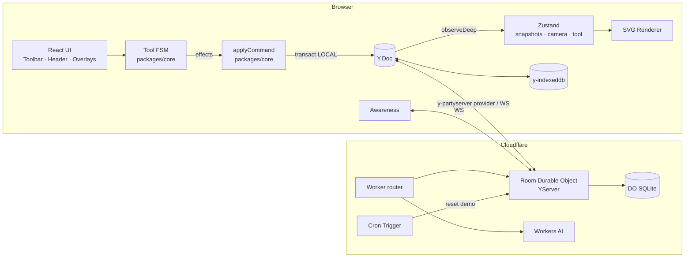

# Relay — Design Spec

Date: 2026-09-24
Status: Approved for planning

## Overview

Relay is a live multiplayer whiteboard: a shared canvas where cursors,
shapes and edits sync instantly between everyone in a room. It supports
rectangles, ellipses, lines, text, sticky notes, code blocks, frames with
columns (for retrospectives), anchored connectors, a shared voting timer,
comments, and an AI assistant that clusters and summarizes sticky notes.

The central idea is that **the document is a CRDT and everything else is a
pure function of it**. Yjs is the single source of truth for board content;
all mutations are typed commands applied inside Yjs transactions; geometry,
tool behaviour and normalization live in a framework-free core package that
is tested deterministically, including property-based convergence tests
across simulated replicas. React only renders snapshots and translates
pointer events into tool events.

This is a portfolio project targeting fullstack / AI engineering roles. It
is scoped so that a recruiter can open one link and immediately see two
cursors collaborating, while the repository shows real engineering: a
hand-written scene renderer, a tool state machine, CRDT modelling decisions,
convergence testing, and an AI feature with a measured evaluation.

**Hard constraint: total cost is $0, with no credit card registered on any
service.**

## Goals

- Real-time collaboration with sub-200 ms propagation between browsers over
  the real network (Vercel ↔ Cloudflare Workers).
- Implement the full feature set of the reference mockup (see Feature
  Inventory), delivered in phases that are each deployable.
- Guarantee convergence: a property-based test runs 10,000 random concurrent
  command sequences across three replicas and asserts identical state and
  schema invariants.
- A public demo room that opens in under 2 s with no cold start and resets
  nightly to a seeded board.
- An AI "Cluster & summarize" feature whose clustering is deterministic and
  whose LLM output is schema-validated, with an offline evaluation reporting
  Adjusted Rand Index and first-pass JSON validity.

## Non-Goals

- No user accounts or login. Identity is anonymous; access is controlled by
  capability links.
- No rich text. Text fields are plain text (`Y.Text`), edited via textarea.
- No nested frames, no rotation, no freehand drawing, no image upload.
- No board listing / dashboard of rooms. A room is reached by its link.
- No mobile/touch-optimized editing (the board is viewable on mobile).
- No self-hosted Node sync server; the Cloudflare Durable Object is the only
  backend.

## Key Decisions

| Decision | Choice | Rationale |
|---|---|---|
| Sync backend | `y-partyserver` on Cloudflare Workers + Durable Objects (SQLite) | Free plan without card, no VM cold start, one DO per room gives natural isolation and built-in storage |
| Frontend host | Next.js (App Router) on Vercel Hobby | Free, no card; the board route is client-only so no SSR cost |
| Renderer | Hand-written SVG renderer | Enough performance for hundreds of shapes; free DOM hit-testing, CSS styling and text layout; maximal portfolio value |
| Rejected: tldraw / Excalidraw | — | tldraw's free license requires visible branding; either library would own the technically interesting parts |
| Rejected: Canvas 2D / Konva | — | Only pays off at thousands of shapes; text editing, hit-testing and accessibility become manual |
| State | Yjs = document truth; Zustand = local UI state only | One writer path for content; camera, active tool and drag state never enter the CRDT |
| Mutations | Typed command union applied by `applyCommand` in `packages/core` | Testable without React; single place to enforce invariants |
| Z-order | Fractional-index strings on each shape | Avoids a shared order array and its concurrent-move conflicts |
| Text editing | `<textarea>` overlay diffed into `Y.Text` | Avoids contentEditable/IME complexity while keeping character-level merges |
| Identity | Anonymous random name + color persisted in `localStorage` | Zero friction for demo visitors |
| Access control | Capability links: HMAC-derived edit/view keys | No accounts, still supports read-only sharing enforced server-side |
| AI provider | Cloudflare Workers AI | Free daily allocation, same provider and account, fails closed instead of billing |
| Package manager | npm workspaces | Already installed (Node 25 ships no corepack); `overrides` pins a single `yjs` copy |
| Yjs version | `yjs` 13.6.x (stable) | v14 (`@y/y`) is still a release candidate |

## Architecture


```mermaid
flowchart LR
  subgraph Browser
    UI[React UI\nToolbar · Header · Overlays]
    R[SVG Renderer]
    Z[Zustand\nsnapshots · camera · tool]
    FSM[Tool FSM\npackages/core]
    CMD[applyCommand\npackages/core]
    YD[(Y.Doc)]
    IDB[(y-indexeddb)]
    AW[Awareness]
  end
  subgraph Cloudflare
    W[Worker router]
    DO[Room Durable Object\nYServer]
    SQL[(DO SQLite)]
    AI[Workers AI]
    CRON[Cron Trigger]
  end
  UI --> FSM
  FSM -->|effects| CMD
  CMD -->|transact LOCAL| YD
  YD -->|observeDeep| Z
  Z --> R
  YD <--> IDB
  YD <-->|y-partyserver provider / WS| DO
  AW <-->|WS| DO
  DO --> SQL
  W --> DO
  W --> AI
  CRON -->|reset demo| DO
```

### Repository Layout

```
relay/
├─ apps/
│  ├─ web/                     Next.js App Router → Vercel
│  │  ├─ app/page.tsx          landing: "New board"
│  │  ├─ app/r/[roomId]/       board route (client-only, dynamic ssr:false)
│  │  └─ src/
│  │     ├─ sync/              provider, awareness, persistence, time offset
│  │     ├─ store/             Yjs→Zustand bridge, local UI store, undo
│  │     ├─ render/            Canvas, ShapeView, ConnectorView, Selection,
│  │     │                     RemoteCursors, Minimap, TextEditor
│  │     └─ ui/                Toolbar, Header, Presence, ZoomControls,
│  │                           VoteBadge, Comments, AiPanel
│  └─ sync-server/             Cloudflare Worker
│     ├─ src/index.ts          router: WS, /api/rooms, /api/.../ai/cluster
│     ├─ src/room.ts           Room DO extends YServer
│     ├─ src/auth.ts           HMAC key derivation / verification
│     ├─ src/limits.ts         token bucket, size caps
│     ├─ src/ai/               embeddings, clustering, naming, schema
│     └─ src/demo-seed.ts      seeded demo board
├─ packages/
│  └─ core/                    pure TypeScript, no React/DOM
│     ├─ schema/               types, doc constructors, migrations, normalize
│     ├─ commands/             command union + applyCommand
│     ├─ geometry/             bounds, hit-test, resize, camera, connectors
│     ├─ tools/                tool FSM
│     └─ ai/                   proposal types + validation (shared w/ server)
├─ e2e/                        Playwright
├─ eval/                       AI evaluation fixtures + runner
├─ docs/                       specs, architecture.md, screenshots
├─ Makefile
├─ docker-compose.yml          web + wrangler dev
└─ .github/workflows/          ci.yml, deploy.yml (manual)
```

`packages/core` is the heart of the system. Anything that can be tested
deterministically — commands, geometry, tool transitions, normalization,
convergence — lives there.

## Feature Inventory (from the reference mockup)

- Left toolbar: select, rectangle, ellipse, line/arrow, text, sticky note,
  code block `{ }`, help `?`.
- Header: logo, breadcrumbs (e.g. `Q3 Planning / Sprint 14 Retro`), presence
  avatars with initials, `N online` pill, connection status, COMMENTS and
  SHARE buttons.
- Canvas: dotted grid, pan, zoom at cursor (10%–400%), zoom controls
  `- 100% +`, world cursor coordinates readout, minimap with viewport
  rectangle.
- Frames with titled columns and derived counters (`WENT WELL · 2`); sticky
  notes with author initials and time/owner metadata; reparenting on drop.
- Connectors between shapes, straight or elbow, with arrowheads.
- Selection with 8 resize handles and a `W × H` dimension label; marquee
  multi-select.
- Remote named cursors, remote selections, remote "Typing..." ghost card.
- Large text shapes with a tag (e.g. `DECISION NEEDED`).
- Shared countdown badge `VOTE OPEN · m:ss` and per-sticky votes.
- Anchored comments with threads and resolve.
- Visual style: neo-brutalist — off-white background, 2–3 px black borders,
  hard offset shadow `4px 4px 0 #000`, yellow / blue / orange accents,
  Archivo Black headings, JetBrains Mono metadata.

## Data Model

### Yjs Document

```
meta        Y.Map   { schemaVersion: number, title: string, breadcrumb: string[] }
pages       Y.Map<id, Y.Map>
              type        'board' | 'sheet' | 'calendar'
              title       string
              order       fractional-index string
              createdBy   user id
              createdAt   epoch ms
pageTombstones Y.Map<pageId, true>   (flat, write-once: a deleted page never
                                     comes back — concurrent writes of `true`
                                     cannot lose a delete, unlike a flag on a
                                     lazily created page map)
shapes      Y.Map<id, Y.Map>
              pageId?     page id (absent = the implicit 'main' page)
              type        'rect'|'ellipse'|'line'|'text'|'sticky'|'code'|'frame'
              x, y, w, h  numbers, world coordinates
              z           fractional-index string
              parentId?   frame id
              columnId?   column id within parent frame
              style       atomic JSON { fill, stroke, font, size? }   (size: 's'|'m'|'l',
                          text-bearing shapes; absent = 'm')
              locked?     true   (no move/resize/delete/restyle/text edit)
              text?       Y.Text (sticky, text, code, rect label)
              tag?        string
              lang?       string (code)
              createdBy   user id
              authorName  display name at creation time (shown on stickies)
              createdAt   epoch ms
              columns     Y.Array<{ id, title }>   (frame only)
connectors  Y.Map<id, Y.Map>
              pageId?     page id (absent = 'main')
              from, to    { shapeId, anchor: 'n'|'s'|'e'|'w'|'auto' } | { x, y }
              routing     'straight' | 'elbow'
              head        'arrow' | 'none'
              label?      string, ≤ 40 characters (drawn at the path's middle; a
                          number doubles as the edge weight for graph algorithms)
              z           fractional-index string
              createdBy   user id
session     Y.Map   { vote: { open: boolean, endsAt: number, maxPerUser: number,
                              startedBy: user id } }   (atomic JSON value)
votes       Y.Map<"<shapeId>:<userId>", true>
comments    Y.Map<id, Y.Map>
              pageId?     page id (absent = 'main')
              anchor      { shapeId, dx, dy } | { x, y }   (atomic JSON; dx/dy from
                          the shape's top-left)
              resolved    boolean
              createdBy   user id
              createdAt   epoch ms
              thread      Y.Array<{ id, authorId, author, body, ts }>
sheets      Y.Map<pageId, Y.Map>      (sheet pages only; created with the page)
              rows        Y.Map<rowId, Y.Map { order }>
              cols        Y.Map<colId, Y.Map { order, width? }>
              cells       Y.Map<"<rowId>|<colId>", { src, fmt? }>   (atomic JSON;
                          fmt: { bold?, align?, num? })
calendars   Y.Map<pageId, Y.Map>      (calendar pages only; created with the page)
              events      Y.Map<eventId, Y.Map>
                            title       string, ≤ 120 characters
                            notes?      string, ≤ 2000 characters
                            color       palette colour
                            when        atomic JSON:
                                        { allDay: true, start: 'YYYY-MM-DD', end: 'YYYY-MM-DD' }
                                        (end inclusive) |
                                        { allDay: false, start: 'YYYY-MM-DDTHH:mm',
                                          end: 'YYYY-MM-DDTHH:mm', tz: IANA zone }
                                        (wall time in the creator's zone)
                            rule?       atomic JSON { freq: 'daily'|'weekly'|'monthly'|'yearly',
                                        interval: 1–99, byDay?: (0–6)[], until?: 'YYYY-MM-DD',
                                        count?: 1–999 }
                            exceptions  Y.Map<'YYYY-MM-DD' (original date), { cancelled: true } |
                                        { when, title?, notes?, color? }>   (atomic JSON values)
                            rsvp        Y.Map<userId, { status: 'yes'|'maybe'|'no', name }>
                            link?       atomic JSON { pageId, shapeId }   (the source sticky)
                            uid?        string, ≤ 200 characters (imported .ics UID)
                            createdBy   user id
                            createdAt   epoch ms
```

Lines are shapes (`type: 'line'`) with endpoints encoded in `x, y, w, h`
(w/h may be negative); connectors are separate entities because their
geometry is derived from the shapes they attach to.

### Modelling Rules

1. **Map, not array, for shapes.** Concurrent edits to different shapes
   never conflict, and lookup is O(1). Arrays are index-based and conflict
   on concurrent delete/reorder.
2. **Flat keys where concurrent creation is possible.** If two clients
   concurrently create a nested `Y.Map` under the same key, one whole map is
   lost (last-writer-wins per key). `votes` therefore uses flat
   `shapeId:userId` keys. Nested structures are only created by the client
   that creates their parent (e.g. a comment's `thread`).
3. **Normalize on read, not on write.** The read-side normalizer drops
   connectors whose endpoint shape no longer exists, treats a `parentId`
   pointing to a missing frame as root, drops a `columnId` that is not
   present among its parent frame's columns, and breaks equal `z` values by
   id. The `DeleteShapes` command also deletes attached connectors in the
   same transaction; the read filter covers the concurrent connect-while-delete
   case. Frames cannot be nested, so parent cycles cannot occur. Pages:
   the visible pages are the entries of `pages` whose id is not in
   `pageTombstones`, plus the implicit `main` board page when `pages` has no
   `Y.Map` entry for `main` and `main` is not tombstoned, sorted by
   `order` then id; a shape, connector or comment whose page is deleted is
   hidden; a connector is dropped when either attached endpoint lives on
   another page; a `parentId` pointing to a frame on another page is treated
   as root.
4. **Derive, never store, aggregates.** Column counters and vote totals are
   computed from the document.
5. **Timer uses server time.** `endsAt` is an absolute server epoch; clients
   apply a server-provided clock offset.
6. **Schema versioning.** `meta.schemaVersion` plus forward-only migration
   functions in `packages/core/schema/migrations`.

### Awareness (ephemeral)

```ts
{
  user: { id: string; name: string; color: string };
  cursor: { x: number; y: number } | null;   // world coordinates
  selection: string[];
  editing: string | null;                    // shape id being text-edited ("typing…")
  viewport: { x: number; y: number; w: number; h: number } | null;  // world rect in view
  page: string | null;                       // page id this user is looking at
  sheet?: { anchor: [string, string]; focus: [string, string]; editing: boolean } | null;
                                             // [rowId, colId] selection on a sheet page
  calEvent?: string | null;                  // event id open in the editor on a calendar page
  ai?: { status: 'thinking'; target: string };
}
```

Awareness updates are throttled to 50 ms (≈20 messages/s per active user).
Inactive clients are dropped by the standard awareness timeout. There is no
separate "typing" field: shapes are created on click, so a peer's `editing`
id is enough to show a "Name · typing…" tag on the shape being edited.
Untrusted `viewport` values are accepted only when finite with a positive,
bounded size (≤ 1e6 world units per side).

## Client

### Sync Layer (`apps/web/src/sync`)

- `YProvider` from `y-partyserver/provider` connects to
  `/parties/room/<roomId>` with the capability key as a query parameter.
- `y-indexeddb` persists the doc locally for instant load and offline edits.
- Connection status (`connecting` / `online` / `offline · N pending`) is
  surfaced in the header.
- Custom messages from the server (y-partyserver's `__YPS:` channel) carry
  JSON: `{ type: 'hello', role, now, viewKey? }` on every connect (`viewKey`
  only for the `edit` role, so editors can share a read-only link) and
  `{ type: 'time', now }` in reply to the client's `{ type: 'time?' }`, sent
  every 5 minutes. The client keeps `offset = now − Date.now()` at receipt
  (error ≤ one-way latency) and its `role` (`edit` | `view`) in the
  connection's `clock` store; unknown or malformed messages are ignored.

### Commands and Undo

All mutations are values of a typed union — `CreateShape`, `MoveShapes`,
`ResizeShapes`, `DeleteShapes`, `Reparent`, `Connect`, `SetRouting`,
`RenameColumn`, `SetZ`, `SetText`, `SetStyle`, `SetLocked`, `SetHead`,
`PasteItems`, `StartVote`, `EndVote`,
`CastVote`, `RetractVote`, `AddComment`, `ReplyComment`, `ResolveComment`,
the sheet commands (`SetCells`, `InsertRows`, `InsertCols`, `DeleteRows`,
`DeleteCols`, `MoveRow`, `MoveCol`, `SetColWidth`), the calendar commands
(`CreateEvent`, `UpdateEvent`, `DeleteEvent`, `SetOccurrence`,
`ClearOccurrence`, `ImportEvents`, `SetRsvp`),
`ApplyAiProposal`, … — applied by `applyCommand(doc, cmd)` inside
`doc.transact(fn, origin)`. UI code never touches Yjs types directly.

`Y.UndoManager` tracks the `shapes`, `connectors`, `sheets` and `calendars` roots and
the `LOCAL` and `AI` origins only, so each user undoes
only their own changes. Votes and comments are applied with a third origin,
`SESSION`, that the undo manager does not track: `Ctrl+Z` undoes board
edits, never a vote or a message. Gestures call `stopCapturing()` on completion so a
whole drag or resize is one undo step.

The undo manager uses a 60 s capture timeout, so undo steps are delimited
explicitly: every gesture ends one (`endGesture`), and so does closing the
text editor — a whole text-editing session is a single undo step. Undo and
redo are ignored while a gesture is in progress.

### Yjs → Zustand Bridge

`observeDeep` on `shapes` and `connectors` collects the ids touched by each
transaction and rebuilds immutable snapshots only for those ids. The store
exposes `{ shapes: Record<id, Shape>, connectors: Record<id, Connector>,
order: id[] }` (normalized, sorted by `z`). Each `<ShapeView id>` subscribes
with its own selector and is memoized, so only changed shapes re-render.
Awareness feeds a separate `presence` slice. Camera, active tool and
in-progress gesture state live only in Zustand.

### Tool State Machine

A pure reducer in `packages/core/tools`:

```ts
step(state: ToolState, event: ToolEvent, ctx: ToolContext)
  → { state: ToolState; effects: Effect[] }
```

- Events: pointer down/move/up (world coordinates, modifiers, hit target),
  key down/up, cancel.
- Effects: `command`, `preview` (local-only visual state), `awareness`,
  `setTool`, `endGesture`.
- During drags and resizes, the FSM emits an `overlay` effect with the
  current geometry on every pointer move; the web app renders shapes with
  that local geometry (so the gesture is smooth at display rate) while
  `MoveShapes` / `ResizeShapes` commits to the document stay throttled at
  50 ms, and a final exact commit plus `overlay: null` ends the gesture.
  `endGesture` triggers `stopCapturing()`.

### Rendering

A single `<svg>` whose root `<g>` carries the camera transform. Layers,
back to front: dotted grid (`<pattern>` scaled with the camera), frames,
connectors, shapes, remote selections, local selection and handles with the
`W × H` label. Remote cursors and their name tags are an HTML overlay in
screen space so labels do not scale with zoom. Text inside shapes is
rendered via `foreignObject` so CSS handles wrapping.

Camera math: `screen = (world + cam.xy) * cam.zoom`,
`world = screen / cam.zoom - cam.xy`; zoom is anchored at the cursor.

### Hit-Testing and Spatial Index

Clicks resolve the shape under the pointer by position
(`document.elementFromPoint`), because pointer capture retargets events to
the `<svg>`. Resize handles carry `data-handle` and are reported to the tool
FSM as `PointerInfo.handle`. Marquee selection uses a linear scan over shape
bounds (`shapesInRect`), which is ample for the hundreds of shapes a board
holds; an R-tree (`rbush`) can replace it behind the same signature if
profiling ever shows a need. Lines are hit through a 14-unit transparent
stroke (world units, so it scales with zoom).

### Connectors

Connectors are drawn with the connector tool (`A`): press on a shape (or on
empty canvas for a free end) and release on another shape (or anywhere for a
free end). Attached ends use the `auto` anchor. Geometry is derived on every
render from the current — overlay-aware — shape geometry, so connectors
follow shapes while they are dragged. Straight connectors clip to the shape
outline (rectangle bounds or the ellipse curve) along the line between
centres; elbow connectors leave and enter through the facing sides with an
orthogonal polyline of at most two bends (obstacle-avoiding routing is out of
scope). New connectors are straight with an arrowhead; `E` toggles the
selected connectors between straight and elbow (`SetRouting`). Connectors
are selected by clicking them (14-unit hit stroke) and deleted with the
selection; deleting a shape deletes its connectors in the same transaction,
and the read side drops connectors whose shape vanished concurrently.
With an arrowhead, the visible stroke ends at the arrowhead's base (so the
round cap never pokes past the tip) and the arrowhead length is clamped to
the last segment's length. A connector may carry a `label` (≤ 40
characters), drawn in a small white box at the middle of its path (by
length); double-clicking a connector opens an inline input to edit it
(`SetConnectorLabel { id, label }`, `LOCAL` origin, empty removes it;
Enter commits, Escape cancels). Viewers cannot edit labels. Pasted and
duplicated connectors keep their label.

### Frames

The frame tool (`F`) draws a frame with the default retro columns
(`Went well`, `To improve`, `Actions`) stored as a `Y.Array<{ id, title }>`
created by the frame's creator; the frame title is its `Y.Text`. Columns
split the body equally under a 36-unit title band. A frame reads back at
most `MAX_COLUMNS` (12) columns from its `Y.Array`, keeping the first valid,
deduplicated ones and dropping the rest. Frames render in the bottom layer;
only the title band and the column headers are hit-testable (the headers so
that double-clicking one opens its rename editor) — clicks elsewhere inside
a frame reach the shapes and the canvas (marquee). A new shape created
inside a frame, or a shape dropped there, is parented to
the topmost frame under its centre and to the column under it (`Reparent`);
dropped outside every frame it is unparented. Frames also adopt: when a
frame is created, moved, nudged or resized, every non-frame shape whose
centre is inside the frame's old or new rectangle is re-evaluated with the
same drop rule, so shapes the frame now covers join it (in the column under
their centre), shapes it no longer covers are released, and children of a
resized frame are re-assigned to the column now under them. These
`Reparent` moves are emitted in the same gesture as the frame's own
command, so one undo reverts both. Resizing any other shape re-evaluates
its own membership the same way. A frame is never smaller than its title
band plus the column header (64 units tall). Dragging or nudging a frame
moves its children. Column counters are derived from `parentId`/`columnId`.
Double-clicking a column header renames it (`RenameColumn`: delete + insert
in one transaction; concurrent renames converge and readers de-duplicate
columns by id). Marquee selection includes a frame only when it is fully
inside the marquee.

### Text Editing

Double-click (or typing on a new sticky) mounts a `<textarea>` overlay
positioned over the shape. Local input is diffed against the current string
and applied to `Y.Text` as insert/delete; remote changes are applied to the
textarea while preserving the caret by mapping it through the single-span diff (equivalent to `Y.RelativePosition` for textarea edits). The editor
publishes `editing` in awareness so peers see a dashed outline and a
`Name · typing…` tag (see Remote presence, under Navigation).

### Input

Shortcuts: `V` select, `R` rectangle, `O` ellipse, `L` line, `T` text,
`S` sticky, `C` code block, `A` connector, `F` frame, `E` toggle connector
routing, `Delete`, `Ctrl+Z` / `Ctrl+Shift+Z`, arrow keys to nudge
(Shift = 10 px). Pan with space-drag or middle mouse; zoom with
Ctrl/⌘+wheel or pinch. Keyboard shortcuts are ignored while typing in an
input, textarea or contenteditable element. Enter commits a frame title
(frame titles are single-line); in other text shapes Enter inserts a line
break and Escape or a click outside ends editing. `M` selects the comment
tool for editors only. `Ctrl+C` / `Ctrl+X` / `Ctrl+V` copy, cut and paste,
`Ctrl+D` duplicates, `Ctrl+A` selects all, `]` / `[` bring to front / send
to back, `Shift+1` zooms to fit everything, `?` opens the shortcut help,
`G` opens the graph menu (see Graphs). The toolbar groups rectangle,
ellipse and line under one "Shapes" button whose flyout lists the three
(its icon shows the last shape used; `R`, `O`, `L` still select them).
These are board shortcuts: on a sheet page they (and the board's clipboard
handlers) are off, and the grid's own keys apply (see Sheets).

### Canvas UX (F4·P2)

- **Commands** (all `LOCAL` origin, so undoable; locked shapes are skipped
  by every command except `SetLocked`, `SetZ` and `PasteItems`):
  `SetZ { ids, where: 'front' | 'back' }` gives the ids, in their current
  relative order, fresh fractional keys above the current top (or below
  the current bottom) of their layer — frames only among frames, other
  shapes among non-frames; `SetStyle { ids, patch }` merges `fill`,
  `stroke`, `font` and `size` into each style (unknown values dropped on
  read); `SetLocked { ids, locked }`; `SetHead { id, head }` for connectors;
  `PasteItems { shapes, connectors }` creates a whole clipboard payload in
  one transaction (new ids already assigned by the client).
- **Lock:** a locked shape can still be selected (to unlock it) and shows a
  lock badge; it cannot be moved, resized, deleted, restyled or text-edited
  by anyone (the flag lives in the document). In a mixed selection, delete,
  nudge, drag, restyle and resize apply to the unlocked shapes only.
- **Clipboard:** the system clipboard as text `relay-clip:v1:<json>` with
  `{ shapes, connectors }` (connectors only when both attached ends are in
  the copy; text included). Paste validates every item with the normal
  readers, caps a payload at 500 shapes, assigns new ids (remapping
  parents, columns kept only if the parent frame is pasted too, connector
  ends), places it offset by 24 px — or centred on the context-menu point
  for "Paste here" — on the active page, selects it, and is one undo step.
  Plain text from another app pastes as a sticky with that text (capped at
  2000 characters). `Ctrl+X` = copy + delete (unlocked only); `Ctrl+D` =
  paste of the selection's own payload at +24 px. Viewers can copy. A
  paste (or duplicate) whose single update would exceed 192 KiB is refused
  with a toast "Too much to paste at once", because the sync server closes
  messages above 256 KiB.
- **Undo and locks:** undo of your own earlier edit is not blocked by a
  lock someone set later; undo reverts your own history.
- **Concurrent restyling:** `SetStyle` writes the whole style object, so
  two concurrent restyles of different fields on the same shape are
  last-writer-wins.
- **Cut vs Delete on frames:** Delete on a frame leaves its children; Cut
  takes (and removes) the frame's unlocked children too.
- **Context menu (right-click):** on a selection — Cut, Copy, Paste,
  Duplicate, Delete, Bring to front, Send to back, a row of fill swatches,
  Lock / Unlock, Comment here, Vote (a sticky during an open vote), Add to
  calendar… (a single sticky, editors, since P5); on a
  connector also Straight / Elbow and Arrow on / off; on empty canvas —
  Paste here, New sticky / rectangle / frame here, Select all, Zoom to
  fit. Viewers get only Copy and Zoom to fit. Right-clicking an unselected
  shape selects it first.
- **Properties bar:** a floating bar above the selection bounds (screen
  space, clamped to the viewport), hidden during a gesture and for viewers:
  fill and stroke swatches (the palette plus none), font (`sans`, `mono`,
  `display`) and size (S/M/L) when a text-bearing shape is selected, lock
  toggle; for a connector selection, routing and arrow toggles.
- **Help and empty state:** a "?" button at the bottom of the toolbar (and
  the `?` key) opens a dialog listing every shortcut; an empty board page
  shows a hint card ("S sticky · R rectangle · F frame · Space-drag to pan ·
  ? for help") that disappears once the page has a shape.
- **Polish:** a toast "The page you were on was deleted" when a remote
  delete moves the user; `hashchange` switches to the linked page of the
  same room; dialogs trap focus; the Share link inputs are labelled on their
  own; new page titles never repeat an existing title; consistent
  `focus-visible` rings and hover states; toasts "Undone" / "Redone"; a
  landing page that explains the product next to its two buttons.

### Voting

- **Start:** any editor clicks VOTE in the header and picks 1, 3 or 5
  minutes. `StartVote { endsAt: serverNow + duration, maxPerUser: 3,
  startedBy }` sets `session.vote` and deletes every key of `votes` in the
  same transaction, so a new vote starts from zero.
- **Open state is derived:** a vote is open while `vote.open &&
  serverNow < vote.endsAt`. Nobody writes when the timer runs out. `EndVote`
  (the header's "End" button, any editor) sets `open: false` early.
- **Casting:** while the vote is open every sticky shows a `● n` badge
  (its own hit target with `data-vote-id`, handled outside the tool FSM, so
  it never selects or drags the sticky). Clicking it toggles the local
  user's vote: `CastVote` sets `votes["<shapeId>:<userId>"] = true`,
  `RetractVote` deletes it. The client refuses a cast beyond `maxPerUser`.
- **Tallies are derived on read:** only keys whose sticky still exists
  count, and each user's votes are capped at `maxPerUser` by taking their
  keys in sorted order, so two tabs of one user racing past the cap still
  converge to the same tallies everywhere. Tallies stay visible (badges show
  `● n`, the local user's voted stickies highlighted) after the vote ends,
  until the next `StartVote`.
- **Header:** while open, `VOTE OPEN · m:ss · N left` (server-time countdown,
  `N` = the local user's remaining votes) and an End button; afterwards
  `VOTE ENDED` until the next vote. Only stickies are votable. Viewers see
  `VOTE OPEN · m:ss` without the `N left` part.
- **Identity:** identity is self-asserted (no accounts), so vote user ids are
  only as trustworthy as the holders of the edit link, just like presence
  names and sticky author names.

### Pages

A room holds several pages of three kinds — `board` (the canvas described
above), `sheet` (spreadsheet, phase P3) and `calendar` (phase P5) — in one
`Y.Doc`, so one link, one connection and one set of capabilities cover them
all and switching pages is instant. The document size cap is shared by all
pages.

- **Model:** see `pages` in the Yjs Document. Boards created before pages
  existed are the implicit `main` page (type `board`, title `Board`, order
  `a0`) and keep working with no migration; renaming or moving `main` writes
  its entry. Shapes, connectors and comments carry `pageId` (absent =
  `main`); new ones are created on the active page. A stored `pageId` that
  is not a non-empty string of at most 64 characters also reads as `main`.
  A `pages` entry that is not a map (a misbehaving client) reads as absent:
  it is not listed, a non-map `main` entry does not hide the implicit
  `main`, and rename, move and delete leave it alone (deleting `main` still
  writes its tombstone). Titles are capped on read and on write: 80
  characters for a page title, 120 for the board title; the rename inputs
  enforce the same limits.
- **Commands:** `CreatePage { id, type, title, order }`, `RenamePage { id,
  title }`, `MovePage { id, order }` (fractional key between neighbours),
  `DeletePage { id }` (writes `pageTombstones[id] = true`; rename, move and
  create ignore tombstoned ids; plus deletion of the page's shapes,
  connectors, comments, sheet and calendar in the same transaction; a `DeletePage` of an id
  this replica never held as a page writes no tombstone and deletes
  nothing), and `RenameBoard { title }` for `meta.title`. Page commands
  and `RenameBoard` are applied
  with the `SESSION` origin, so they are never undoable (a page delete must
  never be undone into shapes on a tombstoned page); deleting asks for
  confirmation. The last visible page cannot be deleted from the
  UI; if concurrent deletes remove every page, the UI shows an empty state
  reading "No pages yet" with a "New board" button (editors only).
- **Active page:** local state, mirrored in the URL hash (`#k=<key>&p=<page
  id>`) so a link can open a given page; an unknown or deleted page falls
  back to the first visible page. The fallback is pinned — so a later
  reorder or delete of the first page does not move the user — as soon as
  the active page is deleted, and otherwise after the first sync: a page
  named in a link may simply not have arrived yet, so until then the
  fallback is shown but the named page still wins if it arrives. A hash
  without a page is corrected at once. The document projection publishes only the
  active page's shapes and connectors, so the canvas, tool machine, minimap,
  initial fit and comment pins need no page awareness. The camera is saved
  per room and page (`relay:camera:<roomId>:<pageId>`). Switching pages
  clears the undo and redo stacks, so `Ctrl+Z` never changes a page the user
  is not looking at. The vote session stays room-wide: vote tallies and the
  per-user vote cap count stickies on all visible pages, while badges show
  only on the active page's stickies.
- **Presence:** each user publishes `page`; a peer with `page: null` (or
  none) counts as `main`. Remote cursors, selections,
  typing tags and minimap viewports only show for peers on the same page;
  each tab shows small dots in the colours of the peers looking at it.
- **Tabs:** a strip under the header lists the visible pages. Click
  switches, double-click renames (Enter commits, Escape cancels, empty keeps
  the old title), dragging reorders, right-click opens a context menu
  (Rename, Delete). "+" opens a menu of page types: board, sheet (since P3)
  and calendar (since P5). A page of a type this
  client does not know renders an "unsupported page" notice. Viewers can
  switch pages but get no "+", no rename, no reorder and no delete.
- **Share and title:** the header's SHARE button opens a dialog with the
  edit link and the read-only link (the latter built from the `viewKey` the
  server sends editors), each with a Copy button; viewers only see the
  read-only link. Until the server's hello names the role, the dialog shows
  "Connecting…". The demo room has no read-only link (every key edits it),
  so the server sends demo editors no `viewKey` and the dialog shows "Not
  available" with Copy disabled; the same happens when the server has no
  `ROOM_SECRET`. Clicking the board title (editors) edits it in place.
- **Toasts:** a small queue of transient notices at the bottom centre ("Link
  copied", "Page deleted"), each dismissed after 3 s.

### Sheets (F4·P3)

A `sheet` page is a shared spreadsheet. It is a grid of cells whose rows and columns several users can insert, delete and reorder at the same time, with basic formulas.

- **Model** (`sheets[pageId]`):
  - **Rows and columns:** `rows` and `cols` are maps of small maps holding a fractional `order`, plus a column `width`.
  - **Cells:** `cells` is a flat map keyed `"<rowId>|<colId>"`. Each value is an atomic `{ src, fmt? }`.
  - **Ids:** row and column ids are 8-character random base-36 strings. They never contain `|`.
  - **Source:** `src` is what the cell holds: text, a number as typed, or a formula starting with `=` in *stored form* (references by id, see Formulas).
  - **Format:** `fmt` is `{ bold?: true, align?: 'left'|'center'|'right', num?: 'number'|'percent'|'eur'|'usd' }`.
  - **Why this shape:**
    - One entry per cell keeps concurrent edits of different cells independent. Concurrent edits of the same cell are last-writer-wins.
    - Rows and columns are nested maps, so a concurrent move and delete of the same row cannot resurrect it: a write into a deleted map is dropped.
    - Nested maps are only created with fresh ids by one client, so no two clients create the same key.
- **Normalize on read:**
  - **Order:** visible rows and columns are sorted by `order`, then id. Only the first 500 rows and 60 columns in that order are read.
  - **Orphans:** a cell whose row or column is missing is ignored. This covers a cell written concurrently with the delete of its row, which is left as garbage.
  - **Values:**
    - an empty `src` is an empty cell;
    - `src` is capped at 1000 characters;
    - unknown `fmt` values are dropped;
    - a `width` outside 40–600 px reads as the default 120.
  - **Missing sheet:** a sheet page with no sheet map (or a malformed one) renders the "unsupported page" notice.
- **Limits:**
  - **Size:** a new sheet has 50 rows and 12 columns (A–L). A sheet has at most 500 rows and 60 columns; insert is disabled at the cap. A source is at most 1000 characters, and the editor enforces it.
  - **Batches:** a batch of cell writes whose single update would exceed 192 KiB is refused with the toast "Too much to paste at once" (the same budget as board pastes).
- **Commands:**
  - **Origin:** all sheet commands are `LOCAL` origin, so they are undoable.
    - The undo manager also tracks `sheets`.
    - Switching pages still clears the undo and redo stacks.
    - A cell edit, a paste, a fill, a clear, a format change and each structure change are each one undo step.
  - **`SetCells { pageId, cells: [{ row, col, src, fmt? }] }`:** one transaction.
    - An entry with an empty `src` and no `fmt` deletes the cell.
    - A cell whose row or column does not exist at apply time is skipped.
  - **`InsertRows { pageId, rows: [{ id, order }] }` and `InsertCols { pageId, cols: [{ id, order, width? }] }`.**
  - **`DeleteRows { pageId, ids }` and `DeleteCols { pageId, ids }`:** these also delete those rows' or columns' cells in the same transaction.
  - **`MoveRow { pageId, id, order }`, `MoveCol { pageId, id, order }` and `SetColWidth { pageId, id, width }`.**
  - **No lazy creation:** commands never create a sheet map. A write to a page with no sheet (deleted, or not a sheet) is a no-op.
  - **Page commands:** `CreatePage` for a `sheet` writes its sheet with the initial rows and columns in the same transaction. `DeletePage` deletes `sheets[pageId]`.
- **Formulas:** a source starting with `=` is a formula.
  - **Grammar:**
    - **Literals:** numbers (`12`, `3.5`, `.5`, `1e3`), double-quoted text (`"a""b"` escapes a quote), and `TRUE`/`FALSE`.
    - **References:** `A1`, `$A1`, `A$1` and `$A$1` (columns A–BH, rows 1–500), plus ranges `A1:B5`.
    - **Operators,** from lowest to highest precedence:
      1. comparisons `= <> < > <= >=`
      2. `&` (concatenation)
      3. `+ -`
      4. `* /`
      5. `^` (right-associative)
      6. unary `- +`
      7. postfix `%`
    - **Functions:** `SUM`, `AVERAGE`, `MIN`, `MAX`, `COUNT`, `ROUND(x, digits)`, `ABS(x)` and `IF(cond, then, else?)`. Names are case-insensitive. Aggregates accept ranges.
  - **Stored form:**
    - **On commit:** each reference is translated to ids using the current order, as `[<rowId>.<colId>]`. A `$` goes before each absolute part, e.g. `[$ab12cd34.$ef56gh78]`. A range stores its corners as `[…]:[…]`.
    - **On display** (formula bar, cell editor): the stored form is translated back to A1 with the current order. A reference whose row or column no longer exists shows `#REF!`, and it evaluates to `#REF!`.
    - **Ranges:** a range covers the rows and columns between its two corners in the current order, so rows inserted inside it are included. A range with a deleted corner is `#REF!`.
    - **Out-of-bounds references:** an A1 reference beyond the sheet's current rows or columns is stored as `#REF!` when the formula is committed.
  - **Values:**
    - A value is a number, text, a boolean or an error.
    - A non-formula source that is a number literal is a number, `TRUE`/`FALSE` is a boolean, and anything else is text.
  - **Evaluation rules:**
    - **Empty cells:** an empty cell is 0 in arithmetic and `""` in `&`.
    - **Aggregates:** they skip empty cells, text and booleans in ranges. `COUNT` counts numbers.
    - **Arithmetic:** text in arithmetic is `#VALUE!`.
    - **Text length:** text results longer than 32,767 characters are `#VALUE!`.
    - **`IF` conditions:** a condition is true for a non-zero number or `TRUE`; text is `#VALUE!`.
    - **Comparisons:** numbers compare numerically and text compares case-insensitively. Across types, number < text < boolean.
    - **`IF`:** only the chosen branch is evaluated.
    - **Errors:** they propagate; the first one in evaluation order wins.
  - **Errors:**
    - `#DIV/0!`: division by zero;
    - `#NAME?`: unknown function;
    - `#VALUE!`: wrong type or arity;
    - `#NUM!`: a non-finite result or a reference chain deeper than 1000;
    - `#ERROR!`: a syntax error;
    - `#REF!`: a missing reference;
    - `#CYCLE!`: every cell in a dependency cycle.
  - **Recalculation:** every formula of the active sheet is re-evaluated from the document snapshot after each change. This happens in a pure, memoized core function.
  - **Display:**
    - numbers follow the browser locale, with up to 10 significant digits;
    - `number` shows 2 decimals with grouping;
    - `percent` shows the value ×100 with `%`;
    - `eur` and `usd` show currency with 2 decimals;
    - numbers align right and text aligns left, unless `align` is set.
- **Grid UI:**
  - **Layout:**
    - sticky column letters and row numbers;
    - rows are virtualised (only the visible rows plus a margin render). A row is 28 px and a column defaults to 120 px;
    - a formula bar above the grid shows the active cell's address (e.g. `B3`) and its source in A1 form, and edits it;
    - a format toolbar has Bold, align left/centre/right, and a number format picker (General, Number, Percent, € Euro, $ Dollar).
  - **Keys:**
    - **Moving:** arrows move, Shift+arrows extend a range, Tab / Shift+Tab move right/left, and Enter / Shift+Enter move down/up and commit an edit.
    - **Editing:** a printable key starts editing with that character. F2 or a double-click edits the current content. Escape cancels.
    - **Clearing:** Delete/Backspace clear the sources of the selected range and keep formats.
    - **Other shortcuts:**
      - `Ctrl+B`: bold
      - `Ctrl+C` / `Ctrl+X` / `Ctrl+V`: copy, cut, paste
      - `Ctrl+D`: fill down
      - `Ctrl+Z` / `Ctrl+Shift+Z`: undo, redo
      - `Ctrl+A`: select all
  - **Mouse:**
    - click selects, and drag or Shift+click extends;
    - a header click selects the whole row or column;
    - a right-click on a row header offers Insert above / below and Delete (the selected rows); on a column header, Insert left / right and Delete;
    - dragging a header reorders it;
    - dragging a column header's right edge resizes it (40–600 px).
- **Copy and paste:**
  - **Copy** writes the selected range to the clipboard as tab-separated text of the *displayed* values. It also remembers the range's sources and formats in the tab.
  - **Pasting back the same text** into a sheet uses the remembered sources: relative references shift by the offset between the source and target cells (as in Excel), and a shifted reference outside the sheet becomes `#REF!`.
  - **Pasting other text** parses tab-separated rows (with quoted fields as Excel and Google Sheets write them). Each field is stored as typed, and a field starting with `=` is read as an A1 formula at its target cell.
  - **Size:** a paste starts at the selection's top-left cell. Rows and columns are added as needed up to the limits, in the same undo step as the cells.
  - **Cut** copies, then clears the sources of the range.
- **Fill:**
  - `Ctrl+D` copies the top row of the selection into the rows below it within the selection.
  - The fill handle (a square at the selection's bottom-right corner) dragged down or right repeats the selection's rows (down) or columns (right) cyclically over the dragged cells.
  - Formulas shift like a paste. There is no series inference.
- **Presence:** each user publishes `sheet` (their range and whether they are editing) with `page`. Peers on the same sheet see a coloured outline around each peer's range with a small name tag, which shows "typing…" while that peer edits.
- **Roles and other pages:**
  - Viewers see the grid and can select and copy. They get no editing, formula bar input, structure menu, reordering, resizing, format toolbar or paste.
  - On a sheet page the board's shortcuts and clipboard handlers are off.

### Graphs (F4·P4)

Graphs in the graph-theory sense (nodes joined by edges) are built from the
board's own pieces: every node is an `ellipse` shape labelled with its name,
and every edge is a connector between two nodes. Collaboration, undo,
clipboard, lock, style and comments therefore work on graphs unchanged, and
the user can move and edit a generated graph like anything else.

- **Graph menu:** a "Graph" toolbar button (and `G`) opens a small menu with
  "New graph…" (editors only) and "Algorithms…" (everyone).
- **New graph dialog**, two tabs:
  - **Families**, each with bounded parameters:
    - complete Kₙ (n 1–20)
    - cycle Cₙ (n 3–60)
    - path Pₙ (n 2–60)
    - star (a centre plus n leaves, n 1–60)
    - wheel (a hub plus a rim of n, n 3–60)
    - complete bipartite Kₘ,ₙ (m, n 1–15)
    - grid m×n (m, n 1–10)
    - k-ary tree (k 1–5, depth 0–6, at most 100 nodes)
    - random G(n, p) (n 2–50, p 0–1)
  - **Options:** *directed* (arrowheads; a cycle and a wheel's rim run
    around the ring, i → i+1 and the last node back to the first, so a
    directed Cₙ is a cycle; wheel spokes point hub → rim; a tree points
    parent → child; other families point from the lower-numbered node to the
    higher one),
    *weighted* (each edge gets a random integer weight 1–9 as its label),
    and node names as *letters* (A…Z, AA…) or *numbers* (1…n).
  - **Edge list:** one item per line or comma. `A-B` is an undirected edge,
    `A->B` a directed one, and `A-B:5` or `A->B:5` adds a weight or label (up
    to 40 characters). A lone name adds an isolated node. Names are 1–20
    characters from `[A-Za-z0-9_]`. A self-loop (`A-A`) is an error. Errors
    are listed with their line numbers, and nothing is created while any
    remain.
  - **Limits:** 100 nodes and 500 edges. A graph over the paste budget
    (192 KiB) is refused with the same toast as a paste.
- **Layout** (computed once, when the graph is created):
  - circle: complete, cycle, wheel (hub in the centre), star (centre in the
    middle) and random;
  - layered, top-down: path and tree;
  - grid: grid;
  - two columns: bipartite;
  - deterministic force-directed (seeded on a circle, fixed iterations):
    edge lists.
  Nodes are 56×56 ellipses and the layout keeps at least 40 px between
  them. The graph is centred on the viewport, created on the active page in
  one `PasteItems` step (one undo step), and selected.
- **Algorithms panel** (a floating panel on the right, like the comments
  panel):
  - **Graph read:** the nodes are the selected shapes, or every shape on the
    page when nothing is selected. The edges are the page's connectors whose
    two ends are attached to those nodes. An edge is directed when it has an
    arrowhead (from → to) and undirected otherwise. Its weight is its label
    when that parses as a finite number, and 1 otherwise. A node's name is
    its text, or `#n` when it has none.
  - **Algorithms:**
    - **BFS and DFS** from a start node: nodes are numbered in visit order.
    - **Shortest path (Dijkstra)** from start to end: the path is
      highlighted and its cost shown. A negative weight is an error, and "no
      path" is reported.
    - **Minimum spanning tree (Kruskal)**, treating every edge as
      undirected: a forest on a disconnected graph. The tree edges are
      highlighted and the total weight shown.
    - **Connected components** (weak, for directed graphs): each component
      gets a palette colour and the count is shown.
  - **Results are local:** they are an overlay only the user who ran them
    sees, like a selection, and never touch the document. Escape or "Clear"
    removes them, and nodes or edges deleted meanwhile drop out of the
    overlay. The start and end pickers list the nodes by name. Ties are
    broken by the nodes' current order (top-to-bottom, left-to-right), so a
    result is deterministic.
- **Roles:** viewers can open the Algorithms panel (it writes nothing) but
  not "New graph…" or label editing.

### Calendar (F4·P5)

A `calendar` page is a shared calendar with a month view and a week view.
Events can repeat, each user sees times in their own time zone, people
answer whether they will attend, and a calendar can be exported to and
imported from `.ics`. A sticky on a board can become an event that links
back to it.

- **Model** (`calendars[pageId].events`, see the Yjs Document):
  - **One `when` value.** Start, end and zone are one atomic value, so two
    people moving the same event at once cannot combine one's start with
    the other's end. `title`, `notes` and `color` are separate keys, so
    concurrent edits of different fields merge.
  - **Wall time plus zone.** A timed event stores its start and end as wall
    time in the zone of the user who created it (`DTSTART;TZID=` in
    `.ics`). A weekly 09:00 meeting in Madrid stays at 09:00 in Madrid
    across daylight-saving changes, and each viewer sees it converted to
    their own zone. An all-day event is a range of dates with no time; it
    shows on the same dates for everyone.
  - **Exceptions** are keyed by the occurrence's original date (the date of
    its start in the event's zone), so changes to different occurrences
    never conflict. They are nested maps, so a write that races the event's
    deletion is dropped.
  - **RSVP** is keyed by user id, so each user only writes their own answer.
    An answer applies to the whole series.
  - **Ids:** event ids are 8-character random base-36 strings.
- **Time zones** (pure functions in `packages/core`, built on
  `Intl.DateTimeFormat`, no dependency):
  - `toInstant(wall, zone)` and `toWall(instant, zone)` convert between wall
    time and epoch ms. Formatters are cached per zone.
  - **Gaps and overlaps:** a wall time that does not exist (the spring-
    forward gap) moves forward by the length of the gap; a wall time that
    happens twice (the fall-back overlap) takes the earlier instant.
  - **Viewer zone:** `Intl.DateTimeFormat().resolvedOptions().timeZone`. A
    new event takes the creator's zone. The page header reads "Times in
    <zone>".
  - **Unknown zones:** a zone `Intl` rejects reads as `UTC`.
  - **Formatting:** dates and times use the `en-GB` locale (24-hour clock),
    matching the English UI. Weeks start on Monday.
- **Recurrence** (`expand(event, from, to)` in `packages/core`):
  - **Rules**, all counted in wall time in the event's zone:
    - daily: every `interval` days;
    - weekly: every `interval` weeks, on the `byDay` weekdays (0 = Monday …
      6 = Sunday), or on the start's weekday when `byDay` is absent or
      empty;
    - monthly: the start's day of the month every `interval` months;
      months without that day (the 31st) are skipped;
    - yearly: the start's month and day every `interval` years; 29 February
      only in leap years.
  - **End:** `until` is inclusive (a date in the event's zone); `count`
    counts occurrences from the start, cancelled ones included (as in RFC
    5545). A rule with both keeps the earlier end. An `until` before the
    start reads as the start date (one occurrence).
  - **Output:** the occurrences whose time overlaps `[from, to)`, each with
    its key (original date), its effective `when` (after the exception),
    and its effective title, notes and colour. Cancelled occurrences are
    left out. An occurrence's duration is the first occurrence's duration in
    elapsed time. An exception whose key is not an occurrence of the rule is
    ignored.
  - **Performance:** a rule without `count` jumps straight to the window
    instead of walking from the start. At most 1000 occurrences are
    produced per call; past that the view shows "Showing the first 1000
    events".
- **Views:**
  - **Header:** ‹ Today ›, a Month / Week switch, the period title
    ("September 2026", or "22 – 28 Sep 2026"), a "New event" button (editors)
    and "Times in <zone>". Export `.ics` (everyone) and Import `.ics`
    (editors) sit in a "…" menu.
  - **Month:** a 6 × 7 grid of days from the Monday on or before the 1st;
    today is highlighted and days outside the month are dimmed. All-day and
    multi-day events are bars spanning their days, packed into lanes;
    timed events are chips ("09:00 Standup") on each local day they cover.
    A day shows at most 3 lines; "+N more" opens a popover listing the
    whole day.
  - **Week:** 7 day columns, an all-day row on top and a 24-hour grid
    (48 px per hour) that opens scrolled to 08:00. Timed events are placed
    by the viewer's local time; overlapping events share the column width
    side by side (greedy column packing per overlap cluster); an event that
    crosses midnight is split at the day boundary. A red line marks now.
  - **Presence:** each user publishes `calEvent`, the id of the event open
    in their editor; an event shows up to 3 dots in the colours of peers
    who have it open. Page-tab dots work as on other pages.
  - **Selection:** clicking an event selects it (local state); double-click
    or Enter opens the editor.
- **Editing** (editors only):
  - **Create:** clicking an empty day in the month view, or "New event", or
    `N`, opens the editor for a new event (all-day on that day, or today).
    Dragging on empty time in the week view creates a timed event over the
    dragged range. New timed events default to one hour.
  - **Move and resize:** dragging an event moves it (to another day in the
    month view, keeping its time of day; to another day and time in the
    week view). Dragging the bottom edge of a timed event in the week view
    changes its end. Week-view drags snap to 15 minutes; an event lasts at
    least 15 minutes.
  - **Editor dialog:** title, all-day switch, start and end date (and time),
    repeat (never / daily / weekly with weekday toggles / monthly / yearly,
    an interval, and an end: never, on a date, or after N times), colour
    (the board palette), notes, the RSVP block, "Open on board" when the
    event has a link, and Delete. Times are entered in the viewer's zone and
    stored as wall time in the event's zone; when the zones differ, the
    dialog also shows the event's own time and zone.
  - **Occurrences of a series:** saving, moving, resizing or deleting one
    occurrence asks "Only this event" or "All events". "Only this event"
    writes an exception (`SetOccurrence`; a delete writes `{ cancelled:
    true }`). "All events" changes the series (`UpdateEvent`, or
    `DeleteEvent`). When a whole-series change alters the start date, the
    time of day or the rule, the series' exceptions are cleared in the same
    transaction, because their keys would no longer match; the dialog warns
    first when there are any.
  - **Limits:** 500 events per calendar page (a series counts once;
    creating at the cap shows the toast "This calendar is full (500
    events)"); 200 exceptions per series ("Too many changes to this
    series"); a timed event lasts at most 14 days and an all-day event at
    most 366 days; the editor enforces the text caps.
- **Commands** (all `LOCAL`, so undoable, except `SetRsvp`):
  - `CreateEvent { pageId, id, fields }`, `UpdateEvent { pageId, id, patch,
    clearExceptions? }`, `DeleteEvent { pageId, id }`.
  - `SetOccurrence { pageId, id, key, value }` and `ClearOccurrence {
    pageId, id, key }`.
  - `ImportEvents { pageId, events }`: a whole import in one transaction.
  - `SetRsvp { pageId, id, userId, status | null, name }` uses the `SESSION`
    origin, like votes, so `Ctrl+Z` never undoes an answer; `null` removes
    it.
  - A command on a missing calendar or event does nothing. Each create,
    edit, move, resize, delete and import is one undo step; switching pages
    still clears the undo and redo stacks.
- **Normalize on read** (peer data is untrusted):
  - `title` and `notes` are capped; a missing title reads as "Untitled";
    a colour outside the palette reads as the first palette colour.
  - `when` must match the date or date-time pattern, name a valid calendar
    date, and end on or after its start (an all-day `end` before `start`
    reads as `start`; a timed `end` before `start` reads as start + 1 h); a
    `when` that fails is dropped with its event.
  - `rule` values are clamped to their ranges; an unknown `freq` drops the
    rule (a single event).
  - Only the first 500 events by id are read, and the first 200 exceptions
    of a series by key. An exception value that is neither shape is
    ignored.
  - RSVP `status` must be one of the three values and `name` is capped at 40
    characters; at most 200 answers per event are read; `link` ids are non-empty strings of at most 64 characters;
    `uid` is capped at 200.
- **`.ics` export** (everyone, including viewers): a `VCALENDAR` with
  `PRODID:-//Relay//Calendar//EN`, one `VEVENT` per event with `UID` (the
  imported `uid`, or `<eventId>@relay`), `DTSTAMP`, `SUMMARY`,
  `DESCRIPTION`, `DTSTART`/`DTEND` (`;TZID=<IANA zone>` for timed events,
  `;VALUE=DATE` with an exclusive end for all-day ones), `RRULE`, and
  `EXDATE` for cancelled occurrences; each changed occurrence is a further
  `VEVENT` with the same `UID` and a `RECURRENCE-ID`. Text is escaped,
  lines are folded at 75 octets and end in CRLF. IANA zone names are used
  without `VTIMEZONE` blocks, which Google Calendar, Apple Calendar and
  Outlook accept. The file is named after the page title.
- **`.ics` import** (editors): a file of at most 1 MB.
  - **Read:** unfolded lines and unescaped text; `VEVENT`s only (other
    components are skipped); `DTSTART` with `TZID`, UTC (`Z`), floating or
    `VALUE=DATE`; `DTEND` or `DURATION` (or one hour / one day when both
    are missing); `SUMMARY`; `DESCRIPTION`; `RRULE` with `FREQ`,
    `INTERVAL`, `BYDAY` (plain weekdays), `UNTIL` and `COUNT`; `EXDATE`;
    and `RECURRENCE-ID` overrides of a series in the same file.
  - **Zones:** UTC and floating times become the importer's zone; a `TZID`
    that is not an IANA zone reads as UTC with a warning.
  - **Warnings, not failures:** a rule with parts outside that subset
    imports only its first occurrence; an override without its series is
    skipped; each is reported with its line number.
  - **Duplicates:** imported events keep their `UID` in `uid`; an event
    whose `uid` already exists on the page, or repeats in the file, is
    skipped.
  - **Result:** one `ImportEvents` step (one undo step), refused with a
    toast when it would exceed the 192 KiB budget or the 500-event cap. A
    summary dialog lists "Imported N events" and the warnings.
- **Add to calendar** (board pages, editors): "Add to calendar…" in a single
  sticky's context menu opens a dialog to pick a calendar page (or "New
  calendar page", which creates one titled "Calendar" at the end of the
  tabs), a date (default today) and all-day (default) or a start and end
  time. The title is the sticky's first line (capped at 120; "Untitled"
  when empty). The event stores `link { pageId, shapeId }` and a toast
  reads "Added to <calendar title>". In the editor, "Open on board"
  switches to that page, selects the sticky and centres the camera on it;
  when the sticky or its page is gone it reads "Sticky deleted" and is
  disabled. The event itself stays.
- **Keyboard** (calendar pages only, ignored while typing): `T` today, `M`
  month, `W` week, `←`/`→` previous/next period, `N` new event, `Enter`
  open the selected event, `Delete`/`Backspace` delete it (asking "Only
  this event / All events" for an occurrence of a series), `Escape`
  deselect or close, `Ctrl+Z`/`Ctrl+Y` undo and redo.
- **Page lifecycle:** `CreatePage` of type `calendar` creates
  `calendars[pageId]` with an empty `events` map in the same transaction;
  `DeletePage` deletes it. A calendar page without its map reads as the
  "unsupported page" notice.
- **Roles:** viewers can move between periods and views, open events
  read-only and export `.ics`. They cannot create, edit, move, delete,
  import or answer RSVP (the RSVP buttons are hidden; the counts show).
- **Testing:**
  - core (Vitest + fast-check):
    - zone conversion, including a southern-hemisphere zone and
      `America/Havana`, whose spring change at midnight means 00:00 does
      not exist that day;
    - recurrence properties, e.g. "expanding window by window equals
      expanding the whole range" and "a DST change never moves the wall
      time";
    - `.ics` export → import round trips;
    - parser warnings;
    - commands on a real `Y.Doc`;
    - normalization of malformed data;
    - three-replica convergence.
  - web: pure layout functions (month lanes, week overlap columns), the
    calendar controller (create/move/resize with 15-minute snapping, the
    series question), and the keys.
  - e2e: two users in different zones (Playwright `timezoneId`
    `Europe/Madrid` and `America/Havana`) see one event at different local
    times; a weekly event changed "Only this event"; live RSVP; a read-only
    viewer; `.ics` export and import; sticky → calendar → "Open on board".

### Comments

- **Creating:** the comment tool (`M`) turns a click into a composer at the
  pointer. Clicking a shape anchors the thread to it (`{ shapeId, dx, dy }`,
  the offset from the shape's top-left, so the pin follows the shape — also
  during local drags, through the overlay); clicking empty canvas anchors it
  to the world point. Enter posts (`AddComment` with the first thread
  entry), Shift+Enter inserts a line break, Escape or an empty body cancels.
- **Pins:** open threads render as speech-bubble pins in an HTML overlay in
  screen space (they do not scale with zoom) showing the entry count (the
  number of messages in the thread).
  Clicking a pin opens the thread popover: entries (author, relative time,
  body), a reply box (`ReplyComment`) and Resolve / Reopen
  (`ResolveComment { resolved }`). Resolved threads are hidden from the
  canvas. A thread whose shape was deleted is hidden from the canvas and
  listed in the panel as "(shape deleted)".
- **Panel:** the header's COMMENTS button shows the open-thread count and
  toggles a right-side panel with Open and Resolved tabs, newest first.
  Clicking a thread centres the camera on its pin and opens it.
- **Limits, enforced on read:** bodies are truncated to 2000 characters,
  author names to 40, threads to their first 200 entries; malformed entries
  are skipped. Comment ids and entry ids are random UUIDs.
- **Identity:** identity is self-asserted (no accounts), so comment authors
  are only as trustworthy as the holders of the edit link, just like
  presence names and sticky author names.
- **Read-only links:** viewers (role `view` from the server's `hello`) see
  votes and comments but get no VOTE button, vote badges are not clickable,
  the comment tool is hidden and the composer / reply box are not rendered.
  The server already drops their document updates. The role is `null` until
  the server's `hello` arrives, and session actions (voting, commenting) stay
  hidden until then, so an editor who opens a board offline can't vote or
  comment until connected. `serverNow` falls back to local time until
  `hello`.

### Navigation

The camera is local view state (Zustand), never part of the document, and
is driven outside the tool state machine: the canvas and controller own a
separate pan gesture, so the FSM stays about document edits.

- **Zoom:** Ctrl/⌘+wheel and trackpad pinch (delivered by browsers as
  ctrl+wheel) zoom anchored at the cursor with `zoomAt`, factor
  `exp(-deltaY · 0.01)` per event with `deltaY` capped at ±50 (a mouse
  wheel notch reports ~100), zoom clamped to 10%–400%. A plain wheel pans.
- **Pan:** holding Space (outside text inputs) turns a left-drag into a pan
  with a grab cursor; a middle-button drag always pans. A pan never
  dispatches tool events.
- **Zoom controls:** bottom-left `− 100% +`; the buttons zoom ×1.25 / ÷1.25
  anchored at the viewport centre, and clicking the percentage resets to
  100% around the viewport centre.
- **Coordinates:** next to the zoom controls, `X 1240 · Y 380` shows the
  world position of the local pointer (rounded), hidden when the pointer is
  off the canvas.
- **Camera persistence:** the camera is saved per room in `localStorage`
  on every camera change (reads and writes wrapped in try/catch; a failure
  just means no restore); the initial content fit is not saved. The fit
  happens once, after the first sync, and only if no camera was restored
  and the user has neither moved the camera nor started a gesture on the
  canvas. With no saved camera the board opens fitted to its content
  (`fitBounds`, 48 px padding, zoom clamped to ≤ 100%); an empty board
  opens at the origin.
- **Minimap:** bottom-right, 200 × 140 px. It projects the union of all
  shape bounds and the current viewport (padded) into the box, draws shapes
  as simplified rectangles (frames outlined, other shapes filled grey), the
  local viewport as a cobalt rectangle and each peer's published viewport
  as an outline in the peer's colour. Clicking the minimap centres the
  camera on that point; dragging pans continuously. The local viewport is
  published to awareness (world rectangle) whenever the camera or window
  size changes, through a 50 ms throttle like the cursor.
- **Remote presence:** peers' selections render as outlines in their colour
  (above shapes, below the local selection); a peer's `editing` shape gets
  a dashed outline and a `Name · typing…` tag.

## Server (`apps/sync-server`)

### Routes

| Route | Purpose |
|---|---|
| `WS /parties/room/:roomId` | Room Durable Object (`YServer` subclass) |
| `POST /api/rooms` | Create a room → `{ roomId, editKey, viewKey }` |
| `POST /api/rooms/:roomId/ai/cluster` | AI proposal (requires edit key) |

### Capability Links

- `roomId`: 128-bit random, base32.
- `editKey = HMAC(SECRET, roomId + ":edit")`,
  `viewKey = HMAC(SECRET, roomId + ":view")`, truncated and base64url.
- Share URL: `/r/<roomId>#k=<key>`. The fragment is never sent to the web
  host; the client passes it as the `key` query parameter of the WebSocket
  URL. The Worker router verifies it in `onBeforeConnect` and forwards the
  resulting role in an `x-relay-role` header (always overwritten), so the DO
  assigns the role synchronously in `onConnect` and no early sync message is
  processed without a role.
- Viewers: the DO drops incoming document-update messages; awareness is
  allowed so their cursors remain visible.
- Missing or invalid key: connection closed with code 4401.
- The `demo` room accepts connections without a key, with edit role.

### Demo Room

A public room `demo` seeded with the mockup board (Sprint 14 retro frame,
Intake → Triage → Build → Ship v2.4 flowchart, "WHO OWNS THE RELEASE
NOTES?" text). A Cron Trigger restores it to the seed snapshot nightly.
The landing page offers "New board" only (the demo room is reached by its link).

### Persistence

`onLoad` reads the latest snapshot from DO SQLite; `onSave` writes
`Y.encodeStateAsUpdate(doc)` debounced (2 s wait, 10 s max wait). One
snapshot row per room; update-log compaction is unnecessary at this scale.

### Limits

| Limit | Value |
|---|---|
| Document size | 1 MB, enforced on arrival (running estimate of accepted updates, re-measured exactly when the estimate crosses the limit); snapshots over 1.9 MB are never written |
| Message size | 256 KB |
| Awareness frame | 8 KB, at most 2 awareness client ids per connection |
| Per-connection rate | Token bucket, 60 messages/s, burst 120; exceeding it closes the socket (4429) so the reconnect resyncs |
| Connections per room | 25 |
| `POST /api/rooms` | Per-IP rate limit |
| AI requests | Per-room daily cap plus a global daily cap |

### Server Time

On connect the DO sends `{ type: 'hello', role, now, viewKey? }` (the view
key is included for editors only) through
`sendCustomMessage`; it answers a client's `{ type: 'time?' }` with
`{ type: 'time', now }`. Custom messages go through the same per-connection
rate limit and size checks as every other message; anything else is
ignored. The client refreshes its offset every 5 minutes and on every
reconnect (each reconnect gets a new `hello`).

### Environments

Local development uses `wrangler dev` (Miniflare) and requires no Cloudflare
account. Production is deployed to `*.workers.dev`; `SECRET` is set with
`wrangler secret put`. A Cloudflare account is only needed at phase F5 (Ship).

## AI: Cluster & Summarize (F6)

### User Flow

1. Select a frame or a set of stickies and click **Cluster & summarize**.
2. A ghost proposal appears: stickies regrouped into titled clusters plus up
   to three suggested "Actions" stickies.
3. **Accept** applies the proposal as one `ApplyAiProposal` command with
   origin `AI` — a single `Ctrl+Z` reverts it. **Discard** leaves the
   document untouched.
4. While the request runs, the requester's awareness publishes
   `ai: { status: 'thinking', target }`; peers see "Relay AI is thinking…".

The server returns a proposal instead of writing to the document because a
server-side write would reach the requester as a remote update that their
`UndoManager` cannot revert, and because a human review step is the safer
design.

### Pipeline

1. **Embed** each sticky's text with a Workers AI embedding model.
2. **Cluster deterministically** in the Worker: agglomerative clustering on
   cosine similarity with a threshold. No LLM involved; results are
   reproducible and unit-testable.
3. **Name** each cluster and draft actions with a Workers AI instruct model
   in JSON mode.
4. **Validate** with a zod schema shared from `packages/core/ai`: every
   referenced sticky id must exist in the input, text lengths are bounded.
   On failure retry once; on second failure fall back to unnamed clusters
   (`Group 1`, …). The feature never fails because of model output.

### Safety and Quotas

- Sticky text is untrusted input. The model has no tools and its output can
  only produce titles, new stickies and positions.
- At most 60 stickies per request; requires the edit key.
- Per-room and global daily caps keep usage inside the free allocation;
  when exhausted the UI shows "AI quota reached, try tomorrow".

### Evaluation

`npm run eval:ai` runs ~10 synthetic retrospectives with reference
groupings and reports the Adjusted Rand Index of the clustering and the
first-pass schema-validity rate of LLM output. Results are published as a
table in the README. CI runs the pipeline with a mocked model.

## Testing Strategy

| Layer | Tooling | Coverage |
|---|---|---|
| Geometry & tool FSM | Vitest | Bounds, hit-testing, resize from each of 8 handles including flips, connector clipping (rect/ellipse), elbow routing, camera transforms, FSM transition tables |
| Commands & normalization | Vitest | Each command against an in-memory `Y.Doc`; orphan connectors, missing parents, `z` ties |
| Convergence | Vitest + `fast-check` | 3 replicas, random concurrent command sequences, delayed/reordered delivery; identical `toJSON()` and invariants; undo interleaved with remote ops; 10,000 runs in a nightly job, fewer on PRs |
| Server | Vitest + `@cloudflare/vitest-pool-workers` | HMAC verification, viewer write rejection, size/rate limits, persistence round-trip, demo reset |
| End-to-end | Playwright, two browser contexts | Sticky created in A appears in B; named cursor visible; concurrent drags converge; offline edit + reconnect via `setOffline`; read-only link blocks editing; visual snapshot of the retro frame |
| AI | `eval:ai` | ARI, schema-validity rate (mocked model in CI) |

CI (GitHub Actions): lint, typecheck, unit/property tests, Playwright
against `wrangler dev` + `next dev`. Deployment is a manually triggered
workflow.

## Phases

| Phase | Scope | Est. hours |
|---|---|---|
| F0 — Foundation | This spec, monorepo, CI, Makefile, docker-compose, design tokens, **hibernation spike** | 10 |
| F1 — MVP | One room, grid, rect/sticky/text, move, cursors, presence, DO persistence | 30 |
| F2 — Editing | Ellipse, lines, connectors, selection + marquee, resize, undo/redo, frames with columns, code block | 50 |
| F3 — Navigation & session | F3a: pan/zoom, zoom controls, coordinates, camera persistence, interactive minimap with peer viewports, remote selections and "typing…", frame adoption and F2b polish. F3b: server time, voting + timer, comments | 40 |
| F4 — Workspace | P1: pages (tabs, per-page content and presence, share dialog, editable title, toasts). P2: canvas UX (context menus, system clipboard, properties bar, z-order, style, lock, help, empty state, polish). P3: spreadsheet page with basic formulas. P4: graphs (generator for graph families and edge lists, connector labels, visual algorithms), Shapes flyout, no live-demo link on the landing page. P5: calendar page (month and week views, recurrence with per-occurrence exceptions, per-viewer time zones, RSVP, .ics export and import, "Add to calendar…" from a sticky) | — |
| F5 — Ship | Offline, capability links, demo room + cron, E2E, deploy, bilingual README, mermaid, GIF | 40 |
| F6 — AI | Clustering pipeline, proposal UI, evaluation | 15 |
| **Total** | | **~185** |

Each phase ends in a deployable state. Implementation plans are written
per phase.

### Cut Order (if time runs short)

1. Comments
2. Code block
3. Elbow routing (keep straight connectors)
4. Interactive minimap (keep display-only)
5. Voting (keep the timer)

Never cut: cursors and presence, convergence tests, two-client E2E, deploy,
README with demo GIF.

## Risks and Early Spikes

| Risk | Mitigation |
|---|---|
| `y-partyserver` may not support WebSocket hibernation | F0 spike. Without it the DO still fits the free daily GB-s allowance at demo traffic; monitor usage |
| Free-plan request quota (100k/day; incoming WS messages count 20:1) | 50 ms awareness throttle, 50 ms drag commit throttle, debounced saves |
| Concurrent text editing edge cases (IME, caret) | Textarea overlay, `Y.RelativePosition`, E2E coverage |
| Duplicate `yjs` instances breaking type checks | npm `overrides`, CI smoke test |
| Next.js SSR touching browser-only APIs | Board route loaded with `dynamic(..., { ssr: false })` |
| Clock skew on the vote timer | Server time offset |
| Render performance with many shapes | Per-shape selectors + `memo`, transforms during drag; revisit Canvas only if profiling demands it |
| Workers AI model availability / quota | Deterministic clustering works without the LLM; graceful fallback naming |
| Vercel Hobby non-commercial terms | Personal portfolio use complies |

## Success Criteria

- Changes propagate between two browsers in under 200 ms over the deployed
  stack.
- Convergence property test passes 10,000 random sequences.
- Demo room loads in under 2 s with no cold start.
- 60 fps while dragging with 300 shapes (Chrome Performance panel).
- $0 spent; no credit card on any service.
- README (EN/ES) with architecture diagram, AI evaluation table and a GIF of
  two cursors collaborating.
